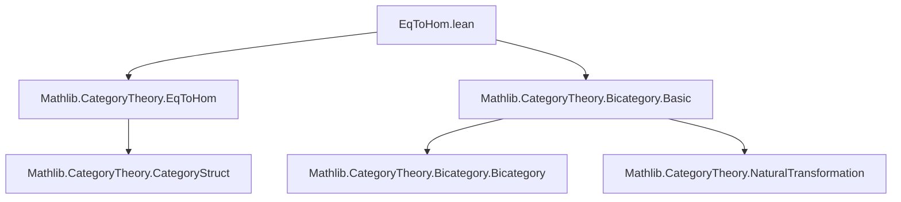
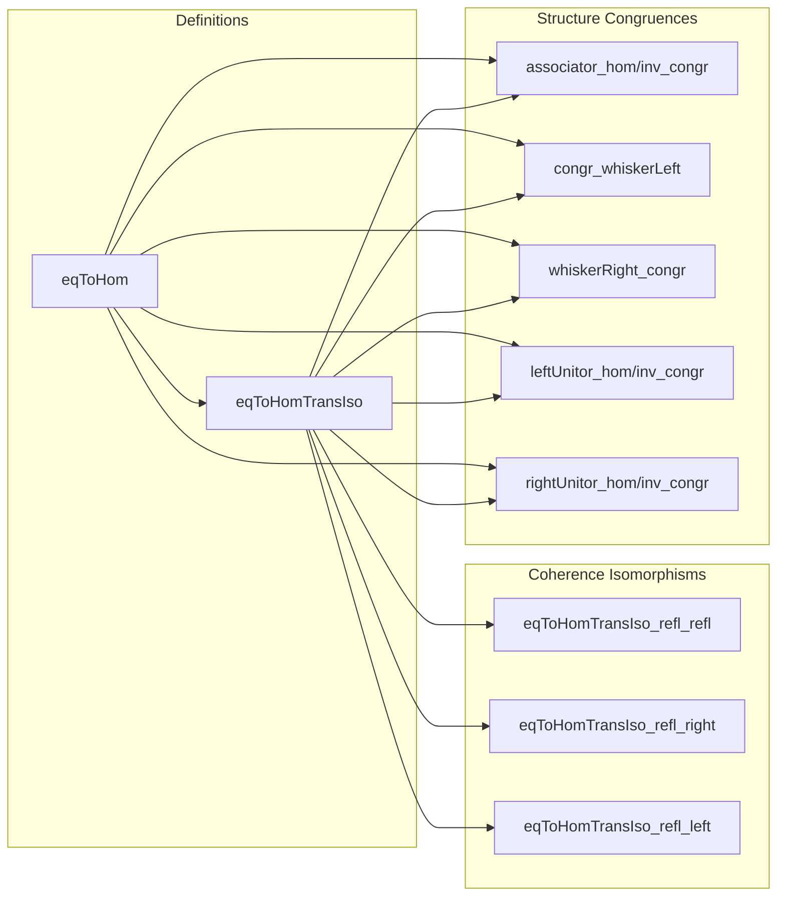

### Technical Brief: `EqToHom.lean`

---

#### **1. Key Definitions & Theorems**

| Name | Type / Signature | Purpose |
|------|------------------|---------|
| `eqToHom` | `∀ {x y : B}, x = y → x ⟶ y` | Converts equality of objects in a bicategory to a 1-morphism. Generalizes `eqToHom` from categories. |
| `eqToHomTransIso` | `eqToHom (e₁.trans e₂) ≅ eqToHom e₁ ≫ eqToHom e₂` | Provides the coherence isomorphism expressing that `eqToHom` preserves composition *up to isomorphism*. |
| `eqToHomTransIso_refl_refl` | `eqToHomTransIso (rfl : x = x) rfl = (λ_ (𝟙 x)).symm` | Special case when both equalities are reflexive; relates to left unitor. |
| `eqToHomTransIso_refl_right` | `eqToHomTransIso e₁ rfl = (ρ_ (eqToHom e₁)).symm` | Right unit law for `eqToHomTransIso`. |
| `eqToHomTransIso_refl_left` | `eqToHomTransIso rfl e₁ = (λ_ (eqToHom e₁)).symm` | Left unit law for `eqToHomTransIso`. |
| `associator_eqToHom_hom` / `inv` | Identities expressing how the associator interacts with `eqToHom`s. | Show that the associator in the bicategory conjugates appropriately under `eqToHom`s. |
| `congr_whiskerLeft`, `whiskerRight_congr` | `f ◁ η = eqToHom h ≫ f' ◁ η ≫ eqToHom h.symm` etc. | Express how whiskering behaves under equality of 1-morphisms via `eqToHom`. |
| `leftUnitor_hom_congr`, `leftUnitor_inv_congr`, `rightUnitor_hom_congr`, `rightUnitor_inv_congr` | Similar congruence lemmas for unitors. | Show how unitors conjugate under equality of 1-morphisms. |

---

#### **2. Naming Conventions**

- **Prefixes**:
  - `eqToHom*`: All definitions/lemmas related to `eqToHom`.
  - `*_congr`: Congruence lemmas showing structure morphisms behave well under equality of morphisms.
  - `*_hom`, `*_inv`: Lemmas distinguishing hom/inv parts of isomorphisms.

- **Suffixes**:
  - `TransIso`: For the coherence isomorphism between composed `eqToHom`s.
  - `refl_*`: For special cases where one or both equalities are reflexive.

- **Pattern**:
  - `eqToHomTransIso_*` → coherence isomorphisms.
  - `*_hom_congr` / `*_inv_congr` → conjugation lemmas for structure morphisms.

---

#### **3. Tactic Stack**

- **`subst` / `subst_vars`**: Used to eliminate equalities by substitution.
- **`simp`**: Heavily used, especially with `simp_rw`-style simplification over definitional equalities.
- **`ext`**: For extensionality proofs (e.g., proving morphism equality by components).
- **`grind`**: A custom tactic (likely from `Mathlib.Tactic`) used in `by grind` to solve equality goals by rewriting and simplifying.
- **`rw`**: Implicitly used in `by rw [h]` inside `eqToHom` arguments.

---

#### **4. Proof Logic**

- **Strategy**:
  - Most proofs follow a *substitution + simplification* pattern:
    1. Use `subst` or `subst_vars` to reduce equalities to `rfl`.
    2. Apply `simp` to reduce to definitional equalities (e.g., unitors, associators at identity).
  - For coherence lemmas (e.g., associator), the proof is purely definitional: after substitution, `simp` resolves everything using bicategory axioms and definitions of `eqToHomTransIso`.

- **Induction**: Not used explicitly — all proofs are *definitional* or rely on `simp`-based simplification over equality types.

- **Key Insight**:
  - Since `eqToHom` is defined via `eq.rec`, many properties hold *up to isomorphism*, and the file carefully tracks these isomorphisms (`eqToHomTransIso`) and their interactions with bicategorical structure.

---

#### **5. Imports**

- `Mathlib.CategoryTheory.EqToHom`: Provides `eqToHom` in categories (base case).
- `Mathlib.CategoryTheory.Bicategory.Basic`: Defines bicategories, including unitors, associators, and whiskering.

> **Scope**: This module extends the behavior of `eqToHom` from categories to bicategories, focusing on coherence laws and interaction with higher structure.

---

#### **8. Mermaid Diagrams**

##### **Dependency Graph**



##### **Overview of File Structure**



##### **Theoretical Context**

```mermaid
flowchart LR
  subgraph Category Theory
    CT[CategoryTheory]
    Cat[Category]
    Bicat[Bicategory]
  end

  subgraph Equality-to-Morphism
    EqHom[eqToHom]
    EqHomCat[EqToHom.lean (Cat)]
    EqHomBicat[EqToHom.lean (Bicat)]
  end

  CT --> EqHom
  Cat --> EqHomCat
  Bicat --> EqHomBicat
  EqHomCat --> EqHomBicat
```

---

#### **Summary**

This file formalizes the *coherence theory* of `eqToHom` in bicategories, showing how equality of objects induces 1-morphisms, and how bicategorical structure (unitors, associators, whiskering) interacts with these induced morphisms. It emphasizes *isomorphism-based coherence* rather than strict equality, reflecting the nature of bicategories. The proofs are mostly definitional, leveraging Lean’s equality handling and `simp`-based automation.
