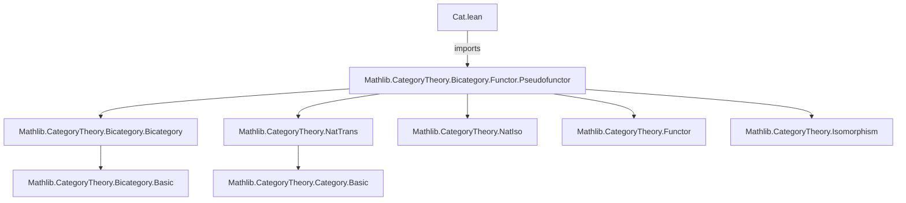
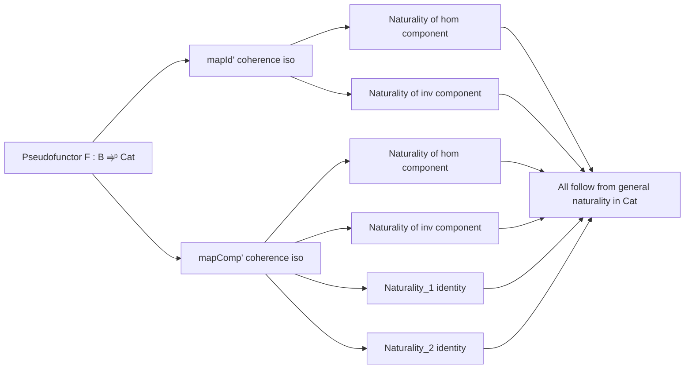

### Technical Brief: `Cat.lean` — Naturality of `mapId'` and `mapComp'` for Pseudofunctors to `Cat`

---

#### **1. Key Definitions & Theorems**

| Name | Type / Signature | Purpose |
|------|------------------|---------|
| `F : B ⥤ᵖ Cat.{v', u'}` | Pseudofunctor from bicategory `B` to `Cat` | Core object of study; encodes weak functoriality. |
| `F.mapId' f hf` | `Iso (F.map (𝟙 b₀) ⟶ F.map f)` (when `f = 𝟙 b₀`) | Unit coherence isomorphism for identity morphisms. |
| `F.mapComp' f g fg hfg` | `Iso (F.map fg ⟶ F.map g ∘ F.map f)` (when `f ≫ g = fg`) | Composition coherence isomorphism. |
| `mapId'_hom_naturality` | `(F.map f).map a ≫ (F.mapId' f hf).hom.app Y = (F.mapId' f hf).hom.app X ≫ a` | Naturality of the *hom* part of `mapId'` w.r.t. morphisms `a : X → Y`. |
| `mapId'_inv_naturality` | `(F.mapId' f hf).inv.app X ≫ (F.map f).map a = a ≫ (F.mapId' f hf).inv.app Y` | Naturality of the *inv* part of `mapId'`. |
| `mapComp'_hom_naturality` | `(F.map fg).map a ≫ (F.mapComp' ...).hom.app Y = (F.mapComp' ...).hom.app X ≫ (F.map g).map ((F.map f).map a)` | Naturality of the *hom* part of `mapComp'`. |
| `mapComp'_inv_naturality` | `(F.map g).map ((F.map f).map a) ≫ (F.mapComp' ...).inv.app Y = (F.mapComp' ...).inv.app X ≫ (F.map fg).map a` | Naturality of the *inv* part of `mapComp'`; marked `@[reassoc (attr := simp)]`. |
| `mapComp'_naturality_1` | Composite with `inv.app X ≫ ... ≫ hom.app Y` simplifies to `(F.map g).map ((F.map f).map a)` | One of two standard naturality identities for an iso of functors. |
| `mapComp'_naturality_2` | Composite with `hom.app X ≫ ... ≫ inv.app Y` simplifies to `(F.map fg).map a` | The other standard naturality identity for an iso of functors. |

All lemmas rely on the general naturality of natural isomorphisms between functors in `Cat`.

---

#### **2. Naming Conventions**

- **Prefixes**:
  - `mapId'`, `mapComp'`: coherence isomorphisms for identity and composition.
  - `hom`, `inv`: refer to the forward and inverse components of a `NatIso`.
  - `naturality`: indicates a naturality square is being expressed.

- **Suffixes**:
  - `_hom_naturality`, `_inv_naturality`: distinguish between naturality of the forward/inverse component.
  - `_1`, `_2`: distinguish the two standard naturality identities for an iso (cf. `NatIso.naturality_1`, `NatIso.naturality_2`).

- **Reassoc attribute**: All lemmas tagged with `@[reassoc]` (and one with `@[reassoc (attr := simp)]`) to support automated rewriting in associativity-heavy contexts.

---

#### **3. Tactic Stack**

- **Core tactics**:
  - `simp`: used implicitly via `@[reassoc (attr := simp)]` on `mapComp'_inv_naturality`.
  - `rw`: for applying naturality lemmas (e.g., `F.mapId' f hf).hom.toNatTrans.naturality a`).
  - `exact`: for direct proof terms (e.g., `exact ...` in lemmas).
  - `symm`: used in `mapId'_inv_naturality` to flip equality.

- **No heavy automation** (e.g., no `aesop`, `linarith`, `ring`), as the proofs are *definitionally* derived from naturality of natural transformations.

---

#### **4. Proof Logic**

- **Structure**: All proofs are *one-liners* derived from the definition of naturality for natural transformations and natural isomorphisms.
- **Pattern**:
  1. Recognize that `F.mapId' f hf` and `F.mapComp' f g fg hfg` are `NatIso`s in `Cat`.
  2. Apply the general naturality lemma for natural transformations (`naturality a`) or for natural isomorphisms (`naturality_1`, `naturality_2`).
  3. Use `.hom.toNatTrans.naturality a` or `.inv.toNatTrans.naturality a` to get the desired square.
  4. For inverses, apply `.symm` to reverse the equality.

- **No induction or case analysis** — purely categorical reasoning in `Cat`.

---

#### **5. Imports**

- **Primary dependency**:
  ```lean
  import Mathlib.CategoryTheory.Bicategory.Functor.Pseudofunctor
  ```
  - Provides:
    - `Bicategory`, `Pseudofunctor`, `mapId'`, `mapComp'`, `NatIso`, `Cat.Hom.toNatIso`.

- **Implicit imports** (via `Mathlib.CategoryTheory.Bicategory.*`):
  - `CategoryTheory.Bicategory.Bicategory`
  - `CategoryTheory.Bicategory.Functor.Pseudofunctor`
  - `CategoryTheory.NatTrans`
  - `CategoryTheory.Functor`
  - `CategoryTheory.Isomorphism`
  - `CategoryTheory.NatIso`

---

#### **8. Mermaid Diagrams**

##### **Dependency Graph**



##### **Overview of File Content**



##### **Theoretical Context**

This file sits in the hierarchy of bicategorical logic:

- **Base**: `Cat`-valued pseudofunctors encode “families of categories” varying over a bicategory.
- **Coherence laws**: `mapId'`, `mapComp'` ensure weak preservation of identities and composition.
- **Naturality**: These lemmas guarantee that coherence isos commute with morphisms in the *target* category (`Cat`), i.e., natural transformations between functors — essential for constructing 2-categorical limits, Grothendieck constructions, etc.

---

Let me know if you'd like a formalized dependency graph in `leanpkg` format or a summary of how these lemmas feed into larger developments (e.g., Grothendieck fibration theory or descent).
