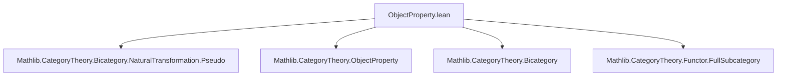
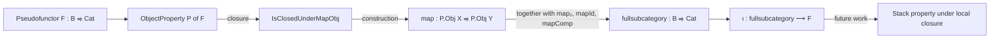
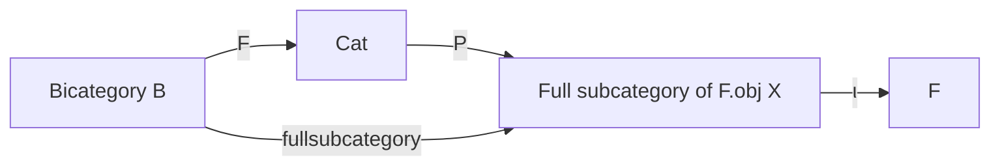

Here is the structured technical metadata extracted from `ObjectProperty.lean`:

---

### **1. Key Definitions & Theorems**

| Name | Type / Structure | Purpose |
|------|------------------|---------|
| `ObjectProperty` | `structure` | Encodes a family of object properties `prop X : ObjectProperty (F.obj X)` indexed by objects `X : B`. |
| `Obj X` | `abbrev` | Full subcategory of `F.obj X` spanned by objects satisfying `P.prop X`. |
| `IsClosedUnderMapObj` | `class Prop` | Ensures that if `M` satisfies `P` in `F.obj X`, then `(F.map f).obj M` satisfies `P` in `F.obj Y` for any `f : X ⟶ Y`. |
| `IsClosedUnderIsomorphisms` | `class Prop` | Ensures each `P.prop X` is closed under isomorphisms in `F.obj X`. |
| `map {f}` | `def` | Induced functor `P.Obj X ⥤ P.Obj Y` from `F.map f`, using `IsClosedUnderMapObj`. |
| `map₂ {α}` | `def` | Induced natural transformation `P.map f ⇒ P.map g` from a 2-cell `α : f ⇒ g`. |
| `mapId X` | `def` | Isomorphism `P.map (𝟙 X) ≅ 𝟭 (P.Obj X)`, auxiliary for pseudofunctor structure. |
| `mapComp f g` | `def` | Isomorphism `P.map (f ≫ g) ≅ P.map f ⋙ P.map g`, auxiliary for pseudofunctor structure. |
| `fullsubcategory` | `def` | The induced pseudofunctor `B ⥤ Cat` sending `X ↦ P.Obj X`. |
| `ι` | `def` | Strong transformation `P.fullsubcategory ⟶ F`, inclusion of the sub-pseudofunctor. |

---

### **2. Naming Conventions**

- **Prefixes**:
  - `prop`: for the family of object properties (`P.prop X`).
  - `map`, `map₂`: for induced morphisms and 2-cells.
  - `Obj`: for the full subcategory definition.
  - `isClosedUnder...`: for closure properties (e.g., `IsClosedUnderMapObj`, `IsClosedUnderIsomorphisms`).
- **Suffixes**:
  - `fullsubcategory`: indicates the sub-pseudofunctor construction.
  - `ι`: standard notation for inclusion morphism.
- **Notable pattern**: `P.map`, `P.map₂`, `P.mapId`, `P.mapComp` — all derived from `P` and `F`.

---

### **3. Tactic Stack**

Frequent tactics used in proofs (inferred from `@[simps!]`, `rfl`, and structure of lemmas):

- `rfl`: for definitional equalities in `@[simp]` lemmas.
- `simps!`: for automatically generating `simp` lemmas for `map`, `map₂`, `fullsubcategory`, `ι`.
- `isoMk`, `homMk`: used to construct isomorphisms/natural transformations in `Cat.Hom`/`Cat.Hom₂`.
- `whiskeringRight`, `whiskerLeft`: for manipulating natural transformations.
- `fullyFaithfulι`: used to lift functors through fully faithful inclusions (via `ObjectProperty.ι`).
- `preimage`, `preimageIso`: to descend constructions from ambient categories to full subcategories.

No explicit use of `aesop`, `ring`, or `linarith` — the proofs are mostly definitional or rely on `simp`-based reasoning.

---

### **4. Proof Logic**

- **Construction style**: *Definitional lifting* via universal properties of full subcategories.
- **Typical flow**:
  1. Define a functor/natural transformation in the ambient category (`F.obj X`).
  2. Use `IsClosedUnderMapObj` (or closure under iso) to ensure it preserves the property `P`.
  3. Use `lift` (via `ObjectProperty.ι`) to factor through the full subcategory.
  4. Use `fullyFaithfulι.whiskeringRight` and `preimage`/`preimageIso` to get the factorization and isomorphisms.
- **No induction or case analysis** is evident — the arguments are structural and categorical.

---

### **5. Imports**

- `Mathlib.CategoryTheory.Bicategory.NaturalTransformation.Pseudo`: core bicategorical machinery (pseudofunctors, natural transformations, 2-cells).
- Implicitly relies on:
  - `Mathlib.CategoryTheory.ObjectProperty`: for `ObjectProperty` and `FullSubcategory`.
  - `Mathlib.CategoryTheory.Bicategory`: for bicategory definitions.
  - `Mathlib.CategoryTheory.Functor.FullSubcategory`: for lifting functors through inclusions.

---

### **8. Mermaid Diagrams**

#### **Dependency Graph (Module-Level)**

#### **Overview of Theory Flow**

#### **Categorical Structure**

---

Let me know if you'd like a formalized summary in Lean syntax or a plan for the `IsLocal` extension mentioned in the TODO.
