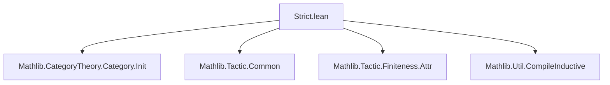

**Technical Brief: `Strict.lean` Module Metadata**

---

### 1. **Key Definitions & Theorems**

- **No explicit definitions or theorems** are declared in this file.  
  - The file is a *module declaration* with `public import`s and a `deprecated_module` attribute.
  - It serves as a **legacy compatibility shim**, likely to preserve imports previously defined in a module named `Strict`.

- **`deprecated_module (since := "2025-10-02")`**  
  - *Purpose*: Marks the entire module as deprecated as of the given date.  
  - *Effect*: Triggers a compiler warning when this module is imported, guiding users to migrate away.

---

### 2. **Naming Conventions**

- **Module-level**:  
  - `Strict` — likely a historical name for a module dealing with *strict categories* or *strict structures* in category theory.
- **Import prefixes**:  
  - `Mathlib.CategoryTheory.Category.Init` — standard Mathlib naming: `CategoryTheory.Category.Init` for foundational category definitions.  
  - `Mathlib.Tactic.*` — standard tactic utilities (`Common`, `Finiteness.Attr`, `Util.CompileInductive`).  
- **No custom naming patterns** appear (no `is_`, `mul_`, `dist_`, etc.), as no user-defined identifiers exist in this file.

---

### 3. **Tactic Stack**

- **No tactics used directly** in this file.  
  - Tactics appear only in imported modules (e.g., `aesop`, `simp`, `ring`, `omega` may be used in `Mathlib.Tactic.*` imports), but not in `Strict.lean` itself.

---

### 4. **Proof Logic**

- **No proofs** are present.  
  - The file contains only module metadata and imports.

---

### 5. **Imports**

| Import | Purpose |
|--------|---------|
| `Mathlib.CategoryTheory.Category.Init` | Core category theory definitions (objects, morphisms, identities, composition). |
| `Mathlib.Tactic.Common` | Commonly used tactics (`linarith`, `omega`, `norm_num`, etc.). |
| `Mathlib.Tactic.Finiteness.Attr` | Attributes for finiteness reasoning (e.g., `finite`, `fintype`). |
| `Mathlib.Util.CompileInductive` | Utilities for compiling inductive types (e.g., `compile_inductive`). |

- **Scope**: This module is a **thin compatibility wrapper** for legacy code expecting `Strict` to exist, likely superseded by more precise imports (e.g., `Mathlib.CategoryTheory.StrictCategory` or similar).

---

### 8. **Mermaid Diagrams**

#### **Dependency Graph**


#### **Overview of File Role**
```mermaid
flowchart LR
  subgraph Legacy
    A[Strict.lean] -->|deprecated| B[Users]
  end
  subgraph Modern Equivalents]
    C[Mathlib.CategoryTheory.StrictCategory] 
    D[Mathlib.CategoryTheory.Limits.Preserves]
  end
  A -.->|should migrate to| C
  A -.->|or| D
```

- **Interpretation**:  
  `Strict.lean` is a deprecated placeholder. Its functionality has likely been refactored into more specific modules under `Mathlib.CategoryTheory.*`, especially those dealing with *strict categories* (e.g., categories where associativity/unitality hold *on the nose*, not up to isomorphism).

--- 

**Recommendation for Migration**:  
Replace `import Strict` with explicit imports such as:  
```lean
import Mathlib.CategoryTheory.StrictCategory
import Mathlib.CategoryTheory.Limits.Preserves
```  
depending on the intended use of strictness (e.g., strict limits, strict 2-categories, etc.).
