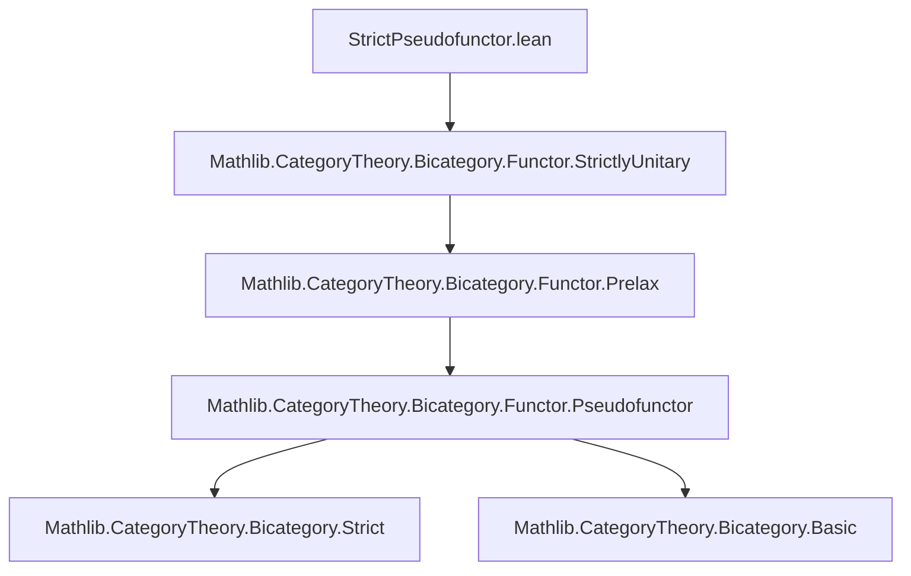
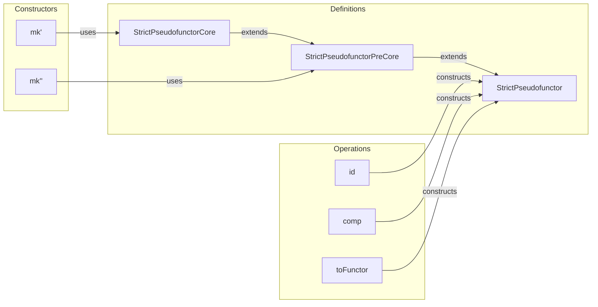

### Technical Brief: `StrictPseudofunctor.lean`

---

#### **1. Key Definitions & Theorems**

| Name | Type / Structure | Purpose |
|------|------------------|---------|
| `StrictPseudofunctor` | `structure extends StrictlyUnitaryPseudofunctor B C` | A pseudofunctor where `mapId` and `mapComp` are given by `eqToIso _`, i.e., strict on identities and composition. |
| `StrictPseudofunctorPreCore` | `structure extends PrelaxFunctor B C` | A pre-core structure bundling object/map actions and whiskering laws, but *not* full pseudofunctor coherence. Used as input when source/target are strict. |
| `StrictPseudofunctorCore` | `structure extends StrictPseudofunctorPreCore B C` | Adds full coherence data (`map₂_left_unitor`, `map₂_right_unitor`, `map₂_associator`) to ensure the pre-core lifts to a strict pseudofunctor. |
| `StrictPseudofunctor.mk'` | `def (S : StrictPseudofunctorCore B C) → StrictPseudofunctor B C` | Constructs a strict pseudofunctor from a full core, using `simps` to discharge fields. |
| `StrictPseudofunctor.id` | `def` | Identity strict pseudofunctor on a bicategory. |
| `StrictPseudofunctor.comp` | `def` | Composition of strict pseudofunctors. |
| `StrictPseudofunctor.mk''` | `def [Strict B] [Strict C] (S : StrictPseudofunctorPreCore B C) → StrictPseudofunctor B C` | Alternate constructor for strict bicategories: coherence automatically follows from strictness. |
| `StrictPseudofunctor.toFunctor` | `def [Strict B] [Strict C] (F : StrictPseudofunctor B C) → Functor B C` | For strict bicategories, a strict pseudofunctor induces an ordinary functor on underlying categories. |

---

#### **2. Naming Conventions**

- **Prefixes**:
  - `map_`: for action on 1-morphisms (`map`, `map_id`, `map_comp`, `map₂`, `map₂_id`, `map₂_comp`, `map₂_whisker_*`)
  - `mapId`, `mapComp`: for 2-isomorphisms encoding identity and composition preservation.
  - `eqToIso`, `eqToHom`: used to convert equalities to isomorphisms/homs in bicategorical contexts.
- **Suffixes**:
  - `_eq_eqToIso`: asserts that a coherence isomorphism is exactly `eqToIso _`.
  - `*_eqToHom`: used in whiskering lemmas to relate `map₂` of whiskered 2-cells to homs induced by `map_comp`.
- **Core variants**:
  - `PreCore`, `Core`, `mk'`, `mk''`: indicate increasing levels of coherence data or context-specific constructors.

---

#### **3. Tactic Stack**

Frequent tactics used in proofs and field definitions:

| Tactic | Usage |
|--------|-------|
| `rfl_cat` | Used in `:= by rfl_cat` to prove equalities of morphisms in bicategories (via `cat_eq_of_hom_eq`). |
| `cat_disch` | Discharges bicategorical equality goals using category-theoretic simplification. |
| `simp` / `simpa` | Used extensively to simplify using `map_comp`, `map_id`, and strictness assumptions. |
| `ext` | To prove equality of natural transformations or 2-cells. |
| `rw [...]` | Rewriting using `map_comp`, `map_id`, and strictness lemmas like `Strict.leftUnitor_eqToIso`. |
| `aesop` (implicit) | Likely used via `cat_disch` or `rfl_cat` for automated reasoning in bicategories. |

---

#### **4. Proof Logic**

- **Structure definitions** are mostly *definitional*: fields like `map_comp` are given by `rfl_cat`, indicating they hold *by definition* in the context of strictness.
- **Coherence proofs** (e.g., `map₂_associator`, `map₂_left_unitor`) reduce to simplifications using:
  - `map_comp` and `map_id` equalities,
  - strictness assumptions (`Strict B`, `Strict C`) which give `α_`, `λ_`, `ρ_` are `eqToIso _`.
- **Constructors** (`mk'`, `mk''`) use `simpa using ...` to discharge coherence conditions by appealing to the corresponding field in the input structure.
- **Functoriality** (`toFunctor`) is immediate once `map_id` and `map_comp` are equalities — i.e., in the strict case.

---

#### **5. Imports & Dependencies**

- **Core dependency**:
  ```lean
  import Mathlib.CategoryTheory.Bicategory.Functor.StrictlyUnitary
  ```
- **Implicit imports** (via `Bicategory` namespace and `PrelaxFunctor`):
  - `Mathlib.CategoryTheory.Bicategory.Basic`
  - `Mathlib.CategoryTheory.Bicategory.Functor.Prelax`
  - `Mathlib.CategoryTheory.Bicategory.Functor.Pseudofunctor`
  - `Mathlib.CategoryTheory.Bicategory.Strict`

> **Note**: The file is intended to eventually replace the deprecated `Mathlib/CategoryTheory/Bicategory/Functor/Strict.lean`.

---

#### **6. Mermaid Diagrams**

##### **Dependency Graph (Module Level)**



##### **Data Flow & Construction Hierarchy**

```mermaid
graph TD
  A[StrictPseudofunctorPreCore] -->|adds coherence| B[StrictPseudofunctorCore]
  B -->|mk'| C[StrictPseudofunctor]
  A -->|mk'' (if B,C strict)| C
  C -->|toFunctor| D[Functor B C]
  C -->|id, comp| C
```

##### **Overview of File Structure**



---

#### **7. Summary**

This file formalizes *strict pseudofunctors* between bicategories — a stricter variant of pseudofunctors where coherence isomorphisms are *definitional* (given by `eqToIso`). It introduces three layered structures (`PreCore`, `Core`, full `StrictPseudofunctor`) to support flexible construction, especially in the case of strict bicategories. The key result is that strict pseudofunctors between *strict* bicategories reduce to ordinary functors on the underlying categories (`toFunctor`). The design reflects Lean’s emphasis on definitional equality and `simps`-driven interface design.
