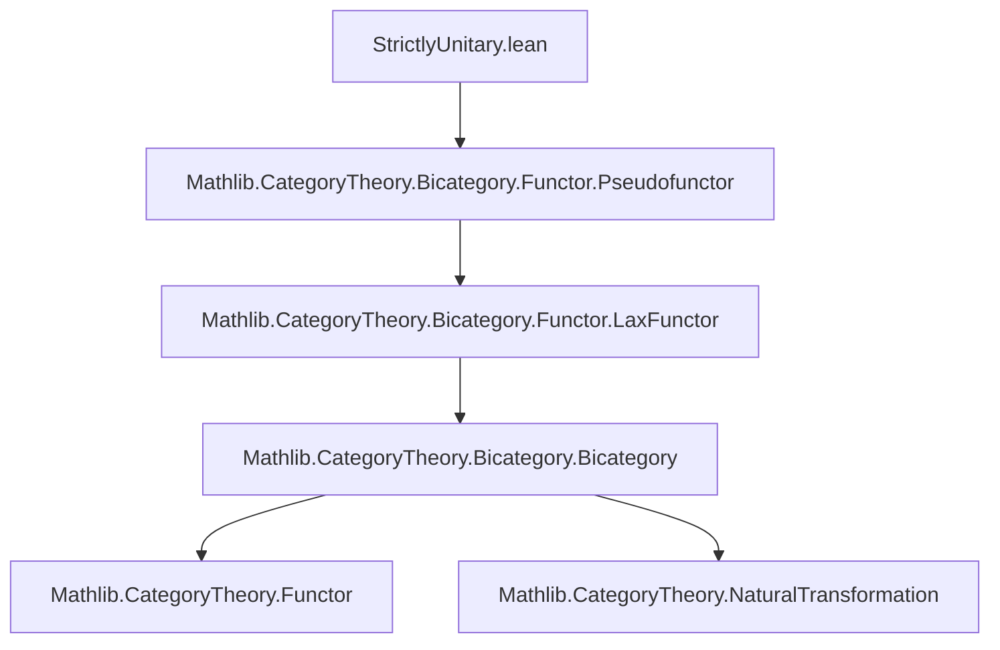
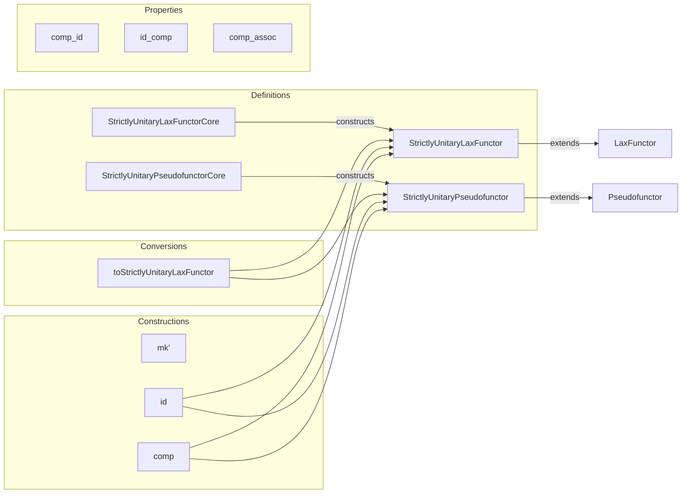

### Technical Metadata Brief: `StrictlyUnitary.lean`

---

#### **1. Key Definitions & Theorems**

| Name | Type / Structure | Purpose |
|------|------------------|---------|
| `StrictlyUnitaryLaxFunctor` | `structure extends B ⥤ᴸ C` | A lax functor $F : B \to C$ between bicategories such that $F(\mathbf{1}_X) = \mathbf{1}_{F(X)}$ *on the nose*, and the unit constraint $\mathbf{1}_{F(X)} \to F(\mathbf{1}_X)$ is the identity 2-morphism. |
| `StrictlyUnitaryLaxFunctorCore` | `structure` | Bundled data to construct a strictly unitary lax functor without redundant fields (`mapId`, etc.). Encodes object/map/map₂/mapComp with naturality and coherence axioms adapted to strict unitarity. |
| `StrictlyUnitaryLaxFunctor.mk'` | `def` | Constructor from `StrictlyUnitaryLaxFunctorCore`, simplifying proofs by omitting `mapId` and adapting unitor axioms. |
| `mapIdIso` | `def` | For $F : \text{StrictlyUnitaryLaxFunctor}$, gives an isomorphism $ \mathbf{1}_{F(X)} \xrightarrow{\sim} F(\mathbf{1}_X) $, using strict equality to simplify inverse. |
| `StrictlyUnitaryLaxFunctor.id` | `def` | Identity strictly unitary lax functor. |
| `StrictlyUnitaryLaxFunctor.comp` | `def` | Composition of strictly unitary lax functors. |
| `comp_id`, `id_comp`, `comp_assoc` | `lemma` | Strict unit and associativity laws for composition (equality, not just isomorphism). |
| `StrictlyUnitaryPseudofunctor` | `structure extends Pseudofunctor B C` | A pseudofunctor whose underlying lax functor is strictly unitary: $F(\mathbf{1}_X) = \mathbf{1}_{F(X)}$, and unit constraint is identity. |
| `StrictlyUnitaryPseudofunctorCore` | `structure` | Bundled data for constructing strictly unitary pseudofunctors, with invertible `mapComp` and adapted coherence laws. |
| `StrictlyUnitaryPseudofunctor.mk'` | `def` | Constructor from core data. |
| `toStrictlyUnitaryLaxFunctor` | `def` | Forgetting the invertibility of `mapComp`, yields a strictly unitary *lax* functor. |
| `StrictlyUnitaryPseudofunctor.id`, `comp` | `def` | Identity and composition of strictly unitary pseudofunctors. |

---

#### **2. Naming Conventions**

- **Prefixes**:
  - `StrictlyUnitaryLaxFunctor`, `StrictlyUnitaryPseudofunctor`: main structures.
  - `StrictlyUnitaryLaxFunctorCore`, `StrictlyUnitaryPseudofunctorCore`: helper data.
  - `map_id`, `mapId`, `mapIdIso`, `map₂`, `mapComp`: standard lax/pseudofunctor components.
  - `map₂_*`, `mapComp_*`: naturality/coherence conditions (e.g., `map₂_leftUnitor`, `mapComp_naturality_left`).
- **Suffixes**:
  - `_core`: core data without redundancy.
  - `_iso`, `_hom`: distinguishing isomorphism vs. morphism components (e.g., `mapId_eq_eqToIso` vs. `mapId_eq_eqToHom`).
- **Equality vs. Isomorphism**:
  - `map_id` gives *equality* $F(\mathbf{1}_X) = \mathbf{1}_{F(X)}$.
  - In pseudofunctors: `mapId_eq_eqToIso` (since unit constraint is an iso), in lax functors: `mapId_eq_eqToHom` (since unit constraint is a 2-morphism, not necessarily iso).

---

#### **3. Tactic Stack**

Frequent tactics used in proofs and definitions:

| Tactic | Usage |
|--------|-------|
| `rfl` | Proving definitional equalities (e.g., `map_id _ := rfl`). |
| `simp` | Simplifying using `@[simps]` lemmas, definitional equalities, and `rfl`-provable goals. |
| `ext` | Extensionality for structures (e.g., proving equality of functors). |
| `rw [heq_iff_eq]` | Converting heterogeneous equality to homogeneous equality (used in strict functor composition proofs). |
| `cat_disch` | Custom tactic (likely from `CategoryTheory.Bicategory`) to discharge bicategorical diagrammatic equations. |
| `simpa using ...` | Simplifying goals using a hypothesis (e.g., in `mk'` definitions). |
| `infer_instance` | Inferring `IsIso` instances. |

---

#### **4. Proof Logic**

- **Structure Equality Proofs**:
  - Use `ext` to decompose structure equality into component-wise equalities.
  - Then `rw [heq_iff_eq]` + `ext` + `simp` to reduce to definitional equalities.
- **Strict Unit/Associativity**:
  - Proven *on the nose* (not up to modification), using `rfl` and `simp` over definitional equalities.
  - E.g., `comp_id`, `id_comp`, `comp_assoc` are proven by `ext` + `simp`, leveraging strictness of unit condition.
- **Coherence Adaptation**:
  - In `StrictlyUnitaryLaxFunctorCore`, unitor axioms simplify because $F(\mathbf{1}_X) = \mathbf{1}_{F(X)}$, so `eqToHom (map_id X)` becomes identity.
  - Similarly, in pseudofunctor core, `mapComp` is an iso, and unitor axioms use `eqToHom` from strict unit equality.

---

#### **5. Imports**

- **Primary dependency**:
  ```lean
  import Mathlib.CategoryTheory.Bicategory.Functor.Pseudofunctor
  ```
  - Provides `LaxFunctor`, `Pseudofunctor`, and their structure components (`map`, `map₂`, `mapComp`, `mapId`, etc.).
- **Implicit imports** (via `CategoryTheory.Bicategory`):
  - Bicategory definitions: objects, 1-cells, 2-cells, associators, unitors, whiskering.
  - `eqToHom`, `eqToIso`, `IsIso`, `heq_iff_eq`.

---

#### **8. Mermaid Diagrams**

##### **Dependency Graph**



##### **Overview of File Structure**



##### **Theory Context**

- **Goal**: Formalize *strictly unitary* (a.k.a. *normal*) functors between bicategories.
- **Motivation**: In higher category theory, strict unit conditions simplify coherence and enable strictification results (e.g., Duskin nerve, 2-nerve constructions).
- **Future Work** (per TODOs):
  - Define *lax-composable* / *pseudo-composable* arrows as strictly unitary functors from `LocallyDiscrete Fin n`.
  - Build bicategory of bicategories, strictly unitary pseudofunctors, and *icons* (identity-on-objects lax natural transformations).
  - Construct *Duskin nerve* and *2-nerve* using these functors.

---

This file provides the foundational categorical structures needed for strict-unital higher categorical constructions, with careful attention to definitional equality to support future strictification and nerve constructions.
