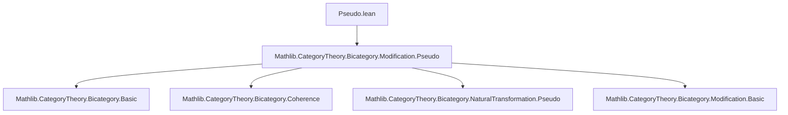

### Technical Brief: `Pseudo.lean` — Bicategory of Pseudofunctors

---

#### **1. Key Definitions & Theorems**

| Name | Type / Signature | Purpose |
|------|------------------|---------|
| `whiskerLeft` | `η : F ⟶ G → {θ ι : G ⟶ H} → θ ⟶ ι → η ≫ θ ⟶ η ≫ ι` | Left whiskering of a strong natural transformation with a modification. Constructs a 2-cell in the bicategory of pseudofunctors. |
| `whiskerRight` | `{η θ : F ⟶ G} → η ⟶ θ → G ⟶ H → η ≫ ι ⟶ θ ≫ ι` | Right whiskering of a modification with a strong natural transformation. |
| `associator` | `(η : F ⟶ G) (θ : G ⟶ H) (ι : H ⟶ I) → (η ≫ θ) ≫ ι ≅ η ≫ θ ≫ ι` | coherence isomorphism for vertical composition of 1-morphisms (strong natural transformations). |
| `leftUnitor` | `(η : F ⟶ G) → 𝟙 F ≫ η ≅ η` | left unit law for vertical composition, up to isomorphism. |
| `rightUnitor` | `(η : F ⟶ G) → η ≫ 𝟙 G ≅ η` | right unit law for vertical composition, up to isomorphism. |
| `instance : Bicategory (Pseudofunctor B C)` | `Bicategory (Pseudofunctor B C)` | Main theorem: constructs a bicategory structure on the type of pseudofunctors `B ⟶ C`, with strong natural transformations as 1-morphisms and modifications as 2-morphisms. |

> **Note**: All constructions are defined pointwise using the bicategorical structure of `C`, leveraging coherence laws like `associator_inv_naturality_right`, `whisker_exchange`, and unitors `λ_`, `ρ_`.

---

#### **2. Naming Conventions**

- **Prefixes**:
  - `whiskerLeft`, `whiskerRight`: indicate direction of whiskering.
  - `associator`, `leftUnitor`, `rightUnitor`: standard bicategorical coherence data.
- **Suffixes**:
  - `_as_app`: used in `@[simps!]` to expose component-wise definitions (e.g., `whiskerLeft_as_app`).
- **Notation**:
  - `η ≫ θ`: vertical composition of strong natural transformations (1-morphisms).
  - `Γ : η ⟶ θ`: 2-morphisms are modifications.
  - `◁`, `▷`: horizontal action of 1-cells on 2-cells (used in naturality components).

---

#### **3. Tactic Stack**

- `dsimp`: simplifies definitions before rewriting.
- `rw [...]`: applies naturality and coherence laws (e.g., `associator_inv_naturality_right_assoc`, `whisker_exchange_assoc`).
- `simp` / `simp_rw`: simplifies using `Category.assoc`, `← associator_inv_naturality_left`, etc.
- `ext`: extensionality for proving equality of modifications (pointwise equality).
- `isoMk`: constructs isomorphisms in a bicategory by giving forward and inverse components (here, pointwise using bicategorical unitors/associators in `C`).

---

#### **4. Proof Logic**

- **Pointwise construction**: All 1- and 2-morphism data are defined componentwise at each object `a : B.obj`.
- **Naturality checks**: Verified using coherence laws of the target bicategory `C`, especially:
  - `associator_inv_naturality_right`
  - `whisker_exchange`
  - `Category.assoc`
- **Isomorphism proofs**: Use `isoMk` with pointwise isomorphisms from `C` (e.g., `α_`, `λ_`, `ρ_`), relying on `simps!` to ensure projection lemmas hold definitionally.
- **Bicategory axioms**: Verified via `@[simps!]` and `whisker_exchange` to ensure coherence diagrams commute (e.g., pentagon, triangle identities are inherited from `C`).

---

#### **5. Imports & Dependencies**

- **Core dependency**:
  ```lean
  import Mathlib.CategoryTheory.Bicategory.Modification.Pseudo
  ```
  This provides the foundational definitions of:
  - `Pseudofunctor`
  - `StrongTrans` (strong natural transformations)
  - `Modification` (2-morphisms)

- **Implicit dependencies** (via `Bicategory` context):
  - `Mathlib.CategoryTheory.Bicategory.Basic`
  - `Mathlib.CategoryTheory.Bicategory.Coherence`
  - `Mathlib.CategoryTheory.Bicategory.NaturalTransformation.Pseudo`
  - `Mathlib.CategoryTheory.Bicategory.Modification.Basic`

---

#### **6. Mermaid Diagrams**

##### **Dependency Graph (Module-Level)**



##### **Structural Overview of the Bicategory Construction**

```mermaid
graph LR
  subgraph Objects
    O1[F : Pseudofunctor B C]
    O2[G : Pseudofunctor B C]
    O3[H : Pseudofunctor B C]
  end

  subgraph 1-Morphisms (StrongTrans)
    O1 -- η : F ⟶ G --> O2
    O2 -- θ : G ⟶ H --> O3
  end

  subgraph 2-Morphisms (Modifications)
    η -- Γ : η ⟶ θ --> θ
  end

  O1 -- associator --> (η ≫ θ) ≫ ι ≅ η ≫ (θ ≫ ι)
  O1 -- leftUnitor --> 𝟙 F ≫ η ≅ η
  O1 -- rightUnitor --> η ≫ 𝟙 G ≅ η

  style O1 fill:#f9f,stroke:#333
  style O2 fill:#f9f,stroke:#333
  style O3 fill:#f9f,stroke:#333
```

##### **Proof Flow for `whiskerLeft` Naturality**


---

#### **7. Summary**

This file formalizes the **bicategory of pseudofunctors** `B ⟶ C`, where:
- Objects = pseudofunctors,
- 1-morphisms = strong natural transformations,
- 2-morphisms = modifications.

It leverages the bicategorical structure of `C` to define all coherence data pointwise, and verifies axioms using standard coherence theorems (e.g., `whisker_exchange`). The instance is scoped to `CategoryTheory.Pseudofunctor.StrongTrans` to avoid conflicts with alternative bicategory structures (e.g., lax/colax natural transformations).
