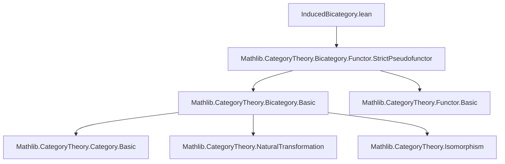
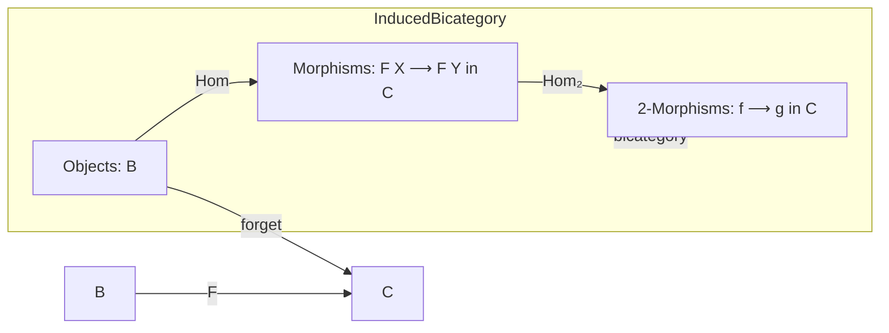

### Technical Brief: `InducedBicategory.lean`

---

#### **1. Key Definitions & Theorems**

| Name | Type / Signature | Purpose |
|------|------------------|---------|
| `InducedBicategory (_F : B → C)` | `Type u → Type v → [Bicategory C] → Type u` | Type synonym for `B`, equipped with a bicategory structure induced by `F : B → C`. |
| `Hom X Y` | `Structure` | Morphisms in the induced bicategory: `F X ⟶ F Y` in `C`. |
| `mkHom {X Y} (f : F X ⟶ F Y)` | `X ⟶ Y` | Constructor for `Hom`, simplifying unification. |
| `Hom₂ f g` | `Structure` | 2-morphisms in the induced bicategory: `f.hom ⟶ g.hom` in `C`. |
| `mkHom₂ (η : f ⟶ g)` | `mkHom f ⟶ mkHom g` | Constructor for `Hom₂` when `f, g` are given directly in `C`. |
| `isoMk (φ : f.hom ≅ g.hom)` | `f ≅ g` | Constructs isomorphisms in the induced bicategory from isos in `C`. |
| `bicategory` | `Bicategory (InducedBicategory C F)` | Bicategory structure on `InducedBicategory`, using `C`’s structure. |
| `forget` | `StrictPseudofunctor (InducedBicategory C F) C` | Forgetful strict pseudofunctor mapping `X ↦ F X`, `f ↦ f.hom`, `η ↦ η.hom`. |
| `hom_ext`, `hom₂_ext` | `lemma` | Extensionality principles for morphisms and 2-morphisms. |
| `eqToHom_hom`, `mkHom_eqToHom` | `lemma` | Behavior of `eqToHom` under coercion to `C`. |
| `instance : Strict (InducedBicategory C F)` | `instance` | If `C` is strict, then so is the induced bicategory. |

---

#### **2. Naming Conventions**

- **Prefixes**:
  - `mkHom`, `mkHom₂`, `isoMk`: constructors for morphisms/2-morphisms/isos.
  - `hom`, `hom₂`: projection of underlying morphism/2-morphism in `C`.
- **Suffixes**:
  - `_ext`: extensionality lemmas.
  - `_hom`, `_hom₂`: projections to underlying `C`-data.
- **Structure fields**:
  - `hom : F X ⟶ F Y`, `hom : f.hom ⟶ g.hom`: standard naming for underlying data.

---

#### **3. Tactic Stack**

Frequently used tactics in proofs:
- `ext`: for extensionality (especially `Hom.ext`, `Hom₂.ext`).
- `simp only [...]`: to simplify using `simps`-generated lemmas.
- `subst h`: for substitution after `eqToHom` manipulations.
- `simpa using ...`: to discharge goals using simplification + assumption.
- `by ext; simpa using ...`: common pattern for 2-morphism equality.

No heavy automation (e.g., `aesop`, `ring`) is used—proofs are mostly structural and definitional.

---

#### **4. Proof Logic**

- **Bicategory construction**:  
  Define objects, morphisms, 2-morphisms via `F`; inherit composition/identities from `C`.  
  Verify bicategory axioms (associator, unitors, coherence) by lifting from `C` via `isoMk` and `simps`.

- **Forgetful pseudofunctor**:  
  Constructed via `StrictPseudofunctor.mk'`, using definitional equality of composition/identity in `C`.

- **Strictness**:  
  If `C` is strict, the induced bicategory inherits strictness because all coherence cells become identities (via `Strict.*_eqToIso` lemmas).

- **Extensionality & equality lemmas**:  
  Prove equality by projecting to `C` (`hom`, `hom₂`), using `ext`, then simplifying.

---

#### **5. Imports**

- `Mathlib.CategoryTheory.Bicategory.Functor.StrictPseudofunctor`:  
  Provides `StrictPseudofunctor` and related infrastructure.

No other imports are present—this file is self-contained for the induced bicategory construction.

---

#### **6. Mermaid Diagrams**

##### **Dependency Graph**



##### **Overview of Induced Bicategory Construction**



##### **Structure Hierarchy**

```mermaid
graph TD
  InducedBicategory --> CategoryStruct
  InducedBicategory --> Bicategory
  Hom --> CategoryStruct.Hom
  Hom₂ --> Category.Hom
  bicategory --> whiskerLeft
  bicategory --> whiskerRight
  bicategory --> associator
  bicategory --> leftUnitor
  bicategory --> rightUnitor
  forget --> StrictPseudofunctor
```

---

#### **7. Theory Context**

This file formalizes a *full sub-bicategory* construction: given a map `F : B → C`, the induced bicategory `InducedBicategory C F` has:
- Objects: elements of `B`
- Morphisms: all morphisms between `F X` and `F Y` in `C`
- 2-morphisms: all 2-morphisms between those in `C`

It is *not* a subobject classifier or a locale-theoretic sub-bicategory—rather, it is a *strictly embedded* bicategory via `F`, with no restriction on 1- or 2-morphisms.

The TODO suggests future work on *locally induced* bicategories (restricting 1-morphisms), which would require careful coherence handling.

---

#### **8. Summary**

This module provides a clean, definitional construction of an induced bicategory from a map into a bicategory. It leverages Lean’s `structure` and `simps` infrastructure to ensure coherence and usability, with extensionality and strictness results as supporting lemmas. The `forget` pseudofunctor serves as the canonical embedding into `C`.
