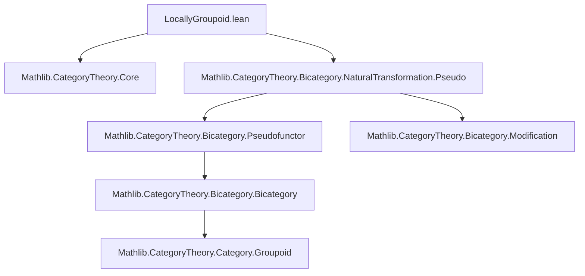
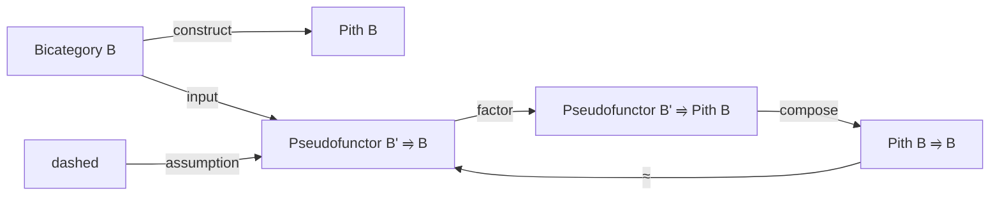

### Technical Brief: Locally Groupoidal Bicategories and the Pith Construction

---

#### **1. Key Definitions & Theorems**

| Name | Type / Signature | Purpose |
|------|------------------|---------|
| `IsLocallyGroupoid` | `∀ (b c : B), IsGroupoid (b ⟶ c)` | Defines a bicategory where each hom-category is a groupoid (i.e., all 1-morphisms are invertible up to 2-isomorphism). |
| `Pith` | `structure Pith (B : Type u₁)` | Wrapper type for objects of `B`, with homs defined as `Core (a.as ⟶ b.as)` — discarding non-invertible 2-cells. |
| `Pith.categoryStruct` | `CategoryStruct (Pith B)` | Provides identity and composition on 1-morphisms in `Pith B`. |
| `Pith.homGroupoid` | `Groupoid (a ⟶ b)` | Shows each hom-category in `Pith B` is a groupoid. |
| `Pith.Bicategory` | `Bicategory (Pith B)` | Constructs the bicategory structure on `Pith B`, using `CoreHom.mk` and `Core.isoMk`. |
| `Pith.inclusion` | `Pseudofunctor (Pith B) B` | Canonical pseudofunctor embedding the pith into the original bicategory. |
| `Pith.pseudofunctorToPith` | `Pseudofunctor B' (Pith B)` | Factorization of any pseudofunctor from a (2,1)-category through the pith. |
| `Pith.pseudofunctorToPithCompInclusionStrongIsoHom` / `StrongIsoInv` | `StrongTrans` between `(pseudofunctorToPith F).comp inclusion` and `F` | Witness that the factorization is essentially unique (up to strong natural isomorphism). |
| `Pseudofunctor.ofLaxFunctorToLocallyGroupoid` | `F.PseudoCore` | Promotes a lax functor into a locally groupoidal bicategory to a pseudofunctor. |
| `Pseudofunctor.ofOplaxFunctorToLocallyGroupoid` | `F.PseudoCore` | Same as above for oplax functors. |

---

#### **2. Naming Conventions**

- **Prefixes**:
  - `is_`: e.g., `IsLocallyGroupoid`, `IsGroupoid` — typeclass predicates.
  - `pseudofunctorToPith`: factorization through pith.
  - `inclusion`: canonical embedding.
  - `ofLaxFunctorToLocallyGroupoid`, `ofOplaxFunctorToLocallyGroupoid`: conversion lemmas.
- **Suffixes**:
  - `_iso_hom`, `_iso_inv`: projections from `CoreHom` or `Core.isoMk`.
  - `_of`: projection to underlying object/morphism in `B`.
- **Core-related**:
  - `CoreHom.mk`, `Core.isoMk`, `CoreHom.ext`: constructors and extensionality for `Core`.
- **Simp/Reassoc**:
  - `@[simp, reassoc]` used for lemmas about 2-morphism composition in `Pith`.

---

#### **3. Tactic Stack**

Frequent tactics used in proofs and instance derivations:

| Tactic | Usage |
|--------|-------|
| `ext` | Hom-extensionality in `Core` (e.g., `hom₂_ext`). |
| `simp` | Simplification using `@[simp]` lemmas (e.g., `comp_of`, `id_of`, `comp₂_iso_hom`). |
| `rw`, `apply`, `exact` | Basic proof scripting. |
| `infer_instance` | To discharge `Groupoid`, `IsLocallyGroupoid`, etc. |
| `by aesop` / `aesop` | Not explicitly used here, but `simp` + `ext` suffices. |
| `core` (via `CoreHom.ext`, `Iso.ext`) | For proving equality of 2-morphisms via underlying iso components. |

---

#### **4. Proof Logic**

- **Structure of `Pith B`**:
  - Define underlying type as `B`.
  - Define homs as `Core (a.as ⟶ b.as)` → automatically a groupoid.
  - Define identity and composition via `⟨𝟙⟩`, `⟨f.of ≫ g.of⟩`.
  - Prove bicategory laws using `whisker_exchange`, `simp`, and `ext`.

- **Factorization**:
  - For `F : Pseudofunctor B' B` with `B'` locally groupoidal:
    - `obj` maps to `mk (F.obj x)`.
    - `map f := mk (F.map f)` — valid since `F.map f` is invertible (as `B'` is groupoidal).
    - `map₂ f := mk (asIso (F.map₂ f))` — uses invertibility of `F.map₂ f`.
  - Show coherence laws hold via `Core.isoMk` and `F.mapId`, `F.mapComp`.

- **Uniqueness up to strong iso**:
  - Construct natural isomorphism with components `𝟙 _`, using unitors to witness naturality.

- **Lax/Oplax → Pseudofunctor**:
  - Invertibility of structure cells in target (locally groupoidal) allows promotion via `asIso`.

---

#### **5. Imports**

```lean
public import Mathlib.CategoryTheory.Core
public import Mathlib.CategoryTheory.Bicategory.NaturalTransformation.Pseudo
```

- **Core**: Provides `Core C`, `CoreHom`, `Core.isoMk`, etc.
- **Pseudo**: Provides `Pseudofunctor`, `LaxFunctor`, `OplaxFunctor`, `StrongTrans`, etc.

---

#### **6. Mermaid Diagrams**

##### **Dependency Graph (Module-Level)**



##### **Overview of Theory Flow**

```mermaid
graph LR
  Bicategory[Bicategory B] -->|discard non-invertible 2-cells| PithB[Pith B]
  PithB -->|is| LocallyGroupoid[(2,1)-category]
  Pseudofunctor[B' ⥤ B] -->|if B' is (2,1)| Factor[Pseudofunctor B' ⥤ Pith B]
  Factor -->|compose with| Inclusion[Pith B ⥤ B]
  Inclusion <-->|strongly naturally iso| Identity
  LaxFunctor[LaxFunctor B' ⥤ B] -->|if B is (2,1)| Pseudofunctor[Pseudofunctor B' ⥤ B]
```

##### **Key Objects & Morphisms**



---

#### **7. Summary**

This file formalizes the theory of **(2,1)-categories** within Lean’s `CategoryTheory.Bicategory` framework:

- Introduces `IsLocallyGroupoid` as a predicate on bicategories.
- Constructs the **pith** `Pith B`, a canonical (2,1)-category associated to any bicategory `B`.
- Shows that the pith satisfies a **universal property**: any pseudofunctor from a (2,1)-category factors uniquely (up to strong natural isomorphism) through the inclusion `Pith B ⥤ B`.
- Demonstrates that in a locally groupoidal target, **lax/oplax functors are automatically pseudofunctors**, via `ofLaxFunctorToLocallyGroupoid` and `ofOplaxFunctorToLocallyGroupoid`.

This aligns with the Kerodon reference (section 1.2.2), and is foundational for higher categorical constructions where invertibility of 1-morphisms is essential (e.g., homotopy theory, derived algebraic geometry).
