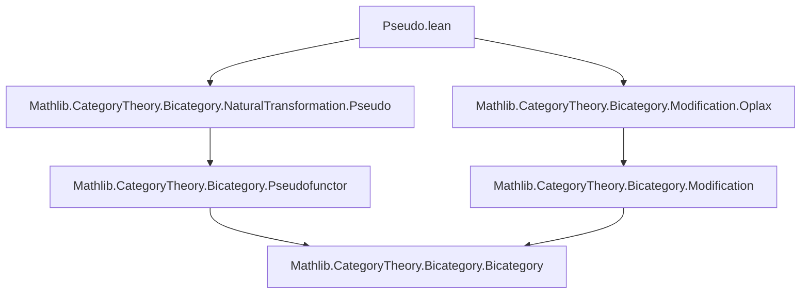
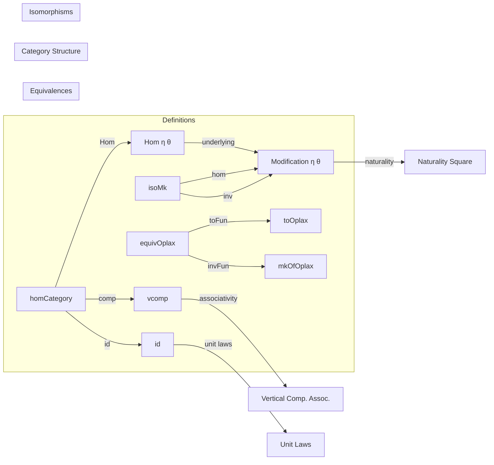

### Technical Brief: `Pseudo.lean` — Modifications Between Strong Transformations of Pseudofunctors

---

#### **1. Key Definitions & Theorems**

| Name | Type / Signature | Purpose |
|------|------------------|---------|
| `Modification η θ` | `Structure` | A family of 2-cells `Γ.app a : η.app a ⟶ θ.app a` satisfying a naturality condition involving pseudofunctor maps and the naturality isos of `η`, `θ`. |
| `toOplax : Modification η θ → Oplax.StrongTrans.Modification η.toOplax θ.toOplax` | `def` | Embeds a modification between pseudofunctor transformations into one between underlying oplax transformations. |
| `mkOfOplax` | `def` | Inverse embedding: lifts an oplax modification to a pseudofunctor modification. |
| `equivOplax` | `def` | Equivalence (`≃`) between modifications for pseudofunctors and for underlying oplax functors. |
| `id : Modification η η` | `def` | Identity modification: family of identity 2-cells. |
| `vcomp : Modification η θ → Modification θ ι → Modification η ι` | `def` | Vertical composition of modifications. |
| `Hom η θ` | `Structure` | Type-alias for `Modification η θ`, used as the hom-object in the category of strong transformations. |
| `homCategory : Category (F ⟶ G)` | `scoped instance` | Category structure on strong transformations `F ⟶ G`, with morphisms = modifications, composition = vertical composition. |
| `isoMk` | `def` | Constructs an isomorphism of strong transformations from pointwise isomorphisms, verifying naturality only in one direction (the other follows by invertibility). |

**Theorems (used as simp lemmas):**
- `whiskerLeft_naturality`, `whiskerRight_naturality`: Naturality of whiskering with modifications; derived from oplax case via `equivOplax`.
- `Modification.ext`: Extensionality: two modifications equal if their components are equal.
- `homCategory.ext`: Extensionality for morphisms in `homCategory`.

---

#### **2. Naming Conventions**

- **Prefixes:**
  - ` Modification.`: Namespace for definitions/lemmas about modifications.
  - `toOplax`, `mkOfOplax`, `equivOplax`: Indicate coercion to/from oplax world.
  - `whiskerLeft_`, `whiskerRight_`: Naturality for left/right whiskering.
- **Suffixes:**
  - `_naturality`: Refers to naturality condition.
  - `_app`: Refers to component at an object.
- **Structure fields:**
  - `app`, `naturality`: Standard for natural transformations/modifications.
- **Category-theoretic naming:**
  - `id`, `vcomp`, `Hom`, `homCategory`: Follows Lean/CategoryTheory conventions.

---

#### **3. Tactic Stack**

| Tactic | Usage |
|--------|-------|
| `by cat_disch` | Used in `naturality` fields to discharge category-theoretic proofs automatically (via `cat` tactic suite). |
| `simp`, `simpa` | Extensively used in `isoMk.inv.naturality`, `whiskerLeft_naturality`, etc., leveraging `reassoc (attr := simp)` on `Modification.naturality`. |
| `rfl` | In `equivOplax.left_inv`, `right_inv`. |
| `funext`, `ext` | In `homCategory.ext`, `Modification.ext`. |
| `simps` | Used in `@[simps]` attributes to auto-generate `simp` lemmas for projections. |

---

#### **4. Proof Logic**

- **Structure definitions** (e.g., `Modification`) are defined by giving components and a single coherence condition (`naturality`), discharged via `cat_disch`.
- **Equivalence proofs** (`equivOplax`) are straightforward: show `toOplax` and `mkOfOplax` are inverses using `rfl`.
- **Naturality lemmas** for whiskering are lifted from the oplax case via the equivalence and `simpa`.
- **Isomorphism construction** (`isoMk`) uses:
  - Forward naturality as hypothesis.
  - Inverse naturality derived by whiskering with inverses and using `simpa`.
- **Category instance** (`homCategory`) is defined by:
  - `Hom := Hom` (type alias),
  - `id`, `comp` via `id` and `vcomp` on underlying modifications.

---

#### **5. Imports & Dependencies**

| Import | Purpose |
|--------|---------|
| `Mathlib.CategoryTheory.Bicategory.NaturalTransformation.Pseudo` | Defines pseudofunctors, strong transformations (`F ⟶ G`), and their underlying oplax versions. |
| `Mathlib.CategoryTheory.Bicategory.Modification.Oplax` | Defines modifications for oplax transformations — used as a reference/bridge. |

**Core dependencies:**
- `CategoryTheory.Bicategory`
- `CategoryTheory.NaturalTransformation`
- `CategoryTheory.Modification`

---

#### **8. Mermaid Diagrams**

##### **Dependency Graph (Module-Level)**



##### **Overview of File Structure**



##### **Naturality Square (Modification)**

```mermaid
graph LR
  A[η.app a] -->|η.naturality f|.hom--> B[θ.app a]
  C[η.app b] -->|η.naturality f|.hom--> D[θ.app b]
  A -->|Γ.app a| B
  C -->|Γ.app b| D
  A <--|F.map f ◁ -| C
  B -->| - ▷ G.map f| D
  style A fill:#f9f,stroke:#333
  style B fill:#f9f,stroke:#333
  style C fill:#bbf,stroke:#333
  style D fill:#bbf,stroke:#333
```

> Commutativity of this square is the `naturality` condition for `Γ`.

---

This file formalizes the 2-categorical structure on the hom-category of pseudofunctors: strong transformations form a category (via modifications), and this is foundational for constructing the bicategory of pseudofunctors, strong transformations, and modifications.
