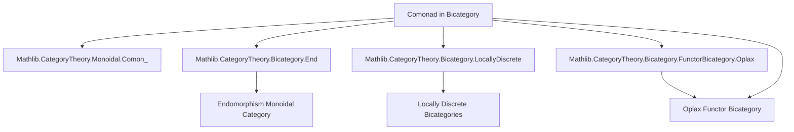
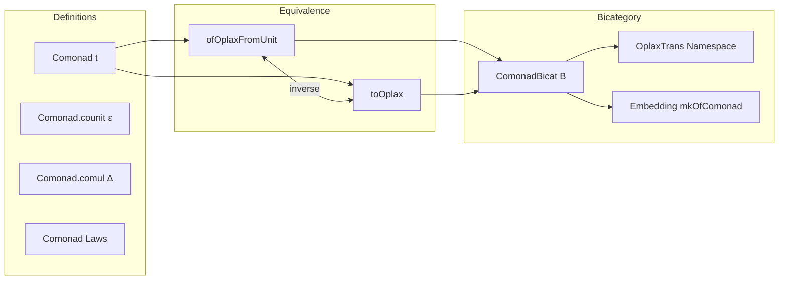

### Technical Brief: `Basic.lean` — Comonads in a Bicategory

---

#### **1. Key Definitions & Theorems**

| Name | Type / Signature | Purpose |
|------|------------------|---------|
| `Comonad {a : B} (t : a ⟶ a)` | `abbrev Comonad t := ComonObj t` | Defines a comonad in a bicategory as a comonoid object in the endomorphism monoidal category $\mathrm{End}(a)$. |
| `Comonad.counit` | `t ⟶ 𝟙 a` | The counit 2-morphism of the comonad. |
| `Comonad.comul` | `t ⟶ t ≫ t` | The comultiplication 2-morphism. |
| `Comonad.counit_comul` | `Δ ≫ ε ▷ t = (λ_ t).inv` | Left counit law (naturality with left unitor). |
| `Comonad.comul_counit` | `Δ ≫ t ◁ ε = (ρ_ t).inv` | Right counit law (naturality with right unitor). |
| `Comonad.comul_assoc` | `Δ ≫ t ◁ Δ = Δ ≫ Δ ▷ t ≫ (α_ t t t).hom` | Coassociativity law (associator coherence). |
| `Comonad.ofOplaxFromUnit` | `LocallyDiscrete (Discrete Unit) ⥤ᵒᵖᴸ B → Comonad (F map (id))` | Constructs a comonad from an oplax functor from the trivial bicategory. |
| `Comonad.toOplax` | `Comonad t → LocallyDiscrete (Discrete Unit) ⥤ᵒᵖᴸ B` | Constructs an oplax functor from a comonad. |
| `ComonadBicat` | `def ComonadBicat (B) := LocallyDiscrete (Discrete Unit) ⥤ᵒᵖᴸ B` | Defines the bicategory of comonads in `B` as the bicategory of oplax functors from the trivial bicategory. |
| `ComonadBicat.mkOfComonad` | `Comonad t → ComonadBicat B` | Embeds a comonad into the bicategory of comonads. |
| `ComonadBicat.obj`, `ComonadBicat.hom` | `ComonadBicat B → B`, `ComonadBicat B → hom` | Extracts the underlying object and 1-morphism of a comonad in `B`. |

---

#### **2. Naming Conventions**

- **Prefixes**:
  - `Comonad.`: Namespace for comonad-related definitions and properties.
  - `ofOplaxFromUnit`, `toOplax`: Directional naming for equivalences between comonads and oplax functors.
  - `mkOfComonad`: Constructor-style naming for embedding a comonad into `ComonadBicat`.
- **Suffixes**:
  - `counit`, `comul`: Standard comonad terminology.
  - `assoc`, `assoc_flip`: For associator-related identities.
- **Notation**:
  - `ε`, `ε[t]`: For `Comonad.counit`.
  - `Δ`, `Δ[t]`: For `Comonad.comul`.

---

#### **3. Tactic Stack**

Frequent tactics used in proofs:
- `simp only [...]`: Simplification with explicit lemmas (e.g., whiskering, associator, unitors).
- `rw [...]`: Rewriting using naturality, functoriality, and coherence laws.
- `apply ...`: Applying known lemmas like `Comonad.comul_assoc`.
- `rw [Category.id_comp]`: Simplifying identity morphism compositions.
- `apply Comonad.comul_assoc`: Direct use of comonad laws.
- `change ...`: Rewriting goal to match known form (e.g., `change 𝟙 t ≫ Δ = Δ`).
- `apply Category.assoc`: Enforcing associativity of composition.

---

#### **4. Proof Logic**

- **Equivalence between comonads and oplax functors**:
  - Construct `ofOplaxFromUnit` and `toOplax` as inverse constructions.
  - Prove coherence conditions using:
    - Functoriality of `F` (e.g., `F.mapComp`, `F.mapId`, `F.map₂_inv_hom`).
    - Monoidal bicategory coherence (unitors, associators).
    - Naturality of oplax structure maps.
- **Bicategory structure on comonads**:
  - Leverages existing bicategory structure on oplax functor categories (`LocallyDiscrete (Discrete Unit) ⥤ᵒᵖᴸ B`).
  - Uses `OplaxTrans` namespace to indicate choice of transformation type (oplax here; lax/pseudonatural variants possible).
- **Embedding lemmas**:
  - `mkOfComonad_hom`, `mkOfComonad_counit`, `mkOfComonad_comul`: Show that embedding preserves structure.

---

#### **5. Imports & Dependencies**

| Import | Purpose |
|--------|---------|
| `Mathlib.CategoryTheory.Bicategory.LocallyDiscrete` | Provides bicategory of locally discrete bicategories (e.g., `LocallyDiscrete (Discrete Unit)`). |
| `Mathlib.CategoryTheory.Bicategory.FunctorBicategory.Oplax` | Defines oplax functor bicategory structure. |
| `Mathlib.CategoryTheory.Bicategory.End` | Provides endomorphism monoidal categories (`End a`). |
| `Mathlib.CategoryTheory.Monoidal.Comon_` | Defines `ComonObj`, the type of comonoid objects in a monoidal category. |

---

#### **6. Mermaid Diagrams**

##### **Dependency Graph**

##### **Overview of File Structure**

---

#### **7. Summary**

This file formalizes comonads in a bicategory `B` as comonoid objects in $\mathrm{End}(a)$, and establishes an equivalence between such comonads and oplax functors from the trivial bicategory $\mathbf{1}$ to `B`. Using this equivalence, it constructs the bicategory of comonads in `B` as the oplax functor bicategory $\mathbf{1} \to B$. The formalization is clean, leveraging existing infrastructure in Mathlib for bicategories, monoidal categories, and oplax functors.

The TODO notes indicate future work on monads, which would require a bicategory structure on lax functors — currently missing.

--- 

Let me know if you'd like a formalization of monads in the same style, or a comparison with the existing `Mathlib.CategoryTheory.Monad` module.
