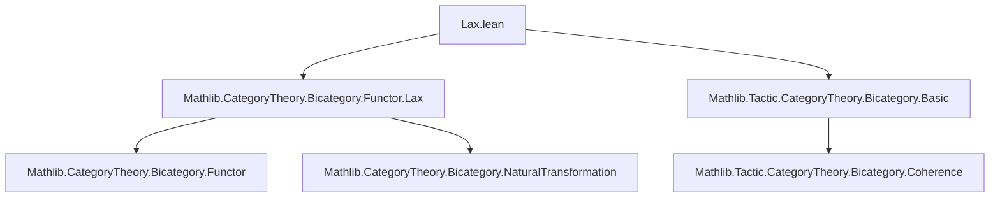

### Technical Brief: `Lax.lean` — Transformations Between Lax Functors in Bicategories

---

#### **1. Key Definitions & Theorems**

| Name | Type / Structure | Purpose |
|------|------------------|---------|
| `LaxTrans F G` | `Structure` | Lax natural transformation between lax functors $F, G : B \rightharpoonup C$. Component 1-morphisms $ \eta_a : F(a) \to G(a) $, with 2-morphisms $ \eta_a \circ G(f) \Rightarrow F(f) \circ \eta_b $ for $f : a \to b$, satisfying coherence laws (naturality, unit, composition). |
| `OplaxTrans F G` | `Structure` | Oplax natural transformation: naturality 2-morphism $F(f) \circ \eta_b \Rightarrow \eta_a \circ G(f)$. Dual coherence laws. |
| `StrongTrans F G` | `Structure` | Strong natural transformation: naturality 2-*isomorphism* $ \eta_a \circ G(f) \cong F(f) \circ \eta_b $, satisfying coherence. |
| `LaxTrans.id F` | `def` | Identity lax transformation: identity 1-morphisms with unitors as naturality cells. |
| `LaxTrans.vComp η θ` | `def` | Vertical composition of lax transformations (1-morphism composition in functor bicategory). |
| `OplaxTrans.id`, `OplaxTrans.vComp` | `def` | Identity and vertical composition for oplax transformations. |
| `StrongTrans.id`, `StrongTrans.vComp` | `def` | Identity and vertical composition for strong transformations (uses `mkOfLax`). |
| `LaxTrans.StrongCore η` | `Structure` | Extra data turning a lax transformation $\eta$ into a strong one: specifies that each naturality 2-morphism is an isomorphism. |
| `StrongTrans.mkOfLax η η'` | `def` | Constructs a strong transformation from a lax transformation equipped with `StrongCore`. |
| `StrongTrans.mkOfLax' η [IsIso …]` | `noncomputable def` | Constructs strong transformation when naturality 2-morphisms are *proven* isomorphisms. |
| `StrongTrans.toLax η` | `def` | Forgets strong structure to underlying lax transformation. |
| `CategoryStruct (B ⥤ᴸ C)` (scoped instances) | `scoped instance` | Three distinct category structures on the type of lax functors: one for each type of transformation (lax, oplax, strong). |

---

#### **2. Naming Conventions**

- **Prefixes**:
  - `LaxTrans.`, `OplaxTrans.`, `StrongTrans.` — namespace prefixes for each transformation type.
  - `vComp` — vertical composition (standard in 2-category literature).
  - `app` — component 1-morphism at an object.
  - `naturality` — the 2-morphism witnessing naturality (direction depends on type).
  - `id` — identity transformation.
- **Suffixes**:
  - `_naturality`, `_id`, `_comp` — coherence conditions for naturality, identity, and composition.
  - `Core` — auxiliary structure (e.g., `StrongCore`) for promoting lax to strong.
- **Auxiliary definitions**:
  - `vCompApp`, `vCompNaturality` — intermediate components for vertical composition.

---

#### **3. Tactic Stack**

| Tactic | Usage |
|--------|-------|
| `cat_disch` | Used in `by`-blocks of structure fields to discharge diagrammatic equalities (automatically handles bicategorical coherence). |
| `bicategory` | Proves equalities of 2-morphisms in bicategories using coherence theorems (e.g., pentagon, triangle identities). |
| `rw [...]` | Rewrites using lemmas like `naturality_naturality`, `naturality_id`, `naturality_comp`. |
| `calc` | Chains equalities in coherence proofs (especially for `vComp` coherence conditions). |
| `whisker_exchange` | Used to rearrange whiskering of 2-morphisms. |
| `← whisker_exchange` | Reverse direction for oplax case. |
| `bicategory` + `rw` + `calc` | Dominant proof pattern: decompose → rewrite coherence → simplify. |

---

#### **4. Proof Logic**

- **Structure definitions** are given by:
  - `app` (1-morphism components),
  - `naturality` (2-morphism witness),
  - three coherence axioms: `naturality_naturality`, `naturality_id`, `naturality_comp`.
- **Vertical composition** (`vComp`) is defined by:
  - `app a := η.app a ≫ θ.app a`,
  - `naturality f` built from associators and component naturality 2-morphisms.
- **Coherence proofs** follow a uniform pattern:
  1. Expand definitions (`vCompApp`, `vCompNaturality`).
  2. Use `bicategory` to rearrange whiskerings and associators.
  3. Apply induction-like rewriting using coherence axioms of `η` and `θ`.
  4. Simplify using `simp`-registered lemmas (`reassoc (attr := simp)`).
- **Strong transformations** are derived from lax ones:
  - `StrongCore` provides the isomorphism data.
  - `mkOfLax` lifts lax → strong.
  - `mkOfLax'` uses `IsIso` to automatically construct `StrongCore`.

---

#### **5. Imports & Dependencies**

| Import | Role |
|--------|------|
| `Mathlib.CategoryTheory.Bicategory.Functor.Lax` | Defines lax functors (`B ⥤ᴸ C`) and their composition. |
| `Mathlib.Tactic.CategoryTheory.Bicategory.Basic` | Provides `cat_disch`, `bicategory`, and other tactics for bicategorical reasoning. |
| `Category`, `Bicategory` | Opened namespaces for morphism/2-morphism operations (`≈`, `≈≫`, `◁`, `▷`, `α_`, `λ_`, `ρ_`, etc.). |

---

#### **6. Mermaid Diagrams**

##### **Dependency Graph (Module-Level)**



##### **Overview of Theory Flow**

```mermaid
graph LR
  subgraph Functors
    F[Lax Functors B ⥤ᴸ C]
  end

  subgraph Transformations
    L[LaxTrans F G]
    O[OplaxTrans F G]
    S[StrongTrans F G]
  end

  subgraph Categories
    CL[Category (LaxTrans)]
    CO[Category (OplaxTrans)]
    CS[Category (StrongTrans)]
  end

  F -->|objects| CL
  F -->|objects| CO
  F -->|objects| CS

  L -->|vComp| CL
  O -->|vComp| CO
  S -->|vComp| CS

  L -- StrongCore --> S
  L -- mkOfLax' --> S
  S -- toLax --> L
```

##### **Coherence Proof Pattern (Vertical Composition)**

```mermaid
graph TD
  A[Expand vCompApp / vCompNaturality] --> B[Apply bicategory tactic]
  B --> C[Use naturality_naturality/id/comp of η, θ]
  C --> D[Rewrite with whisker_exchange]
  D --> E[Apply simp lemmas (reassoc)]
  E --> F[Prove coherence condition]
```

---

#### **7. References**

- Johnson & Yau, *2-Dimensional Categories*, §4.2 — foundational source for lax/oplax/strong transformations in bicategories.

--- 

This file formalizes the foundational 2-categorical structure of the bicategory of lax functors and transformations, enabling higher-categorical reasoning in Lean.
