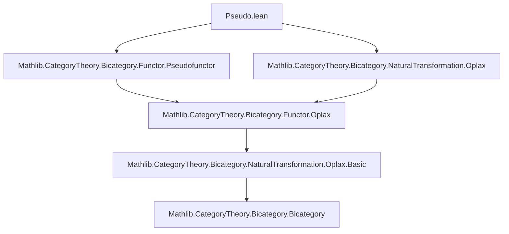

Here is the structured technical brief extracted from `Pseudo.lean`:

---

### **1. Key Definitions & Theorems**

| Name | Type / Signature | Purpose |
|------|------------------|---------|
| `StrongTrans F G` | `Structure` | A strong transformation between pseudofunctors `F, G : B ⥤ᵖ C`: consists of component 1-morphisms `app a`, invertible 2-morphisms `naturality f`, and coherence axioms (`naturality_naturality`, `naturality_id`, `naturality_comp`). |
| `toOplax η` | `η : StrongTrans F G → Oplax.StrongTrans F.toOplax G.toOplax` | Forgets the pseudofunctor structure and views a strong transformation as a strong transformation of underlying oplax functors. |
| `mkOfOplax η` | `η : Oplax.StrongTrans F.toOplax G.toOplax → StrongTrans F G` | Lifts a strong transformation of oplax functors to a strong transformation of pseudofunctors (inverse of `toOplax`). |
| `StrongTrans.id F` | `StrongTrans F F` | Identity strong transformation: `app a := 𝟙 (F.obj a)`, `naturality f := ρ_{F.map f} ≪≫ λ_{F.map f}⁻¹`. |
| `StrongTrans.vcomp η θ` | `StrongTrans F G → StrongTrans G H → StrongTrans F H` | Vertical composition of strong transformations, defined via `mkOfOplax` on oplax vertical composition. |
| `StrongTrans.categoryStruct` | `CategoryStruct (B ⥤ᵖ C)` | Induces a category structure on pseudofunctors with morphisms = strong transformations. |
| `naturality_id_hom`, `naturality_id_iso`, `naturality_id_inv` | Lemmas about `α.naturality (𝟙 a)` | Explicit formulas for the hom/inverse components and iso decomposition of the identity naturality constraint. |
| `naturality_naturality_hom`, `naturality_naturality_iso`, `naturality_naturality_inv` | Lemmas for `α.naturality g` when `f ≅ g` | Express how naturality constraints behave under isomorphisms of 1-cells. |
| `naturality_comp_hom`, `naturality_comp_iso`, `naturality_comp_inv` | Lemmas for `α.naturality (f ≫ g)` | Decompose naturality constraints for composite 1-cells into associators, unitors, and component constraints. |

---

### **2. Naming Conventions**

- **Prefixes**:
  - `naturality_`: properties of the 2-isomorphism `naturality f`.
  - `whiskerLeft_`, `whiskerRight_`: lemmas about interaction with left/right whiskering.
  - `id_`, `comp_`: for identity and composition coherence.
- **Suffixes**:
  - `_hom`, `_inv`: refer to the underlying 2-morphism or its inverse.
  - `_iso`: refer to the full 2-isomorphism (as an iso in the hom-category).
- **Structure fields**:
  - `app`, `naturality`, `naturality_naturality`, `naturality_id`, `naturality_comp`.

---

### **3. Tactic Stack**

- `cat_disch`: Used in structure definitions to discharge category-theoretic goals (likely a custom tactic for bicategorical reasoning).
- `simp`, `simp_rw`, `ext`: Heavily used in lemmas to simplify and extend equalities of 2-cells.
- `rw [← assoc, ← IsIso.comp_inv_eq]`: Standard rewriting for inverses and associators.
- `reassoc (attr := simp)`: Custom attribute for automatic associator reordering in `simp`-based proofs.
- `to_app`, `to_app (attr := reassoc)`: Custom attributes for lifting lemmas to the level of `app` components.

---

### **4. Proof Logic**

- **Structure definitions** are discharged using `cat_disch`, indicating reliance on automated bicategorical reasoning.
- **Lemmas** follow a pattern:
  1. Prove the hom-component version (e.g., `naturality_id_hom`) using `simp` and inverse laws.
  2. Derive the iso version (e.g., `naturality_id_iso`) by extending the hom-component equality with `ext`.
  3. Derive the inverse version (e.g., `naturality_id_inv`) from the iso version.
- **Lifting lemmas** (e.g., `whiskerLeft_naturality_naturality`) are proven by reducing to the oplax case via `toOplax` and using corresponding oplax lemmas.
- **Vertical composition** is defined via `mkOfOplax`, ensuring coherence is inherited from oplax transformations.

---

### **5. Imports**

- `Mathlib.CategoryTheory.Bicategory.Functor.Pseudofunctor`: Defines pseudofunctors and their basic theory.
- `Mathlib.CategoryTheory.Bicategory.NaturalTransformation.Oplax`: Defines oplax natural transformations and strong oplax transformations.

---

### **6. Theory Overview & Dependencies**

#### **Mermaid Diagram: Module Dependencies**



#### **Mermaid Diagram: Theory Flow in `Pseudo.lean`**

```mermaid
graph TD
  A[Pseudofunctors B ⥤ᵖ C] --> B[Strong Transformations StrongTrans F G]
  B --> C[Embedding into Oplax.StrongTrans]
  C --> D[Lifting mkOfOplax back]
  D --> E[CategoryStruct on B ⥤ᵖ C]
  E --> F[Identity & Composition Laws]
  F --> G[Explicit coherence lemmas (hom/iso/inv forms)]
```

#### **Scope & Purpose**

This file formalizes **strong transformations** between pseudofunctors in a bicategorical setting, establishing:
- A categorical structure on the hom-class of pseudofunctors,
- Explicit coherence laws for identities and compositions,
- Equivalence between strong transformations of pseudofunctors and strong oplax transformations of their underlying oplax functors.

It serves as a foundational step toward constructing 2-categories of pseudofunctors, natural transformations, and modifications.

--- 

Let me know if you'd like a formalization roadmap or a comparison with other transformation types (e.g., lax, oplax).
