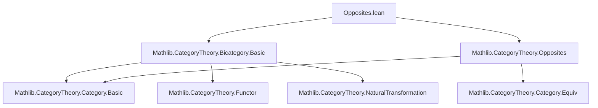
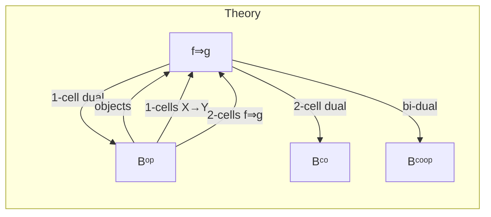

### Technical Brief: Opposites.lean — Bicategorical Opposites in Lean 4

---

#### **1. Key Definitions & Theorems**

| Name | Type / Signature | Purpose |
|------|------------------|---------|
| `Hom2.{w} {a b : Bᵒᵖ} (f g : a ⟶ b)` | `Structure` | Defines 2-morphisms in `Bᵒᵖ` as 2-morphisms in `B` between the *unop*’d 1-cells: `f.unop ⟶ g.unop`. |
| `op2' (η : f.unop ⟶ g.unop)` | `Hom2 f g` | Constructor for `Hom2`, embedding a 2-cell in `B` into `Bᵒᵖ`. |
| `op2 (η : f ⟶ g)` | `f.op ⟶ g.op` in `Bᵒᵖ` | Specialized constructor for `op2'` when `f, g : a ⟶ b` in `B`. |
| `unop2 (η : f ⟶ g)` | `f.unop ⟶ g.unop` in `B` | Projection from `Hom2` back to `B`. |
| `homCategory` | `Category (a ⟶ b)` in `Bᵒᵖ` | Equips hom-objects of `Bᵒᵖ` with a category structure (objects = 1-cells, morphisms = 2-cells). |
| `opFunctor (a b : B)` | `(a ⟶ b) ⥤ (op b ⟶ op a)` | Functor induced by `op` on hom-categories: sends `f ↦ f.op`, `η ↦ op2 η`. |
| `unopFunctor (a b : Bᵒᵖ)` | `(a ⟶ b) ⥤ (unop b ⟶ unop a)` | Inverse functor on hom-categories for `Bᵒᵖ`. |
| `bicategory` | `Bicategory Bᵒᵖ` | Constructs the 1-cell dual bicategory `Bᵒᵖ`. |
| `whiskerLeft`, `whiskerRight` | `f ⟶ g ⇒ h ∘ f ⟶ h ∘ g`, etc. | Defined via `op2` and unop’d whiskering in `B`. |
| `associator`, `leftUnitor`, `rightUnitor` | Natural isomorphisms | Reversed coherence data from `B`, e.g., `α^{Bᵒᵖ}_{f,g,h} = (α^B_{h.unop,g.unop,f.unop})⁻ᵐᵒᵖ`. |
| `op2 {η : f ≅ g}` | `f.op ≅ g.op` | Lifts 2-isomorphisms to `Bᵒᵖ`. |
| `unop2 {η : f ≅ g}` | `f.unop ≅ g.unop` | Projects 2-isomorphisms in `Bᵒᵖ` back to `B`. |

**Key simp lemmas** (used for normalization):
- `op2_comp`, `op2_id`, `unop2_comp`, `unop2_id`
- `op2_associator`, `op2_leftUnitor`, `op2_rightUnitor`
- `op2_whiskerLeft`, `op2_whiskerRight`
- `unop2_op2`, `op2_unop2`, `unop2_op`, `op2_unop` (for isos)

---

#### **2. Naming Conventions**

| Pattern | Meaning | Examples |
|--------|---------|----------|
| `op2` | Embedding of 2-cells from `B` to `Bᵒᵖ` | `op2 η`, `op2' η`, `op2 f`, `op2 η.symm` |
| `unop2` | Projection of 2-cells from `Bᵒᵖ` to `B` | `unop2 η`, `unop2 η⁻¹` |
| `opFunctor`, `unopFunctor` | Hom-category functors induced by `op`/`unop` | `opFunctor a b`, `unopFunctor a b` |
| `op2_unop`, `unop2_op` | Inverse equivalences on isos | `op2_unop η`, `unop2_op η` |
| `op2'_iff_unop2` (implicit) | `op2'` and `unop2` are inverses | `op2_unop2`, `unop2_op2` |

---

#### **3. Tactic Stack**

| Tactic | Usage Frequency | Purpose |
|--------|-----------------|---------|
| `rfl` | Very high | Proving equalities of structures/constructors (e.g., `op2' η = op2' η`) |
| `simp` / `simp only [...]` | High | Simplifying whiskering, unitors, associators using `@[simp]` lemmas |
| `congrArg op2` | Medium | Proving equality of 2-cells by reducing to `B` |
| `by simp` / `by aesop` | Medium | In `bicategory` instance proofs (e.g., `pentagon`, `triangle`) |
| `congrArg` + `by simp` | Medium | Proving coherence laws in `Bᵒᵖ` via transport from `B` |
| `ext` | Low | For extensionality of natural transformations (if needed) |

---

#### **4. Proof Logic**

The proofs follow a **transport-and-reverse** pattern:

1. **Define hom-categories** (`homCategory`) using `Hom2`, with identity and composition pulled back from `B` via `unop2`.
2. **Define whiskering** in `Bᵒᵖ` by:
   - Unop the 2-cell (`unop2 η`)
   - Whisker in `B` (`f.unop ◁ unop2 η`)
   - Re-embed via `op2`
3. **Define coherence isomorphisms** (associator, unitors) by:
   - Taking the corresponding coherence in `B` on *reversed* 1-cells (`h.unop`, `g.unop`, `f.unop`)
   - Applying `op2_unop.symm` to get back to `Bᵒᵖ`
4. **Verify bicategory axioms**:
   - Use `congrArg op2` to reduce to `B`
   - Apply known axioms in `B` (e.g., pentagon, triangle)
   - Use `simp` to normalize using `op2_*` lemmas

This yields a **1-cell dual** (only 1-cells reversed, 2-cells unchanged).

---

#### **5. Imports**

| Module | Role |
|--------|------|
| `Mathlib.CategoryTheory.Bicategory.Basic` | Core bicategory definitions: `Bicategory`, `whiskerLeft`, `associator`, etc. |
| `Mathlib.CategoryTheory.Opposites` | `Opposite`, `op`, `unop`, `op₂`, `unop₂` for categories and functors |

---

#### **6. Mermaid Diagrams**

##### **Dependency Graph (Module-Level)**



##### **Overview of Bicategorical Opposites**



##### **Hom-Category Functors**

```mermaid
graph LR
  A[a ⟶ b] -->|opFunctor a b| B[op b ⟶ op a]
  B -->|unopFunctor (op b) (op a)| A

  A -.->|op2| B
  B -.->|unop2| A
```

---

#### **7. Notes & Future Work**

- **TODO items** from docstring:
  - Define `2-cell dual` `Cᶜᵒ` (reverse only 2-cells).
  - Relate `LocallyDiscrete Cᵒᵖ` and `(LocallyDiscrete C)ᵒᵖ`.
- **WIP**: `Cᶜᵒᵒᵖ` (full dual) by Christian Merten.
- **Design choice**: `Bᵒᵖ` preserves 2-cell direction — standard for *1-cell dual*.
- **Notation**: `op2` is overloaded: used for both 2-cells (`η : f ⟶ g`) and isos (`η : f ≅ g`), via `mapIso`.

--- 

✅ **Summary**: This file formalizes the *1-cell dual* bicategory `Bᵒᵖ`, with careful coherence transport and a clean interface via `op2`/`unop2`. It follows Lean’s `@[simps]` and `simp`-friendly conventions, enabling smooth reasoning about duals in higher category theory.
