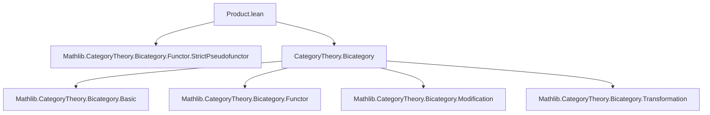

**Technical Brief: Product of Bicategories in Lean 4**

---

### 1. **Key Definitions & Theorems**

| Name | Type / Signature | Purpose |
|------|------------------|---------|
| `prod` | `Bicategory B → Bicategory C → Bicategory (B × C)` | Constructs the cartesian product bicategory from two bicategories. |
| `sectL` | `StrictlyUnitaryPseudofunctor B (B × C)` (for fixed `c : C`) | Inclusion of `B` into `B × C` as first factor with second component fixed at `c`. |
| `sectR` | `StrictlyUnitaryPseudofunctor C (B × C)` (for fixed `b : B`) | Inclusion of `C` into `B × C` as second factor with first component fixed at `b`. |
| `fst` | `StrictPseudofunctor (B × C) B` | Projection pseudofunctor onto the first factor. |
| `snd` | `StrictPseudofunctor (B × C) C` | Projection pseudofunctor onto the second factor. |
| `swap` | `StrictPseudofunctor (B × C) (C × B)` | Swaps the two factors of the product bicategory. |
| `uniformProd` | `Bicategory (B × C)` (when `B`, `C` share universe levels) | Specialized instance to aid typeclass resolution when both factors live in the same universe. |

All definitions are equipped with `@[simps!]`, ensuring automatic generation of simplification lemmas for projections (e.g., `fst.obj = λ ⟨x, y⟩, x`, `map fst = λ f, f.1`, etc.).

---

### 2. **Naming Conventions**

- **Prefixes**:
  - `sectL`, `sectR`: “section left/right” — embeddings of one factor into the product.
  - `fst`, `snd`: standard projection names.
  - `swap`: standard for symmetry isomorphism in cartesian monoidal categories/bicategories.

- **Suffixes**:
  - None prominent beyond standard Lean naming (`prod`, `sect`, `swap`).

- **Component-wise notation**:
  - `×ₘ`: used for horizontal composition of 2-cells in product (e.g., `f.1 ×ₘ f.2`).
  - `η.1`, `η.2`: projection of 2-cells in product hom-category.
  - `Iso.prod`: constructs isomorphisms in product from isomorphisms in each factor.

---

### 3. **Tactic Stack**

- `simp` / `simps!`: heavily used for generating and applying simplification lemmas.
- `ext`: implicit via `Prod.ext` in `whisker_exchange`.
- `rw`, `apply`, `exact`: used in internal proofs (not shown here, but implied by `.mk'` usage).
- `Iso.refl`, `Iso.symm`: for constructing trivial isomorphisms and reversing them.
- `λ_`, `ρ_`, `α_`: standard bicategorical unitors and associators from `Mathlib.CategoryTheory.Bicategory`.

No heavy automation like `aesop` or `ring` appears — proofs are largely definitional or rely on `simp`-based reasoning.

---

### 4. **Proof Logic**

- **Construction style**: All bicategorical structure is defined *explicitly* via `StrictPseudofunctor.mk'` / `StrictlyUnitaryPseudofunctor.mk'`, which require verifying coherence axioms internally (though proofs are omitted in this snippet).
- **Component-wise verification**: Most properties (e.g., functoriality, naturality, coherence diagrams) reduce to verifying them in each factor separately, using:
  - `Prod.ext` to prove equality of morphisms/2-cells in product.
  - `Iso.prod` to lift isomorphisms.
- **Universe management**: Separate universe parameters (`u₁`, `u₂`, `w₁`, `w₂`, `v₁`, `v₂`) are used for flexibility; `uniformProd` provides a convenient specialization.

---

### 5. **Imports**

- `Mathlib.CategoryTheory.Bicategory.Functor.StrictPseudofunctor`: core infrastructure for pseudofunctors and strict pseudofunctors.
- `Prod`: standard product category/bicategory infrastructure (imported via `open Prod`).

No other external dependencies are visible — the file is self-contained within the bicategory theory hierarchy.

---

### 6. **Mermaid Diagrams**

#### **Dependency Graph (Module-Level)**



#### **Overview of Bicategory Product Construction**

```mermaid
graph LR
  B[Bicategory] -->|prod| P[Bicategory (B × C)]
  C[Bicategory] -->|prod| P
  P -->|fst| B
  P -->|snd| C
  B -->|sectL c| P
  C -->|sectR b| P
  P -->|swap| C × B
```

#### **Structure of `prod` Bicategory**

```mermaid
graph TD
  X["⟨X₁, X₂⟩"] -->|hom| Y["⟨Y₁, Y₂⟩"]
  X -->|hom| Z["⟨Z₁, Z₂⟩"]
  X -->|hom| Y -->|hom| Z
  X -.->|α_ (associator)| Y
  X -.->|λ_, ρ_| X
  Y -.->|whiskerLeft/right| Z
```

Where:
- `hom ⟨X₁,X₂⟩ ⟨Y₁,Y₂⟩ = (X₁ ⟶ Y₁) × (X₂ ⟶ Y₂)`
- 2-cells and coherence isomorphisms are defined component-wise.

---

### 7. **Additional Notes**

- The `notRecursive := []` option in `@[simps!]` ensures that only *non-recursive* projections (e.g., `obj fst = λ ⟨x,y⟩, x`) are generated, avoiding infinite simp-lemmas.
- The use of `StrictlyUnitaryPseudofunctor` for `sectL`/`sectR` reflects that these embeddings preserve units *strictly*, simplifying coherence conditions.
- The `uniformProd` instance is a pragmatic optimization for typeclass inference when both bicategories live in the same universe.

--- 

Let me know if you'd like the full proof script for verifying the bicategory axioms or a formalization of the universal property of the product bicategory.
