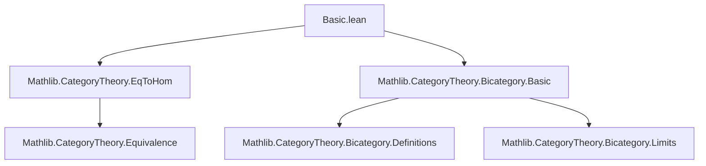
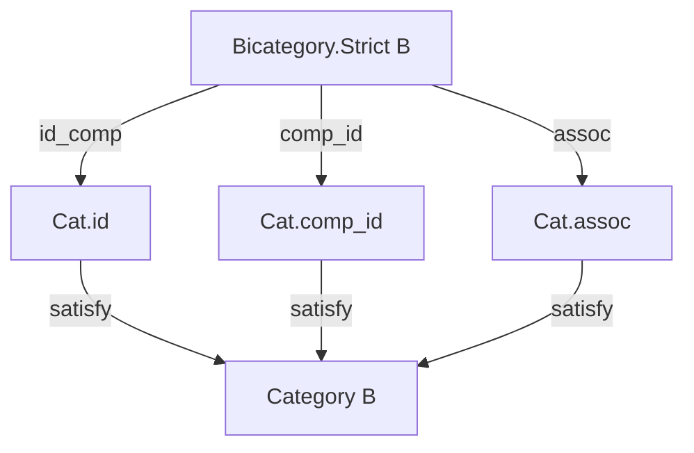

### Technical Brief: `Basic.lean` — Strict Bicategories in Lean 4

---

#### **1. Key Definitions & Theorems**

| Name | Type / Signature | Purpose |
|------|------------------|---------|
| `Bicategory.Strict` | `class Bicategory.Strict : Prop` | Defines a *strict bicategory* (i.e., strict 2-category) by requiring unitors and associators to be *equalities* via `eqToIso`. |
| `id_comp` | `∀ {a b : B} (f : a ⟶ b), 𝟙 a ≫ f = f` | Left identity law for composition. |
| `comp_id` | `∀ {a b : B} (f : a ⟶ b), f ≫ 𝟙 b = f` | Right identity law for composition. |
| `assoc` | `∀ {a b c d : B} (f g h), (f ≫ g) ≫ h = f ≫ g ≫ h` | Associativity of composition. |
| `leftUnitor_eqToIso` | `∀ f, λ_ f = eqToIso (id_comp f)` | Left unitor is the isomorphism induced by `id_comp`. |
| `rightUnitor_eqToIso` | `∀ f, ρ_ f = eqToIso (comp_id f)` | Right unitor is the isomorphism induced by `comp_id`. |
| `associator_eqToIso` | `∀ f g h, α_ f g h = eqToIso (assoc f g h)` | Associator is the isomorphism induced by `assoc`. |
| `StrictBicategory.category` | `instance [Bicategory.Strict B] : Category B` | Equips a strict bicategory with a category structure (using the above laws). |
| `whiskerLeft_eqToHom` | `f ◁ eqToHom η = eqToHom (congr_arg₂ (· ≫ ·) rfl η)` | Interaction of left whiskering with `eqToHom`. |
| `eqToHom_whiskerRight` | `eqToHom η ▷ h = eqToHom (congr_arg₂ (· ≫ ·) η rfl)` | Interaction of right whiskering with `eqToHom`. |

> **Note**: All equalities are *definitional* in the sense that the coherence isomorphisms of a bicategory are *literally* `eqToIso` of the corresponding equality proofs — crucial for avoiding coherence issues in proof assistants.

---

#### **2. Naming Conventions**

- **Prefixes**:
  - `id_`, `comp_`, `assoc_`: Standard categorical laws.
  - `leftUnitor_`, `rightUnitor_`, `associator_`: Coherence isomorphisms.
  - `eqToIso`, `eqToHom`: From `Eq` to isomorphism/hom (standard in Lean’s `Eq`-based reasoning).
  - `whiskerLeft_`, `whiskerRight_`: Action of 1-morphisms on 2-morphisms.

- **Suffixes**:
  - `_eqToIso`: Indicates that a coherence isomorphism is *defined* as `eqToIso` of a proof.
  - `_eqToHom`: Indicates that a 2-morphism is given by `eqToHom` of an equality.

- **No `is_` prefix** — this is a *property* (`Prop`-valued class), not a structure with data.

---

#### **3. Tactic Stack**

Frequent tactics used in proofs (as seen in `by cat_disch` and `simp` usage):

| Tactic | Role |
|--------|------|
| `cat_disch` | Custom tactic (likely from `Mathlib.CategoryTheory`) to discharge category-theoretic goals using definitional equalities and axioms. |
| `simp only [...]` | Simplifies using specific lemmas (e.g., `whiskerLeft_id`, `eqToHom_refl`). |
| `cases η` | Eliminates equality hypotheses (e.g., `η : g = h`) by case analysis on reflexive equality. |
| `congr_arg₂` | Used to lift equalities through binary operations (e.g., composition `· ≫ ·`). |

> The proofs are largely *definitional* — no heavy automation like `ring`, `linarith`, or `interval_cases` is needed.

---

#### **4. Proof Logic**

- **Structure of proofs**:
  1. **Induction on equalities**: For lemmas involving `eqToHom`/`eqToIso`, proofs proceed by `cases η` (since `η : f = g` is an identity type, only `rfl` exists).
  2. **Definitional simplification**: After case analysis, `simp only [...]` reduces both sides to identical terms (e.g., `whiskerLeft_id`).
  3. **Coherence via `eqToIso`**: The class axioms assert that coherence isomorphisms *are* `eqToIso` of the categorical laws — so no higher coherence proofs are needed.

- **No induction on objects/morphisms**: Since strictness is a *property* (not structure), proofs are purely equational.

---

#### **5. Imports & Dependencies**

| Import | Purpose |
|--------|---------|
| `Mathlib.CategoryTheory.EqToHom` | Provides `eqToHom`, `eqToIso`, and basic lemmas about transport along equalities. |
| `Mathlib.CategoryTheory.Bicategory.Basic` | Defines bicategories, 2-morphisms, unitors (`λ_`, `ρ_`), associators (`α_`), whiskering, etc. |

> This module builds *on top of* bicategory theory, specializing to the strict case.

---

#### **6. Mermaid Diagrams**

##### **Dependency Graph (Module-Level)**



##### **Theoretical Overview (Strict Bicategory as a Special Case)**

```mermaid
graph LR
  subgraph Bicategory
    B[Bicategory] -->|coherence laws| L[Left unitors λ_]
    B -->|coherence laws| R[Right unitors ρ_]
    B -->|coherence laws| A[Associators α_]
  end

  subgraph StrictBicategory
    S[Bicategory.Strict] -->|axiom| L
    S -->|axiom| R
    S -->|axiom| A
    S -->|defines| C[Category B]
  end

  L -->|λ_ f = eqToIso (id_comp f)| E[eqToIso]
  R -->|ρ_ f = eqToIso (comp_id f)| E
  A -->|α_ f g h = eqToIso (assoc f g h)| E

  E -->|from Eq| F[Eq]
```

##### **Data Flow in `StrictBicategory.category` Instance**



---

#### **7. Summary**

This file formalizes **strict bicategories** (a.k.a. strict 2-categories) in Lean 4, using `eqToIso` to bridge the gap between *equality* (definitional) and *isomorphism* (categorical). It leverages the fact that in a strict setting, all coherence isomorphisms are *trivial* — they are just transports along the usual categorical laws. The module is foundational: it enables downstream development (e.g., strict 2-categories of categories, functors, natural transformations) without coherence overhead.

> **Design Insight**: By making strictness a `Prop`-valued class, Lean avoids storing redundant data while still allowing typeclass inference to recover the underlying category structure.
