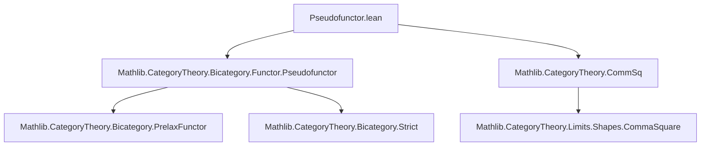
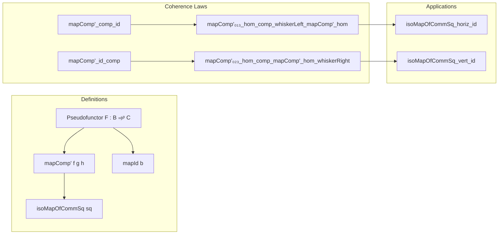

### Technical Brief: `Pseudofunctor.lean`

---

#### **1. Key Definitions & Theorems**

| Name | Type / Signature | Purpose |
|------|------------------|---------|
| `mapComp'` | `F.mapComp' f g h : F.map f ≫ F.map g ≅ F.map h` (when `f ≫ g = h`) | Flexible variant of `mapComp`, allowing arbitrary mediating morphism `h` in a commuting triangle. Used to handle non-strict composition. |
| `mapId'` | Implicitly defined via `mapComp' f (𝟙 _) f` and related lemmas | Not explicitly named, but `mapId` and `mapId'` are related via unitors and `mapComp'`. |
| `isoMapOfCommSq` | `F.isoMapOfCommSq sq : F.map t ≫ F.map r ≅ F.map l ≫ F.map b` | Constructs the canonical isomorphism induced by a commutative square `t ≫ r = l ≫ b` under a pseudofunctor `F`. |
| `mapComp'_comp_id` | `F.mapComp' f (𝟙 _) f = (ρ_ _).symm ≪≫ whiskerLeftIso _ (F.mapId b₁).symm` | Describes how `mapComp'` behaves when composed with identity on the right. |
| `mapComp'_id_comp` | `F.mapComp' (𝟙 _) f f = (λ_ _).symm ≪≫ whiskerRightIso (F.mapId b₀).symm _` | Describes behavior of `mapComp'` when composed with identity on the left. |
| `mapComp'₀₁₃_hom_comp_whiskerLeft_mapComp'_hom` | Hom-component compatibility for associativity in a 3-morphism diagram | Core associativity coherence law for `mapComp'`. |
| `mapComp'₀₁₃_hom`, `mapComp'₀₁₃_inv`, etc. | Explicit formulas for hom/inverse parts of `mapComp'` in terms of associators and other `mapComp'`s | Enables manipulation and simplification of coherence isomorphisms. |
| `isoMapOfCommSq_horiz_id`, `isoMapOfCommSq_vert_id` | Special cases of `isoMapOfCommSq` when one pair of arrows are identities | Simplify coherence isomorphisms in degenerate squares (e.g., identity squares). |

---

#### **2. Naming Conventions**

- **Prefixes**:
  - `mapComp'` — flexible composition map (non-strict mediating morphism).
  - `mapId` — standard identity map under pseudofunctor.
  - `isoMapOfCommSq` — isomorphism induced from a *commutative square*.
- **Suffixes**:
  - `_hom`, `_inv` — projections of an isomorphism to its forward/backward component.
  - `_assoc`, `_assoc_hom`, `_assoc_inv` — variants used in associativity lemmas.
  - `_horiz_id`, `_vert_id` — special cases for horizontal/vertical identities.
- **Pattern**:
  - `mapComp'₀₁₃_...` — refers to composite `f₀₁ ≫ f₁₃ = f₀₃` (indices 0,1,3).
  - `mapComp'₀₂₃_...` — composite `f₀₂ ≫ f₂₃ = f₀₃` (indices 0,2,3).
  - `whiskerLeft_...`, `whiskerRight_...` — whiskering actions.

---

#### **3. Tactic Stack**

- **Core tactics**:
  - `ext` — extensionality for morphisms/isomorphisms.
  - `rw [...]` — rewriting using lemmas, definitions, and equalities.
  - `dsimp` — definitional simplification.
  - `simp` — simplification using `@[simp]` lemmas and `@[to_app]` annotations.
  - `subst` — substitution using equalities (e.g., `h₀₂`, `h₁₃`, `hf`).
  - `have := ...; simp at this` — intermediate lemma extraction.
  - `cancel_epi`, `cancel_mono` — categorical cancellation lemmas.
  - `cat_disch` — tactic for discharging trivial commuting diagrams in bicategories.

- **Custom annotations**:
  - `@[to_app (attr := reassoc)]` — enables `reassoc` attribute for associator-aware rewriting.
  - `@[reassoc]` — for lax/oplax variants.

---

#### **4. Proof Logic**

- **Inductive structure**:
  - Proofs rely heavily on **substitution of equalities** (`subst`) to reduce to canonical forms (e.g., `f₀₁ ≫ f₁₂ = f₀₂`, `f₁₂ ≫ f₂₃ = f₁₃`, `f₀₁ ≫ f₁₃ = f`).
  - Then apply **definitional simplification** (`dsimp`, `simp`) using:
    - `mapComp'` definition,
    - `Strict.rightUnitor_eqToIso`, `Strict.leftUnitor_eqToIso`,
    - `F.map₂_comp_assoc`, `F.map₂_id`, etc.
  - Use **coherence laws** (e.g., `F.map₂_associator`) to relate associators and whiskered maps.
  - For associativity lemmas, proofs often proceed by:
    1. Substituting equalities to reduce to a single diagram,
    2. Applying `map₂_associator`,
    3. Simplifying using `Strict.associator_eqToIso`,
    4. Rearranging whiskerings and unitors.

- **Isomorphism reasoning**:
  - Use `Iso.hom_inv_id`, `Iso.inv_hom_id`, `cancel_epi`, `cancel_mono` to manipulate isomorphisms.
  - `≈≫` (horizontal composition of isos) is central to expressing naturality and coherence.

---

#### **5. Imports**

- `Mathlib.CategoryTheory.Bicategory.Functor.Pseudofunctor` — core definitions of pseudofunctors, `mapComp`, `mapId`, etc.
- `Mathlib.CategoryTheory.CommSq` — definition and basic properties of commutative squares (`CommSq`).

---

#### **6. Mermaid Diagrams**

##### **Dependency Graph (Module Level)**



##### **Overview of Theory Flow**



##### **Commutative Square → Isomorphism Pipeline**

```mermaid
flowchart LR
  A[CommSq t l r b] -->|def| B[isoMapOfCommSq sq]
  B --> C[F.map t ≫ F.map r ≅ F.map l ≫ F.map b]
  C -->|simplify| D[whiskerRightIso (F.mapId X₁) (F.map f) ...]
  style A fill:#f9f,stroke:#333
  style D fill:#bbf,stroke:#333
```

---

#### **7. Summary**

This file formalizes the **coherence theory of pseudofunctors from strict bicategories**, with emphasis on:
- Behavior of `mapComp'` with identities and associativity,
- Construction of canonical isomorphisms from **commutative squares**,
- Explicit formulas for hom/inverse components of coherence isomorphisms.

It serves as a foundational module for higher categorical constructions (e.g., descent, Grothendieck constructions, bicategorical limits), where precise control over coherence isomorphisms is essential.

The proofs are highly structured, leveraging:
- Strictness assumptions to simplify unitors/associators,
- Categorical cancellation and whiskering lemmas,
- `simp`-friendly `@[to_app]` annotations for automation.

The `LaxFunctor` and `OplaxFunctor` sections mirror the pseudofunctor case, showing how the same coherence patterns adapt to lax/oplax variants.
