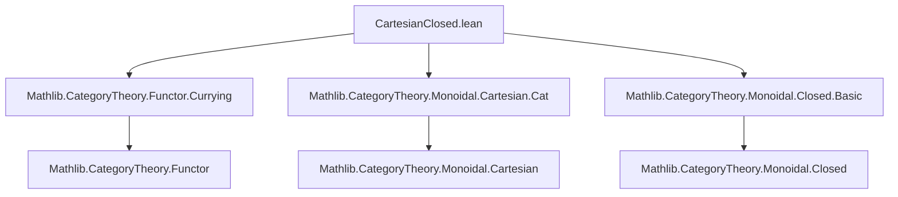

**Technical Brief: CartesianClosed.lean**

---

### 1. KEY DEFINITIONS & THEOREMS

| Name | Type / Signature | Purpose |
|------|------------------|---------|
| `exp` | `def exp : Cat ⥤ Cat` | For a fixed category `C`, `exp C` is the endofunctor on `Cat` sending `D ↦ (C ⥤ D)` and `F ↦ (whiskeringRight _ _ _).obj F.toCatHom`. Models exponentiation in a Cartesian closed structure. |
| `curryingIso` | `def curryingIso : Cat.of (C ⥤ D ⥤ E) ≅ Cat.of (C × D ⥤ E)` | Isomorphism of categories expressing currying: bifunctors `C × D → E` ↔ functors `C → (D → E)`. |
| `flippingIso` | `def flippingIso : Cat.of (C ⥤ D ⥤ E) ≅ Cat.of (D ⥤ C ⥤ E)` | Isomorphism expressing symmetry of product: swapping arguments of a bifunctor. |
| `closed` | `instance closed : Closed (Cat.of C)` | Shows `(Cat.of C)` is closed: the internal hom `ihom (Cat.of C)` has right adjoint `exp C`. |
| `cartesianClosed` | `instance cartesianClosed : MonoidalClosed Cat.{u, u}` | `Cat` is monoidal closed under Cartesian product (`×`). |
| `ihom_obj` | `@[simp] lemma ihom_obj : (ihom (Cat.of C)).obj (Cat.of D) = Cat.of (C ⥤ D)` | Describes the internal hom object: `C ⟹ D ≅ C ⥤ D`. |
| `ihom_map` | `@[simp] lemma ihom_map : (ihom (Cat.of C)).map F.toCatHom = ((whiskeringRight _ _ _).obj F).toCatHom` | Describes action of internal hom on morphisms: precomposition via right whiskering. |

---

### 2. NAMING CONVENTIONS

- **Prefixes**:
  - `exp` — exponentiation functor (as in `exp C`).
  - `ihom` — internal hom (standard in monoidal closed categories).
  - `currying`, `flipping` — standard categorical operations on functors.
- **Suffixes**:
  - `_obj`, `_map` — object and morphism parts of functors/natural transformations.
  - `_Iso` — categorical isomorphisms (e.g., `curryingIso`, `flippingIso`).
- **`toCatHom`** — coercion from a functor to the corresponding morphism in `Cat`.
- **`whiskeringRight _ _ _`** — standard notation for right whiskering of natural transformations.

---

### 3. TACTIC STACK

- `rw`, `simp`, `rfl` — used heavily in `@[simp]` lemmas and proofs of naturality.
- `isoOfEquiv` — constructs categorical isomorphisms from equivalences of objects and morphisms.
- `Adjunction.mkOfHomEquiv` — constructs adjunctions from natural hom-equivalences.
- `Equiv.trans` — composes equivalences (used in defining the hom-equivalence for the adjunction).
- `Functor.*` — tactics like `Functor.curry_obj_uncurry_obj`, `Functor.uncurry_obj_curry_obj`, `Functor.flip_flip` — used to witness inverse directions of equivalences.

No heavy automation (e.g., `aesop`, `linarith`) is used; proofs are mostly definitional or rely on `simp`-friendly lemmas.

---

### 4. PROOF LOGIC

- **Structure**: The proof proceeds in layers:
  1. Define `exp` as a functor using `whiskeringRight`.
  2. Construct `curryingIso` and `flippingIso` via `isoOfEquiv`, using explicit inverse functors (`curry_obj_uncurry_obj`, `flip_flip`).
  3. Define the closed structure on `Cat.of C` by constructing an adjunction:
     - Hom-equivalence: `Cat.of D × C → E ≅ Cat.of D → (C ⥤ E)`
     - Built via composition of standard equivalences:
       - `Cat.Hom.equivFunctor _ _` (currying for hom-sets)
       - `curryingFlipEquiv.symm.trans (Functor.equivCatHom _ _)`
  4. Verify naturality conditions trivially (`rfl`).
  5. Derive `ihom_obj` and `ihom_map` as definitional equalities (`rfl`), confirming compatibility with `exp`.

- **Key idea**: Leverage existing equivalences of functor categories (currying, flipping) to build the closed structure, avoiding heavy coherence machinery.

---

### 5. IMPORTS

| Import | Purpose |
|--------|---------|
| `Mathlib.CategoryTheory.Functor.Currying` | Provides `currying`, `flip`, and related equivalences of functor categories. |
| `Mathlib.CategoryTheory.Monoidal.Cartesian.Cat` | Defines Cartesian monoidal structure on `Cat` (product as tensor). |
| `Mathlib.CategoryTheory.Monoidal.Closed.Basic` | Provides `Closed`, `MonoidalClosed`, `ihom`, and adjunction-based definitions. |

---

### 6. DEPENDENCY & THEORY OVERVIEW

#### Mermaid Diagram: Module Dependencies



#### Mermaid Diagram: Theoretical Flow

```mermaid
graph LR
  Cat[Category of small categories] -->|×| Monoidal[Cartesian monoidal structure]
  Monoidal -->|Closed| Closed[MonoidalClosed Cat]
  Closed -->|ihom| InternalHom[Internal hom = functor category]
  InternalHom -->|exp| Exponentiation[exp C D = C ⥤ D]
  Exponentiation -->|adj| Adjunction[exp C ⊣ ihom (Cat.of C)]
  Adjunction -->|naturality| Proof[Proof of closed structure]
```

#### Theory Context

- This file formalizes that **`Cat` is Cartesian closed**, i.e., for small categories `C`, `D`, `E`, there is a natural isomorphism:
  $$
  \mathrm{Cat}(C \times D, E) \cong \mathrm{Cat}(C, [D, E])
  $$
  where `[D, E] = D ⥤ E` is the functor category.
- The internal hom `ihom (Cat.of C)` is defined as the functor `D ↦ C ⥤ D`.
- The adjunction is witnessed by currying/uncurrying of functors and natural transformations.
- The `ihom_obj` and `ihom_map` lemmas confirm that this internal hom behaves as expected on objects and morphisms.

---

### 7. TODO & EXTENSIONS (from comment)

- Investigate coherence between:
  - `ihom_obj`, `ihom_map`
  - Currying in monoidal closed categories (`tensorHom`, etc.)
  - Precomposition with left whiskering
- Likely require `eqToIso` for non-definitional equalities (e.g., associators, unitors).

--- 

**End of Technical Brief**
