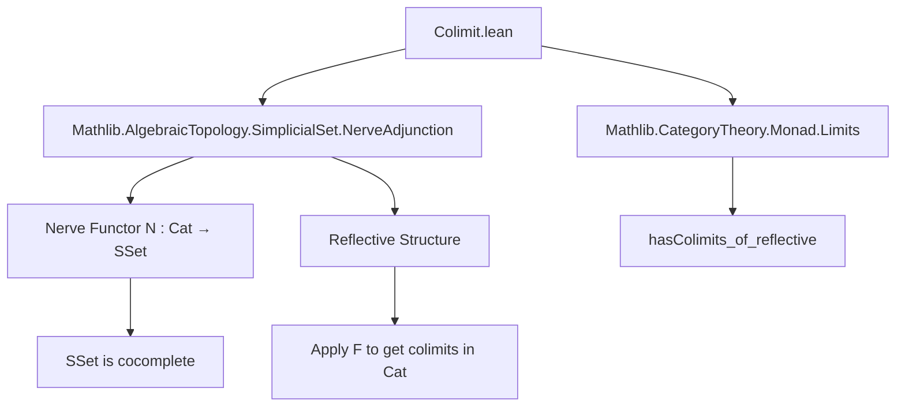

**Technical Brief: `Colimit.lean` (Lean 4 Formalization)**  
*Domain: Category Theory — Colimits in `Cat` via Reflective Subcategory Embedding into `SSet`*

---

### 1. KEY DEFINITIONS & THEOREMS

| Name | Type / Declaration | Purpose |
|------|---------------------|---------|
| `nerveFunctor` | `Cat ⥤ SSet` (implicit from `NerveAdjunction`) | The nerve functor embedding small categories into simplicial sets. |
| `HasColimits Cat.{v, v}` | `instance : HasColimits Cat.{v, v}` | Proves that the category of small categories has all small colimits. |
| `hasColimits_of_reflective` | From `Mathlib.CategoryTheory.Monad.Limits` | General theorem: if a functor is reflective and codomain has colimits, then domain does too. |
| `nerveFunctor` (used as argument) | `nerveFunctor : Reflective Cat.{v, v} SSet.{v, v}` | The reflective structure of `Cat` in `SSet` (via nerve–homotopy category adjunction). |

> **Theorem (informal)**: *If $F : \mathcal{C} \to \mathcal{D}$ is a reflective functor and $\mathcal{D}$ has all small colimits, then $\mathcal{C}$ has all small colimits, computed as $ \mathrm{colim}\, c_i \cong L(\mathrm{colim}\, F(c_i)) $, where $L$ is the left adjoint to the inclusion.*

---

### 2. NAMING CONVENTIONS

- **Prefixes**:
  - `hasColimits_`: predicate-style naming for existence of colimits (e.g., `hasColimits_of_reflective`).
  - `nerve_`: consistently used for the nerve construction (e.g., `nerveFunctor`).
- **Suffixes**:
  - `_Functor`: for functors (e.g., `nerveFunctor`).
  - `_of_`: for constructing instances via structural lemmas (e.g., `hasColimits_of_reflective`).
- **Universe polymorphism**: `Cat.{v, v}` indicates hom-universe `v`, object-universe `v`.

---

### 3. TACTIC STACK

- **No explicit tactics appear in the visible code** — this is a *declarative* module.
- The proof relies on:
  - `instance` resolution via `hasColimits_of_reflective nerveFunctor`
  - Implicit use of `Reflective` typeclass inference (from `NerveAdjunction`).
- Likely supported internally by:
  - `apply`, `exact`, `refine`, `rw [reflective.hasColimits]` (in the underlying lemma `hasColimits_of_reflective`).
  - `simp`/`aesop` may be used in the supporting lemmas in `Mathlib.CategoryTheory.Monad.Limits`.

---

### 4. PROOF LOGIC

- **High-level strategy**: *Reflective subcategory transfer of colimits*.
- **Steps**:
  1. Use that `SSet` has all small colimits (`SSet` is cocomplete — assumed from prior imports).
  2. Use that the nerve functor `N : Cat → SSet` is **reflective**, i.e., admits a left adjoint $L : SSet → Cat$ (the homotopy category / fundamental category functor).
  3. Apply the general lemma `hasColimits_of_reflective`, which formalizes:
     $$
     \mathrm{colim}_{i \in I} C_i \cong L\bigl(\mathrm{colim}_{i \in I} N(C_i)\bigr)
     $$
     in `Cat`, where $N$ is fully faithful and $L \dashv N$.

- **No induction or case analysis** is needed — the argument is categorical and abstract.

---

### 5. IMPORTS

| Import | Role |
|--------|------|
| `Mathlib.AlgebraicTopology.SimplicialSet.NerveAdjunction` | Provides the nerve functor and the reflective structure `nerveFunctor : Reflective Cat SSet`. |
| `Mathlib.CategoryTheory.Monad.Limits` | Supplies `hasColimits_of_reflective`, the key lemma for transferring colimits along a reflective functor. |

> **Scope**: This module lives in the *higher categorical foundations* layer of Mathlib, bridging homotopical algebra (`SSet`) and ordinary category theory (`Cat`).

---

### 6. MERMAID DIAGRAMS

#### Dependency Graph (Module-Level)



#### Conceptual Proof Flow

```mermaid
graph LR
  S[SSet has all small colimits] --> C[Take colimit in SSet]
  R[Reflective: L ⊣ N] --> L[Apply left adjoint L]
  C --> D[L(colim N(C_i)) ∈ Cat]
  L --> D
  D --> Result[Colimit in Cat]
```

#### Categorical Diagram (Colimit Computation)

$$
\begin{array}{ccc}
\mathcal{I} & \xrightarrow{C} & \mathbf{Cat} \\
 & \searrow_{N \circ C} & \downarrow^N \\
 & & \mathbf{SSet}
\end{array}
\quad\leadsto\quad
\mathrm{colim}\, C \;\cong\; L\bigl(\mathrm{colim}\, (N \circ C)\bigr)
$$

Where $L : \mathbf{SSet} \to \mathbf{Cat}$ is the left adjoint to $N$ (the homotopy category functor).

---

### 7. SUMMARY

This file demonstrates a *highly abstract* but powerful technique: leveraging a reflective embedding to inherit cocompleteness. It is concise (≈10 lines of code), but depends on substantial prior development in simplicial sets and monadic limits/colimits. The naming and structure follow Lean’s category-theoretic conventions, prioritizing reuse of general lemmas over ad-hoc construction.
