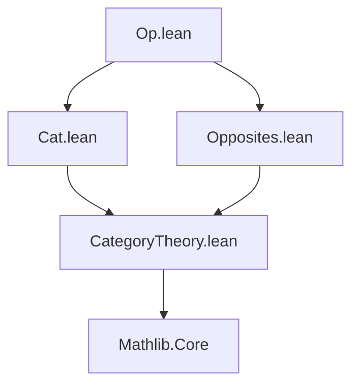

**Technical Brief: `Op.lean` — Dualizing Functor on `Cat`**

---

### 1. KEY DEFINITIONS & THEOREMS

| Name | Type | Purpose |
|------|------|---------|
| `opFunctor` | `Cat.{v₁, u₁} ⥤ Cat.{v₁, u₁}` | The strict endofunctor sending each category `C` to its opposite `Cᵒᵖ`, and each functor `F : C ⟶ D` to its opposite `F.op : Cᵒᵖ ⟶ Dᵒᵖ`. |
| `opFunctorInvolutive` | `opFunctor ⋙ opFunctor ≅ 𝟭 _` | A natural isomorphism witnessing that applying `opFunctor` twice is naturally isomorphic to the identity functor on `Cat`. |
| `opEquivalence` | `Cat.{v₁, u₁} ≌ Cat.{v₁, u₁}` | An equivalence of categories (not just a functor) where both the functor and its inverse are `opFunctor`, with unit and counit isomorphisms given by the canonical isomorphisms `C ≅ (Cᵒᵖ)ᵒᵖ`. |

---

### 2. NAMING CONVENTIONS

- **Prefixes**:
  - `op_`: for constructions involving opposite categories or functors (`opFunctor`, `opEquivalence`).
  - `unopUnop_`, `opOp_`: for canonical isomorphisms `C ≅ (Cᵒᵖ)ᵒᵖ` and `F ≅ (Fᵒᵖ)ᵒᵖ`.
- **Suffixes**:
  - `_toCatHom`: used to convert hom-objects (e.g., `unopUnop C`) into morphisms in `Cat` (i.e., functors).
- **`mk`**: used in `Iso.mk` and `NatIso.ofComponents` to construct isomorphisms from forward/backward maps.

---

### 3. TACTIC STACK

- **`ext` / `ext x`**: implicit in `@[simps]` and `@[simps!]` to prove equality of functors/natural transformations by extensionality.
- **`constructor`**: used implicitly in `def` blocks to build structured objects (e.g., functors, natural transformations).
- **`simp` / `simp_rw`**: heavily used via `@[simps]` and `@[simps!]` attributes to simplify projections and compositions.
- **`apply` / `exact`**: used internally in `Iso.mk`, `NatIso.ofComponents`, etc., to construct morphisms.
- **No heavy automation (e.g., `aesop`, `ring`, `linarith`)**: proofs are mostly definitional or rely on `simp`-friendly lemmas.

---

### 4. PROOF LOGIC

- **Definitional reasoning**: Most proofs are immediate from definitions (e.g., `opFunctor` is defined directly, and `@[simps]` ensures projections behave as expected).
- **Canonical isomorphisms**: The isomorphisms `unopUnop C : C ⟶ (Cᵒᵖ)ᵒᵖ` and `opOp C : (Cᵒᵖ)ᵒᵖ ⟶ C` are standard in category theory and used to witness that `op` is strictly involutive up to isomorphism.
- **Equivalence construction**: `opEquivalence` uses the fact that `opFunctor` is its own inverse up to natural isomorphism — the unit and counit are both given by the same canonical isomorphism `C ≅ (Cᵒᵖ)ᵒᵖ`.

---

### 5. IMPORTS

- `Mathlib.CategoryTheory.Category.Cat`: Provides the 2-category `Cat` of categories, functors, and natural transformations.
- `Mathlib.CategoryTheory.Opposites`: Provides the opposite category construction `Cᵒᵖ`, opposite functors `F.op`, and canonical isomorphisms like `unopUnop`, `opOp`.

---

### 6. DEPENDENCY & THEORY OVERVIEW

#### Mermaid Diagram: Module Dependencies



#### Mermaid Diagram: Theoretical Flow

```mermaid
graph LR
  C[Category C] --> Cᵒᵖ[Cᵒᵖ]
  Cᵒᵖ --> (Cᵒᵖ)ᵒᵖ[(Cᵒᵖ)ᵒᵖ]
  C -- unopUnop --> (Cᵒᵖ)ᵒᵖ
  (Cᵒᵖ)ᵒᵖ -- opOp --> C
  Cᵒᵖ -- F.op --> Dᵒᵖ
  C -- F --> D
  opFunctor -- applies op --> opFunctor
  opFunctor² -- opFunctorInvolutive ≅ --> id
  opFunctor -- opEquivalence ⇄ --> opFunctor
```

#### Theory Context

- This file formalizes the **dualizing functor** on the category of (small) categories.
- It shows that taking opposites is a **strictly involutive** operation up to natural isomorphism.
- The construction yields a **self-duality equivalence** of `Cat`, i.e., an equivalence `Cat ≌ Cat` where the functor is its own inverse.
- This is foundational for duality arguments in category theory (e.g., contravariant functors as covariant functors into `Catᵒᵖ`, or defining dual notions like limits/colimits).

--- 

Let me know if you'd like a formalized proof sketch or a comparison with other dualities (e.g., `opFunctor` vs. `opCat` in `Type`).
