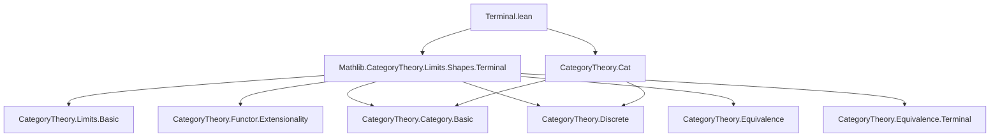
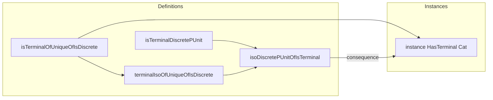

**Technical Brief: Terminal.lean**

---

### 1. KEY DEFINITIONS & THEOREMS

| Name | Type | Purpose |
|------|------|---------|
| `isTerminalOfUniqueOfIsDiscrete` | `{T : Type u} [Category T] [Unique T] [IsDiscrete T] → IsTerminal (Cat.of T)` | Proves that a discrete category with a unique object is terminal. |
| `instance : HasTerminal Cat` | `HasTerminal Cat.{v, u}` | Constructs a terminal object in `Cat` using `ShrinkHoms PUnit`. |
| `terminalIsoOfUniqueOfIsDiscrete` | `{T : Type u} [Category T] [Unique T] [IsDiscrete T] → ⊤_ Cat.{v, u} ≅ Cat.of T` | Shows any such category is isomorphic to the canonical terminal object. |
| `isTerminalDiscretePUnit` | `IsTerminal (Cat.of (Discrete PUnit))` | Special case: discrete category on `PUnit` is terminal. |
| `isoDiscretePUnitOfIsTerminal` | `{T : Type u} [Category T] → IsTerminal (Cat.of T) → Cat.of T ≅ Cat.of (Discrete PUnit)` | Any terminal object is isomorphic to `Discrete PUnit`. |

---

### 2. NAMING CONVENTIONS

- **Prefixes**:
  - `isTerminal_`: asserts terminality (`IsTerminal`).
  - `terminalIso_`: constructs isomorphism *to* the terminal object.
  - `iso_…_OfIsTerminal`: constructs isomorphism *from* a terminal object.
- **Suffixes**:
  - `_OfUniqueOfIsDiscrete`: conditions for terminality (unique object + discrete homs).
  - `_DiscretePUnit`: specific instance using `Discrete PUnit`.

---

### 3. TACTIC STACK

Frequent tactics used:
- `aesop` (in `Functor.ext` proof)
- `simp` (with `eq_iff_true_of_subsingleton`)
- `congrFun`, `rfl`, `congrArg` (for hom extensionality)
- `ext` (via `Cat.Hom.ext`, `Functor.ext`)
- `by simp [eq_iff_true_of_subsingleton]` (key for proving hom uniqueness)

---

### 4. PROOF LOGIC

- **Structure**:  
  1. **Main lemma**: Prove terminality by showing there is a unique morphism between any two objects.  
     - Uses `IsTerminal.ofUniqueHom` with explicit construction of the unique morphism via `const X . obj default`.
     - Hom uniqueness follows from `IsDiscrete` (homs are subsingletons) and `Unique T` (only one object).
  2. **Construct `HasTerminal`**:  
     - Define `T := ShrinkHoms PUnit`, show it satisfies `[Unique T]` and `[IsDiscrete T]`, then apply `isTerminalOfUniqueOfIsDiscrete`.
  3. **Isomorphism results**:  
     - Use `terminalIsoIsTerminal` (from `Limits` theory) to get canonical iso to `⊤_ Cat`.
     - Use `IsTerminal.uniqueUpToIso` to get iso between any two terminal objects.

- **Inductive/structural pattern**:  
  No induction; relies on extensionality principles (`Cat.Hom.ext`, `Functor.ext`) and subsingleton reasoning.

---

### 5. IMPORTS

- `Mathlib.CategoryTheory.Limits.Shapes.Terminal` — provides `IsTerminal`, `HasTerminal`, `⊤_`, `terminalIsoIsTerminal`, `uniqueUpToIso`.

---

### 6. DEPENDENCY & THEORY OVERVIEW

#### Mermaid Diagram: Theory Dependencies

#### Mermaid Diagram: File Overview

---

### 7. TODO & OPEN QUESTIONS (from comments)

- Prove **converse**: `IsTerminal (Cat.of T) → Unique T ∧ IsDiscrete T`.
- Provide characterization of terminal categories as **codiscrete** categories with unique object.

---

### 8. KEY FORMULAS & TYPES

- Unique morphism construction:  
  $$
  \forall X : \Cat.of\ T,\quad \mathrm{hom}_X := ((\mathrm{const}\ X)\ \mathrm{obj}\ \mathrm{default}) : \ast \to X
  $$
- Hom uniqueness:  
  $$
  \forall f, g : X \to Y,\quad f = g \quad \text{by} \quad \mathrm{Functor.ext}\ (\lambda\ x,\ \mathrm{eq\_of\_comp\_right\_eq}\ (\mathrm{congrFun}\ \mathrm{rfl}))
  $$
- Terminal object:  
  $$
  \top_{\Cat} \cong \Cat.of\ (\mathrm{Discrete}\ \PUnit)
  $$

--- 

Let me know if you'd like a formalized proof sketch or a Lean tactic trace.
