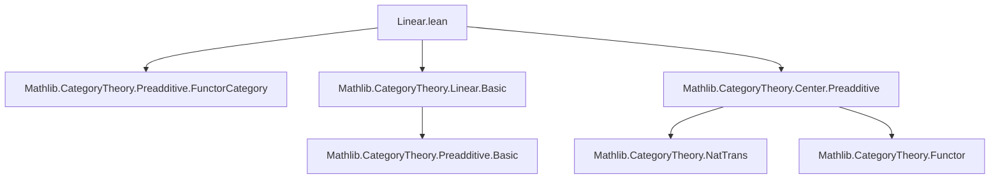
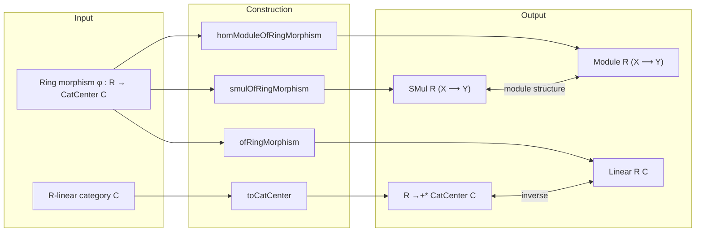

### Technical Brief: `Linear.lean` — Center of a Linear Category

---

#### **1. Key Definitions & Theorems**

| Name | Type / Signature | Purpose |
|------|------------------|---------|
| `toCatCenter` | `[Linear R C] → R →+* CatCenter C` | Constructs the canonical ring morphism from the base ring $ R $ to the center of a preadditive category $ C $ when $ C $ is $ R $-linear. |
| `smulOfRingMorphism` | `φ : R →+* CatCenter C → SMul R (X ⟶ Y)` | Defines scalar multiplication of morphisms in $ C $ via the action of $ R $ through $ φ $: $ a \cdot f = (\varphi(a))_X \circ f $. |
| `smulOfRingMorphism_smul_eq` | `a • f = (φ a).app X ≫ f` | Identity expressing scalar multiplication in terms of the center element’s component at the domain object. |
| `smulOfRingMorphism_smul_eq'` | `a • f = f ≫ (φ a).app Y` | Naturality-derived identity: scalar multiplication can also be expressed using the codomain component. |
| `homModuleOfRingMorphism` | `φ : R →+* CatCenter C → Module R (X ⟶ Y)` | Equips each hom-set $ \mathrm{Hom}(X,Y) $ with an $ R $-module structure induced by $ φ $. |
| `ofRingMorphism` | `φ : R →+* CatCenter C → Linear R C` | Constructs an $ R $-linear structure on a preadditive category $ C $ from a ring morphism $ R \to \mathrm{CatCenter}(C) $. |

---

#### **2. Naming Conventions**

- **Prefixes**:
  - `to_`: Constructs canonical maps (e.g., `toCatCenter`, `ofRingMorphism`).
  - `smulOfRingMorphism`: Derives scalar multiplication from a ring morphism.
  - `homModuleOfRingMorphism`: Derives module structure on hom-sets.

- **Suffixes**:
  - `_eq`, `_eq'`: Equational lemmas; `'` often indicates a dual or equivalent form (e.g., domain vs codomain action).
  - `_app`: Refers to component of a natural transformation at an object (used internally in proofs).

- **Notable patterns**:
  - `φ a).app X`: Component of natural transformation $ \varphi(a) $ at object $ X $.
  - `NatTrans.comp_app`, `End.mul_def`, `zero_app`, etc.: Standard category-theoretic utilities.

---

#### **3. Tactic Stack**

Frequent tactics used in proofs:

| Tactic | Usage |
|--------|-------|
| `simp` | Simplifying expressions involving `smul`, `comp`, `id`, `zero`, etc. |
| `rw [mul_comm]`, `rw [assoc]` | Rewriting using categorical or ring-theoretic identities. |
| `ext X` | Extensionality for natural transformations or functions. |
| `dsimp only [...]` | Simplifying definitions with specific lemmas. |
| `cat_disch` | A custom tactic (likely from `Mathlib.CategoryTheory`) to discharge category-theoretic goals (e.g., proving naturality or functoriality). |
| `exact ...` | Directly applying a lemma or hypothesis. |

---

#### **4. Proof Logic**

The logical flow follows a **bidirectional correspondence**:

1. **From $ R $-linearity to center morphism**:
   - Given $ C $ is $ R $-linear, define $ R \to \mathrm{CatCenter}(C) $ by $ a \mapsto (X \mapsto a \cdot \mathrm{id}_X) $.
   - Verify it's a natural transformation (naturality follows from $ R $-linearity: $ a \cdot (f \circ g) = (a \cdot f) \circ g = f \circ (a \cdot g) $).
   - Check ring homomorphism properties using module axioms (`smul_comp`, `comp_smul`, etc.).

2. **From center morphism to $ R $-linearity**:
   - Given $ \varphi : R \to \mathrm{CatCenter}(C) $, define scalar multiplication on $ \mathrm{Hom}(X,Y) $ via $ a \cdot f = \varphi(a)_X \circ f $.
   - Prove module axioms using naturality of $ \varphi(a) $ and ring homomorphism properties.
   - Show $ C $ becomes $ R $-linear: verify $ a \cdot (f \circ g) = (a \cdot f) \circ g $ and $ (f \circ g) \cdot a = f \cdot (g \cdot a) $, using naturality again.

**Induction is not used** — the proofs are mostly direct verification using definitions and naturality.

---

#### **5. Imports**

| Import | Role |
|--------|------|
| `Mathlib.CategoryTheory.Preadditive.FunctorCategory` | Provides background on preadditive categories and functor categories. |
| `Mathlib.CategoryTheory.Linear.Basic` | Defines $ R $-linear categories and basic properties. |
| `Mathlib.CategoryTheory.Center.Preadditive` | Defines `CatCenter` (center of a preadditive category) and its structure. |

These imports indicate the file sits at the intersection of:
- **Linear category theory** (scalar multiplication on hom-sets),
- **Center of a category** (natural endomorphisms of the identity functor),
- **Preadditive categories** (enrichment over abelian groups).

---

#### **6. Mermaid Diagrams**

##### **Dependency Graph (File-Level)**

##### **Conceptual Overview**

---

#### **7. Summary**

This file establishes a **bijection** (up to equivalence) between:
- $ R $-linear structures on a preadditive category $ C $, and
- Ring morphisms $ R \to \mathrm{CatCenter}(C) $.

It is foundational for understanding how scalar actions on a category are encoded via its center, and is likely used in further developments (e.g., module categories, derived categories, or deformation theory in categorical settings).

--- 

Let me know if you'd like a formalization of the equivalence (i.e., that `toCatCenter` and `ofRingMorphism` are inverses), or a proof sketch of naturality in `toCatCenter`.
