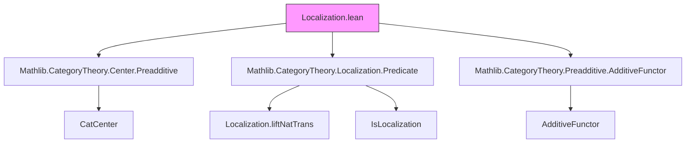
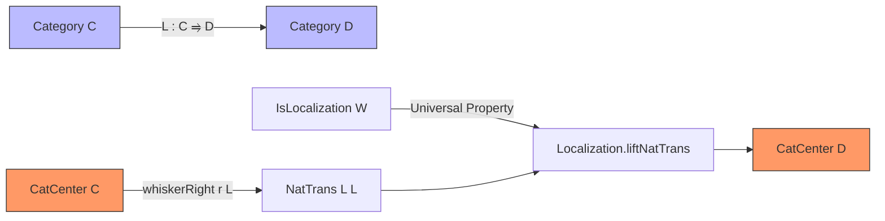
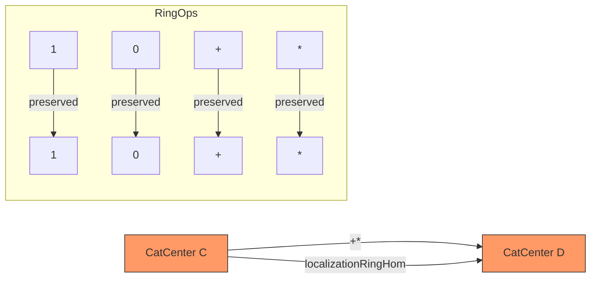

### Technical Brief: Localization of the Center of a Category (Lean 4)

---

#### **1. Key Definitions & Theorems**

| Name | Type / Signature | Purpose |
|------|------------------|---------|
| `localization` | `CatCenter C → CatCenter D` | Induced map on centers via localization; defined as `Localization.liftNatTrans` applied to the whiskered natural transformation `Functor.whiskerRight r L`. |
| `localization_app` | `(r.localization L W).app (L.obj X) = L.map (r.app X)` | Describes the component of the localized natural transformation at objects in the image of `L`. |
| `ext_of_localization` | `(∀ X, r.app (L.obj X) = s.app (L.obj X)) → r = s` | Uniqueness criterion: two natural transformations on `D` are equal if they agree on all objects in the image of `L`. |
| `localization_one` | `(1 : CatCenter C).localization L W = 1` | Localization preserves the multiplicative identity. |
| `localization_mul` | `(r * s).localization L W = r.localization L W * s.localization L W` | Localization preserves multiplication. |
| `localization_zero` | `(0 : CatCenter C).localization L W = 0` | Localization preserves additive zero (in preadditive setting). |
| `localization_add` | `(r + s).localization L W = r.localization L W + s.localization L W` | Localization preserves addition (in preadditive setting). |
| `localizationRingHom` | `CatCenter C →+* CatCenter D` | Ring homomorphism induced by additive localization functor between preadditive categories. |

---

#### **2. Naming Conventions**

- **Prefixes**:
  - `localization_`: for lemmas about the `localization` construction.
  - `ext_of_`: for extensionality lemmas (here: `ext_of_localization`).
- **Suffixes**:
  - `_app`: for component-wise properties (e.g., `localization_app`).
  - `_RingHom`: for ring homomorphism constructions (`localizationRingHom`).
- **General pattern**: `localization_*` for basic properties, `*_RingHom` for algebraic structure preservation.

---

#### **3. Tactic Stack**

Frequent tactics used in proofs:

- `simp only [...]`: for simplification with precise lemmas (e.g., `localization_app`, `whiskerRight_app`, `natTrans.naturality`).
- `ext_of_localization ...`: used repeatedly to reduce equality of natural transformations to pointwise equality on `L.obj X`.
- `simp`: for routine simplifications (e.g., in `localization_one`, `localization_add`, etc.).
- `dsimp [localization]`: for definitional simplification before applying `simp`.

No heavy automation (e.g., `aesop`, `ring`, `linarith`) is needed — the proofs are mostly structural and rely on naturality and universal properties.

---

#### **4. Proof Logic**

- **Structure**: Proofs follow a standard pattern:
  1. **Define** the candidate object/map (e.g., `localization` via `Localization.liftNatTrans`).
  2. **Prove pointwise equality** using `localization_app`.
  3. **Apply `ext_of_localization`** to lift pointwise equality to natural transformation equality.
  4. For algebraic properties (`map_zero`, `map_add`, etc.), reduce to pointwise verification using `simp` and naturality.

- **Induction**: Not used — the arguments are categorical and rely on universal properties of localization and naturality.

- **Key logical flow**:
  > *To prove $f(r) = g(s)$, show $\forall X,\ f(r)_{LX} = g(s)_{LX}$, then apply extensionality.*

---

#### **5. Imports**

| Module | Role |
|--------|------|
| `Mathlib.CategoryTheory.Center.Preadditive` | Defines `CatCenter` and its ring structure in preadditive settings. |
| `Mathlib.CategoryTheory.Localization.Predicate` | Provides `Localization.liftNatTrans`, `IsLocalization`, and extensionality lemmas. |
| `Mathlib.CategoryTheory.Preadditive.AdditiveFunctor` | Supplies `L.Additive` class for additive functors. |

These imports define the ambient categorical and localization machinery.

---

#### **6. Mermaid Diagrams**

##### **Dependency Graph (Module-Level)**

##### **Overview of Theory Flow**

##### **Algebraic Structure Preservation**

---

#### **7. Summary**

This module formalizes the **localization of the center of a category**, constructing a canonical ring homomorphism  
$$
\mathrm{CatCenter}(C) \to \mathrm{CatCenter}(D)
$$  
when $L : C \to D$ is an **additive localization functor** with respect to a class of morphisms $W$. The construction leverages the universal property of localization for natural transformations and verifies ring homomorphism axioms via pointwise checks, made possible by the extensionality principle `ext_of_localization`.
