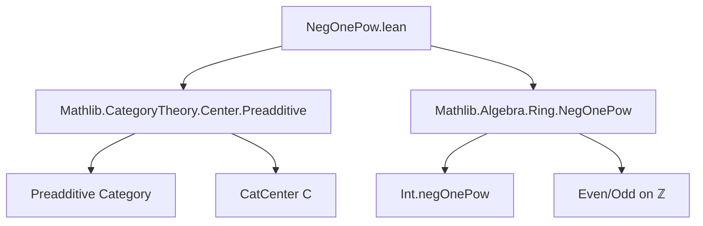

**Technical Brief: `NegOnePow.lean`**

---

### 1. **Key Definitions & Theorems**

- **`Int.negOnePow`**  
  - *Type*: `ℤ → ℤ`  
  - *Purpose*: Defines the integer power of $-1$, i.e., $(-1)^n$, returning $1$ if $n$ is even and $-1$ if $n$ is odd.

- **`app_neg_one_zpow`** *(main theorem)*  
  - *Type*:  
    ```lean
    ∀ (n : ℤ) (X : C), 
    ((-1) ^ n : (CatCenter C)ˣ).val.app X = n.negOnePow • 𝟙 X
    ```  
  - *Purpose*: Relates the $n$-th power of $-1$ in the unit group of the center of a preadditive category $C$ to the scalar multiplication by $n.\text{negOnePow}$ on the identity morphism at any object $X$.  
    Specifically, it identifies the component at $X$ of the central unit $(-1)^n$ as the scalar action of $(-1)^n \in \mathbb{Z}$ on $\mathrm{id}_X$.

---

### 2. **Naming Conventions**

- **`negOnePow`**  
  - Suffix used for functions/lemmas involving powers of $-1$ (e.g., `Int.negOnePow`, `n.negOnePow`).
- **`app_...`**  
  - Prefix for lemmas about the *application* (i.e., component at an object) of a natural transformation or functor.
- **`zpow_...`**  
  - Refers to integer exponentiation in a group (here, the unit group of the center).

---

### 3. **Tactic Stack**

- `obtain ⟨n, rfl⟩ | ⟨n, rfl⟩ := Int.even_or_odd n`  
  - Case analysis on parity of integer $n$.
- `simp [...]`  
  - Simplification using algebraic identities: `zpow_add`, `mul_zpow`, `Int.negOnePow_even`, `Int.negOnePow_odd`, `Int.two_mul`.
- `rw [...]`  
  - Rewrite using `Int.negOnePow_odd`.
- `Units.smul_def`  
  - Used to unfold scalar multiplication in the unit group.

No heavy automation (e.g., `aesop`, `ring`, `linarith`) is used—proof is mostly algebraic simplification and case analysis.

---

### 4. **Proof Logic**

- **Strategy**:  
  1. Decompose $n$ into even or odd case via `Int.even_or_odd`.  
  2. For even $n = 2k$:  
     - Use `Int.negOnePow_even` to reduce $(-1)^{2k} = 1$.  
     - Simplify using `zpow_add`, `mul_zpow`, and evenness properties.  
  3. For odd $n = 2k+1$:  
     - Use `Int.negOnePow_odd` to reduce $(-1)^{2k+1} = -1$.  
     - Apply `Units.smul_def` to interpret $-1$ as scalar multiplication by $-1$.  
     - Simplify using algebraic lemmas.

- **Core idea**: Leverage the universal property of the center in a preadditive category: scalars from $\mathbb{Z}$ embed centrally via $n \mapsto n • \mathrm{id}_X$, and $(-1)^n$ maps to the corresponding scalar.

---

### 5. **Imports**

- **`Mathlib.CategoryTheory.Center.Preadditive`**  
  - Provides the definition of the center of a preadditive category (`CatCenter C`) and its structure as a ring (in fact, a commutative ring).
- **`Mathlib.Algebra.Ring.NegOnePow`**  
  - Defines `Int.negOnePow` and basic algebraic properties (even/odd behavior, multiplicative behavior).

These imports define the ambient context: the center is a commutative ring, and $(-1)^n$ is well-defined in any ring.

---

### 6. **Mermaid Diagrams**

#### **Dependency Graph**


#### **Overview of File Structure**
```mermaid
flowchart LR
  subgraph "Context"
    C[Category C] --> Preadditive[Preadditive C]
    Preadditive --> Center[CatCenter C]
    Center --> Units[(CatCenter C)ˣ]
  end

  subgraph "Main Result"
    n[n : ℤ] --> zpow[(-1)^n ∈ (CatCenter C)ˣ]
    zpow --> app[app at X : C]
    app --> smul[n.negOnePow • 𝟙 X]
  end

  style C fill:#f9f,stroke:#333
  style smul fill:#9f9,stroke:#333
```

---

### 7. **Mathematical Significance**

This lemma formalizes the fact that in a preadditive category, the central unit $(-1)^n$ acts on each object $X$ as multiplication by $(-1)^n$ on the abelian group $\mathrm{Hom}(X,X)$. It connects the *group-theoretic* notion of powers in the center’s unit group with the *module-theoretic* scalar action of $\mathbb{Z}$, a foundational step for graded or $\mathbb{Z}_2$-graded structures (e.g., supercategories).
