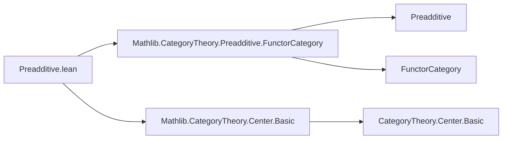
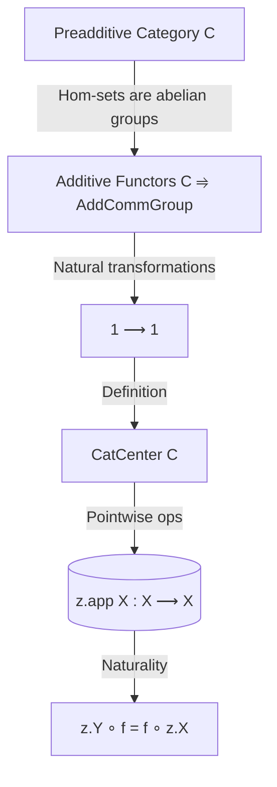

**Technical Brief: `Preadditive.lean` (CatCenter Section)**

---

### 1. **Key Definitions & Theorems**

| Name | Type / Signature | Purpose |
|------|------------------|---------|
| `CatCenter C` | `Type u` (implicitly defined as the center of the additive category `C`) | Represents the *center* of a preadditive category: natural transformations from the identity functor to itself, i.e., families of central endomorphisms `z.X : X ⟶ X` natural in `X`. |
| `app_add` | `(z₁ z₂ : CatCenter C) (X : C) → (z₁ + z₂).app X = z₁.app X + z₂.app X` | States that addition in the center is computed pointwise. |
| `app_sub` | `(z₁ z₂ : CatCenter C) (X : C) → (z₁ - z₂).app X = z₁.app X - z₂.app X` | States that subtraction in the center is computed pointwise. |
| `app_neg` | `(z : CatCenter C) (X : C) → (-z).app X = - z.app X` | States that negation in the center is computed pointwise. |

> **Note**: The type `CatCenter C` is *not defined* in this snippet — it is imported from `Mathlib.CategoryTheory.Center.Basic`, where it is defined as the type of natural transformations `1 ⟶ 1` (identity functor to itself) in the category of additive functors `C ⥤ AddCommGroup`. In a preadditive category, such natural transformations correspond to families of central endomorphisms.

---

### 2. **Naming Conventions**

- **Prefix `app_`**: Used for lemmas about the `app` component of natural transformations (e.g., `app_add`, `app_sub`, `app_neg`).  
- **No suffixes beyond `_add`, `_sub`, `_neg`**: Standard arithmetic operation suffixes, consistent with Lean’s `Add`/`Sub`/`Neg` typeclass conventions.
- **`CatCenter` namespace**: Indicates this is about the *categorical center*, distinct from ring-theoretic centers.

---

### 3. **Tactic Stack**

- **`rfl`** — Used exclusively in all three lemmas.  
  These are definitional equalities: the operations on `CatCenter C` are defined pointwise, so `rfl` suffices to prove the component-wise behavior.

No other tactics appear in this file.

---

### 4. **Proof Logic**

- **Definitional reasoning**: All proofs are immediate by definition (`rfl`).  
- **Structure**:  
  1. Assume `z₁, z₂ : CatCenter C`, `X : C`.  
  2. Unfold the definition of `+`, `-`, `neg` on `CatCenter C` (as pointwise operations on natural transformations).  
  3. Apply `rfl` — equality holds by definition of the hom-addition in a preadditive category.

No induction, cases, or simplification beyond definitional equality is needed.

---

### 5. **Imports**

| Import | Role |
|--------|------|
| `Mathlib.CategoryTheory.Preadditive.FunctorCategory` | Provides the category structure on additive functors `C ⥤ AddCommGroup`, needed to define `CatCenter C` as `1 ⟶ 1` in that functor category. |
| `Mathlib.CategoryTheory.Center.Basic` | Defines `CatCenter C` and basic properties (e.g., its additive group structure, naturality condition). |

> **Note**: The `Preadditive C` instance is essential: it ensures hom-sets are abelian groups and composition is bilinear, enabling the center to inherit an abelian group structure.

---

### 6. **Mermaid Diagrams**

#### Dependency Graph (Module-Level)



#### Overview of `CatCenter` Construction



#### Proof Structure (for `app_add`)

```mermaid
graph LR
  z₁ z₂ -->|Definition of + on NatTrans| z₁ + z₂
  z₁ + z₂ -->|app X| (z₁ + z₂).app X
  z₁ -->|app X| z₁.app X
  z₂ -->|app X| z₂.app X
  z₁.app X z₂.app X -->|Addition in Hom(X,X)| z₁.app X + z₂.app X
  (z₁ + z₂).app X <-->|rfl| z₁.app X + z₂.app X
```

---

### Summary

This file establishes that the center of a preadditive category inherits pointwise additive structure: addition, subtraction, and negation act componentwise on the natural transformations defining the center. All properties are definitional, so proofs are trivial (`rfl`). The module serves as a lightweight companion to `Center.Basic`, ensuring compatibility with the preadditive setting and enabling future developments (e.g., centers as rings, module structures, or connections to Hochschild cohomology).
