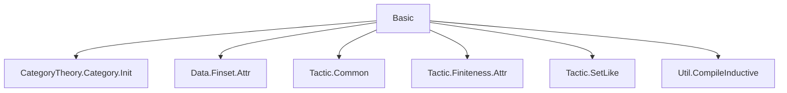
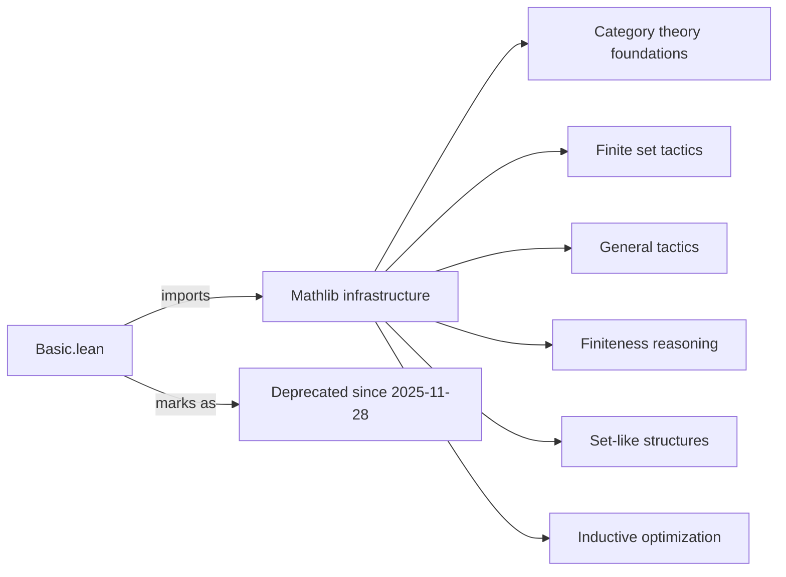

```markdown
# Technical Metadata: `Basic.lean`

## 1. Key Definitions & Theorems  
- **No definitions or theorems** are declared in this file.  
- This is a **module declaration file** (a `.lean` file with `module` and `import` directives only), serving as a namespace or entry point for importing a collection of utilities.

## 2. Naming Conventions  
- Not applicable — no definitions or theorems present.  
- However, the *imports* follow standard Mathlib naming:
  - `CategoryTheory.Category.Init` → category-theoretic initialization
  - `Finset.Attr` → attribute-based tactics for finite sets
  - `Tactic.*` → tactic infrastructure
  - `Util.CompileInductive` → compile-time optimization for inductives

## 3. Tactic Stack  
- **No tactics used** in this file (no proofs or tactic blocks present).  
- The file only contains `import` and `deprecated_module` directives.

## 4. Proof Logic  
- **No proofs** — purely a module header.

## 5. Imports  
- **Core dependencies**:
  - `Mathlib.CategoryTheory.Category.Init`  
    → Provides foundational category theory definitions (e.g., `Category`, `Hom`, identity/morphism composition).
  - `Mathlib.Data.Finset.Attr`  
    → Attribute infrastructure for finite sets (e.g., `finset`-related simp/rewrite rules).
  - `Mathlib.Tactic.Common`  
    → Common tactics (`aesop`, `linarith`, `omega`, etc.).
  - `Mathlib.Tactic.Finiteness.Attr`  
    → Attributes for finiteness reasoning (e.g., `is_finite`, `finite_type`).
  - `Mathlib.Tactic.SetLike`  
    → Tactics for working with `SetLike` types (e.g., subsets, subgroups).
  - `Mathlib.Util.CompileInductive`  
    → Utility to precompute and optimize inductive types at compile time.

## 8. Mermaid Diagrams  

### Dependency Graph  


### Overview of File Role  


### Summary  
- **Purpose**: A deprecated top-level module aggregating foundational imports for Mathlib-based developments.  
- **Status**: Deprecated — likely superseded by more modular or updated imports.  
- **Use case**: Historically used to bootstrap a standard set of imports for basic Lean 4 + Mathlib developments; now discouraged in favor of explicit, minimal imports.
```
