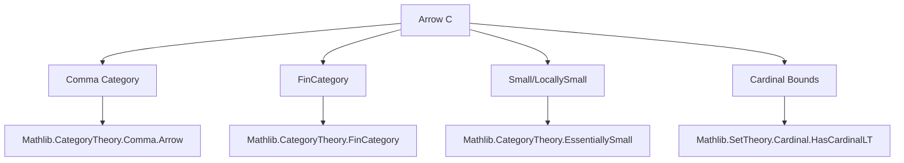
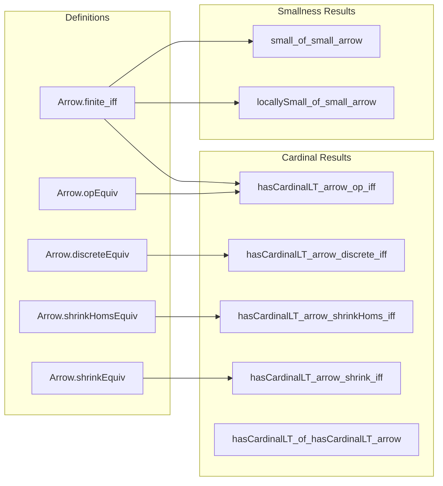

### Technical Brief: `CardinalArrow.lean`

---

#### **1. Key Definitions & Theorems**

| Name | Type / Signature | Purpose |
|------|------------------|---------|
| `Arrow.finite_iff` | `Finite (Arrow C) ↔ Nonempty (FinCategory C)` | Characterizes finiteness of the arrow category in terms of finite category structure. |
| `Arrow.opEquiv` | `Arrow Cᵒᵖ ≃ Arrow C` | Establishes a bijection between arrows in $C^{op}$ and $C$. |
| `Arrow.discreteEquiv` (implicit via `Arrow.discreteEquiv X`) | `Arrow (Discrete X) ≃ X × X` | Links arrows in a discrete category to pairs of objects (i.e., morphisms are just identity maps, so arrows correspond to ordered pairs). |
| `Arrow.shrinkHomsEquiv` | `Arrow (ShrinkHoms C) ≃ Arrow C` | Shows equivalence of arrow categories under hom-shrinking (when locally small). |
| `Arrow.shrinkEquiv` | `Arrow (Shrink C) ≃ Arrow C` | Shows equivalence of arrow categories under object+hom shrinking (when small). |
| `hasCardinalLT_arrow_op_iff` | `HasCardinalLT (Arrow Cᵒᵖ) κ ↔ HasCardinalLT (Arrow C) κ` | Cardinal comparison is invariant under opposite category. |
| `hasCardinalLT_arrow_discrete_iff` | `HasCardinalLT (Arrow (Discrete X)) κ ↔ HasCardinalLT X κ` | Cardinality of arrows in discrete category matches cardinality of objects. |
| `small_of_small_arrow` | `Small (Arrow C) → Small C` | If arrow category is small, then base category is small. |
| `locallySmall_of_small_arrow` | `Small (Arrow C) → LocallySmall C` | Small arrow category implies locally small base. |
| `hasCardinalLT_of_hasCardinalLT_arrow` | `HasCardinalLT (Arrow C) κ → HasCardinalLT C κ` | Cardinal bound on arrows yields cardinal bound on objects. |

---

#### **2. Naming Conventions**

- **Prefixes:**
  - `Arrow.`: All definitions/lemmas are scoped under `CategoryTheory.Arrow`.
  - `hasCardinalLT_..._iff`: Used for equivalences involving `HasCardinalLT`.
  - `small_...`: For implications about smallness (e.g., `small_of_small_arrow`).
- **Suffixes:**
  - `_equiv`: For equivalences/bijections.
  - `_iff`: For biconditional lemmas.
  - `_op`: For constructions involving opposite categories.
  - `_discrete`: For discrete category-specific results.
  - `_shrink` / `_shrinkHoms`: For constructions involving `Shrink` / `ShrinkHoms`.

---

#### **3. Tactic Stack**

Frequently used tactics in proofs:
- `constructor`: For splitting biconditionals.
- `intro`, `rintro`, `exact`, `refine`: Basic proof construction.
- `congr`: To prove equality of arrows/morphisms by congruence.
- `rw [Arrow.finite_iff]`, `rw [Arrow.discreteEquiv]`: Rewriting using equivalences.
- `have := ...`: To introduce intermediate facts.
- `apply Fintype.ofFinite`, `apply small_of_injective`: To derive finiteness/smallness from injective maps.
- `simp` / `simp_rw`: Simplification using lemmas and equivalences.
- `infer_instance`: To fill in typeclass instances.

---

#### **4. Proof Logic**

- **Structure of `Arrow.finite_iff`:**
  - **Forward direction (`→`)**:
    - Prove `Nonempty (FinCategory C)` by constructing finite type and finite hom-sets.
    - Use injectivity of maps $a \mapsto \mathrm{Id}_a$ and $f \mapsto f$ to embed objects and morphisms into `Arrow C`.
    - Apply `Fintype.ofFinite` to deduce finiteness.
  - **Reverse direction (`←`)**:
    - Given `FinCategory C`, use equivalence `Arrow C ≃ Σ a b : C, a ⟶ b`.
    - Apply `Fintype.ofEquiv` to transfer finiteness.

- **Equivalence proofs (`Arrow.opEquiv`, `Arrow.shrinkEquiv`, etc.):**
  - Define forward and inverse maps explicitly.
  - Prove left/right inverses using `simp` and properties of `op`, `unop`, `Shrink.equivalence`.

- **Cardinal comparisons (`hasCardinalLT_*_iff`):**
  - Use `hasCardinalLT_iff_of_equiv`, which reduces to showing an equivalence of types.

- **Smallness propagation:**
  - Use `small_of_injective` with canonical embeddings (e.g., $X \mapsto \mathrm{Id}_X$) to lift smallness from `Arrow C` to `C`.

---

#### **5. Imports**

| Module | Purpose |
|--------|---------|
| `Mathlib.CategoryTheory.Comma.Arrow` | Defines `Arrow C` as comma category $(C \downarrow C)$. |
| `Mathlib.CategoryTheory.FinCategory.Basic` | Defines `FinCategory`, finite categories. |
| `Mathlib.CategoryTheory.EssentiallySmall` | For `Small`, `LocallySmall`, `Shrink`, `ShrinkHoms`. |
| `Mathlib.Data.Set.Finite.Basic` | Basic finite set theory (used via `Finite`, `Fintype`). |
| `Mathlib.SetTheory/Cardinal/HasCardinalLT` | Defines `HasCardinalLT`, cardinal bounds. |

---

#### **6. Mermaid Diagrams**

##### **Dependency Graph (High-Level)**

##### **Overview of File Structure**

---

#### **7. Theory Context**

This module sits at the intersection of:
- **Category theory** (arrows, smallness, finite categories),
- **Set theory** (cardinal arithmetic, `HasCardinalLT`),
- **Type theory** (finite types, `Fintype`, `Small`).

It serves as a foundational tool for reasoning about the size of arrow categories, especially in contexts where one wants to control cardinalities (e.g., in sheaf theory, model categories, or homotopy theory).

--- 

Let me know if you'd like a formalized dependency graph or a summary of how this module integrates with `ShrinkHoms`/`Shrink` infrastructure.
