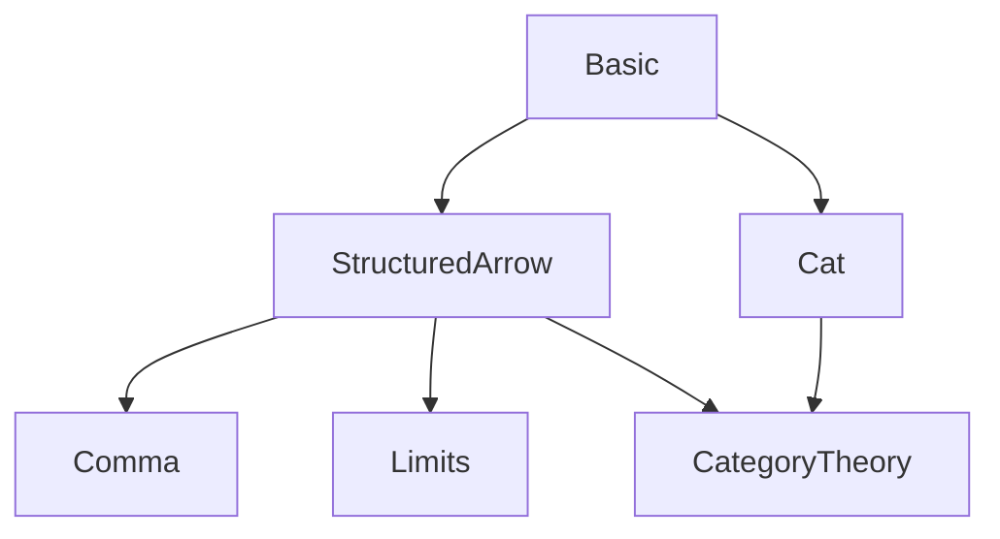

Here's a structured technical brief based on the provided `Basic.lean` file:

---

### **1. Key Definitions & Theorems**

| Name | Type / Signature | Purpose |
|------|------------------|---------|
| `Over X` | `T → Type u₁` | The *over category* (a.k.a. slice category) over object `X : T`. Objects are morphisms `Y ⟶ X`; morphisms are commutative triangles. |
| `Under X` | `T → Type u₁` | The *under category* (a.k.a. coslice category) under object `X : T`. Objects are morphisms `X ⟶ Y`; morphisms are commutative triangles. |
| `Over.mk f` | `f : Y ⟶ X → Over X` | Constructor for objects in `Over X`. |
| `Under.mk f` | `f : X ⟶ Y → Under X` | Constructor for objects in `Under X`. |
| `Over.homMk f w` | `f : U.left ⟶ V.left, w : f ≫ V.hom = U.hom → U ⟶ V` | Constructor for morphisms in `Over X`. |
| `Under.homMk f w` | `f : U.right ⟶ V.right, w : U.hom ≫ f = V.hom → U ⟶ V` | Constructor for morphisms in `Under X`. |
| `Over.forget X` | `Over X ⥤ T` | Forgetful functor sending `f : Y ⟶ X` to `Y`. |
| `Under.forget X` | `Under X ⥤ T` | Forgetful functor sending `f : X ⟶ Y` to `Y`. |
| `Over.map f` | `f : X ⟶ Y → Over X ⥤ Over Y` | Functor induced by post-composition with `f`. |
| `Under.map f` | `f : X ⟶ Y → Under Y ⥤ Under X` | Functor induced by pre-composition with `f`. |
| `Over.iteratedSliceForward f` | `f : Over X → Over f.left` | Functor from double slice `(T/X)/f` to `T/Y` where `f : Y ⟶ X`. |
| `Over.iteratedSliceBackward f` | `f : Over X → Over f.left` | Inverse direction of the equivalence. |
| `Over.iteratedSliceEquiv f` | `Over f ≌ Over f.left` | Equivalence between double slice and slice over domain of `f`. |
| `Over.post F` | `F : T ⥤ D → Over X ⥤ Over (F X)` | Induced functor on over categories via `F`. |
| `Under.post F` | `F : T ⥤ D → Under X ⥤ Under (F X)` | Induced functor on under categories via `F`. |
| `Over.mapFunctor` | `T ⥤ Cat` | 2-functor from `T` to `Cat`, sending `X ↦ Over X`, `f ↦ Over.map f`. |
| `Under.mapFunctor` | `Tᵒᵖ ⥤ Cat` | 2-functor from opposite category `Tᵒᵖ` to `Cat`, sending `X ↦ Under X`, `f ↦ Under.map f`. |
| `Over.equivalenceOfIsTerminal hX` | `IsTerminal X → Over X ≌ T` | If `X` is terminal, then `Over X ≃ T`. |
| `Over.mkIdTerminal` | `IsTerminal (mk (𝟙 X))` | Identity morphism `𝟙 X` is terminal in `Over X`. |
| `Under.mkIdInitial` | `IsInitial (mk (𝟙 X))` | Identity morphism `𝟙 X` is initial in `Under X`. |
| `Over.forget_reflects_iso` | `(forget X).ReflectsIsomorphisms` | Forgetful functor reflects isomorphisms. |
| `Over.epi_of_epi_left`, `Under.mono_of_mono_right` | Reflects epimorphisms/monomorphisms from underlying map. |
| `Over.isoMk`, `Under.isoMk` | Construct isomorphisms in slice/coslice from component isos. |
| `Over.forgetCocone`, `Under.forgetCone` | Natural cocone/cone over forgetful functor with apex `X`. |
| `Over.lift`, `Over.liftCone`, `Over.isLimitLiftCone` | Lift diagrams/cones to over category. |
| `CostructuredArrow.toOver F X` | `CostructuredArrow F X ⥤ Over X` | Embedding of costructured arrow category into over category. |

---

### **2. Naming Conventions**

- **Prefixes**:
  - `Over.` / `Under.`: Module-level namespace.
  - `mk`: Constructor for objects (arrows with fixed codomain/domain).
  - `homMk`: Constructor for morphisms (arrows in base category making triangle commute).
  - `forget`: Forgetful functors.
  - `map`: Functors induced by base morphisms (`Over.map f`, `Under.map f`).
  - `post`: Functors induced by functors `F : T ⥤ D`.
  - `isoMk`: Isomorphism constructors.
  - `iteratedSlice*`: For double slice constructions.

- **Suffixes**:
  - `left` / `right`: For `Over` (left = domain, right = constant codomain), `Under` (left = constant domain, right = codomain).
  - `obj`, `map`: For functor actions.
  - `eq`: For equalities between functors (e.g., `mapId_eq`, `mapComp_eq`).
  - `Iso`: For natural isomorphisms (e.g., `mapId`, `mapForget`, `mapComp`).
  - `Congr`: For congruence-based isomorphisms (e.g., `mapCongr`, `postCongr`).

---

### **3. Tactic Stack**

Frequently used tactics in proofs:
- `rfl`, `simp`, `ext`, `congr`
- `dsimp`, `rw`, `apply`, `refine`
- `aesop` (for automated reasoning in equivalences like `forall_iff`)
- `cat_disch` (custom tactic for discharging category-theoretic diagrams)
- `eqToIso`, `NatIso.ofComponents`, `Iso.refl`, `isoMk`
- `repeat (ext; simp ...)`, `funext`, `cases`

---

### **4. Proof Logic**

- **Structure**: Most proofs follow a pattern:
  1. **Extensionality**: Use `OverMorphism.ext` / `UnderMorphism.ext` to reduce to component equality.
  2. **Simplification**: Use `simp` with `@[simp]` lemmas (`mk_hom`, `homMk_eta`, `forget_obj`, etc.).
  3. **Diagram chasing**: Use `w` lemmas (`Over.w`, `Under.w`) to verify commutativity.
  4. **Isomorphism construction**: Use `isoMk` with component isos and verify triangle condition.
  5. **Functor equality**: Use `Functor.ext` + `simp` to prove equality of functors.
  6. **Natural isomorphisms**: Use `eqToIso` on proven equalities or `NatIso.ofComponents` with `isoMk`.

- **Induction**: Not used directly; instead, structural reasoning via universal properties (e.g., limits, colimits, adjoints).

- **Equivalences**: Proven via explicit inverse functors (`iteratedSliceEquiv`, `postEquiv`, `equivalenceOfIsTerminal`), with unit/counit isos.

---

### **5. Imports**

- `Mathlib.CategoryTheory.Comma.StructuredArrow.Basic`
- `Mathlib.CategoryTheory.Category.Cat`

These imports provide:
- General comma category machinery (`Comma`, `StructuredArrow`, `CostructuredArrow`)
- Basic category theory infrastructure (`Cat`, `Category`, `Functor`, `NatTrans`, `Limits`, etc.)

---

### **6. Mermaid Diagrams**

#### **Dependency Graph (Module Level)**



#### **Overview of `Basic.lean` Theory**

```mermaid
flowchart LR
  A[Comma Categories] --> B[Over Category Over X]
  A --> C[Under Category Under X]

  B --> D[Forgetful Functor forget X]
  B --> E[map f : Over X ⥤ Over Y]
  B --> F[iteratedSliceEquiv]
  B --> G[post F : Over X ⥤ Over (F X)]

  C --> H[Forgetful Functor forget X]
  C --> I[map f : Under Y ⥤ Under X]
  C --> J[post F : Under X ⥤ Under (F X)]

  D --> K[Limits & Colimits]
  H --> K

  E --> L[2-functor T ⥤ Cat]
  I --> M[2-functor Tᵒᵖ ⥤ Cat]
```

#### **2-Functoriality**

```mermaid
flowchart LR
  X["X : T"] -->|map f| OverX["Over X"]
  Y["Y : T"] -->|map g| OverY["Over Y"]
  OverX -->|Over.map f| OverY

  X -->|mapId_eq| 𝟭X["𝟭 _"]
  X -->|mapComp_eq| OverX -->|Over.map f| OverY -->|Over.map g| OverZ["Over Z"]
```

---

Let me know if you'd like a formalized dependency graph in Lean or a more detailed breakdown of specific sections (e.g., limits in over categories).
