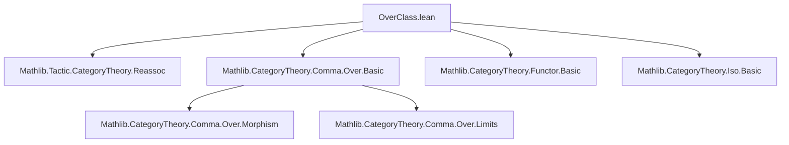

### Technical Brief: `OverClass.lean`

---

#### **1. Key Definitions & Theorems**

| Name | Type / Signature | Purpose |
|------|------------------|---------|
| `OverClass X S` | `class (X S : C) : Type v` | Equips object `X` with a *structure morphism* `X ⟶ S`. |
| `over X S [OverClass X S]` | `X ⟶ S` | The structure morphism; projection of `OverClass`. |
| `X ↘ S` | Notation for `over X S` | Shorthand for structure morphism. |
| `CanonicallyOverClass X S` | `class extends OverClass X S` | Structure morphism `X ⟶ S` where `S` is uniquely inferable from `X`. |
| `HomIsOver f S` | `class (f : X ⟶ Y) [OverClass X S] [OverClass Y S] : Prop` | Asserts that `f` commutes with structure morphisms: `f ≫ (Y ↘ S) = (X ↘ S)`. |
| `IsOverTower X Y S` | `abbrev := HomIsOver (X ↘ Y) S` | Tower condition: `X ↘ Y ≫ Y ↘ S = X ↘ S`. |
| `OverClass.asOver X [OverClass X S]` | `Over S` | Bundles `X` with its structure morphism into the *comma category* `Over S`. |
| `OverClass.asOverHom f [HomIsOver f S]` | `asOver X S ⟶ asOver Y S` | Bundles `f` as a morphism in `Over S`. |
| `Iso.asOver e [HomIsOver e.hom S]` | `asOver X S ≅ asOver Y S` | Converts an isomorphism over `S` to an isomorphism in `Over S`. |
| `comp_over` | `lemma` | Rewrites the commuting condition: `f ≫ Y ↘ S = X ↘ S`. |
| `homIsOver_of_isOverTower` | `lemma` | Lifts `HomIsOver f S` to `HomIsOver f S'` under tower conditions. |

---

#### **2. Naming Conventions**

- **Prefixes**:
  - `over_`: projections from `OverClass` (`over`, `asOver`, `asOverHom`).
  - `isOver_`, `homIsOver_`: properties about morphisms commuting with structure maps.
  - `CanonicallyOverClass`: canonical structure morphism inference.
- **Suffixes**:
  - `_tower`: tower-like composition conditions.
  - `_hom`: morphism bundling.
- **Notation**:
  - `X ↘ S`: structure morphism (right-down arrow).
  - `X.left`, `X.hom`: projections from `Over S` (comma category objects).

---

#### **3. Tactic Stack**

| Tactic | Usage |
|--------|-------|
| `aesop` | Used in `HomIsOver.comp_over` to discharge trivial equalities. |
| `rw [...]` | Rewriting commuting diagrams (`comp_over`, `comp_over_assoc`). |
| `simp` / `simp_rw` | Simplification of `asOver`, `asOverHom`, `Iso.asOver`, and their properties. |
| `constructor` | Introducing `HomIsOver` or `OverClass` instances. |
| `rfl` | For reflexive equalities in `CanonicallyOverClass` and tower instances. |
| `isIso_of_reflects_iso` | Proving isomorphism preservation under forgetful functor. |

---

#### **4. Proof Logic**

- **Structure**: Most proofs follow a *diagram-chasing* pattern:
  1. **Unfold definitions** (`over`, `HomIsOver`, `IsOverTower`).
  2. **Rewrite using `comp_over`** to reduce to known commuting squares.
  3. **Apply associativity** (`comp_over_assoc`) and **simp lemmas** (`asOverHom_comp`, `asOverHom_id`, etc.).
  4. **Use tower assumptions** to lift structure across layers (`homIsOver_of_isOverTower`).
- **Induction**: Not used directly; reasoning is *categorical*, relying on universal properties of `Over S`.
- **Isomorphism handling**: Leverages `isIso_of_reflects_iso` and `Iso.inv_comp_eq`/`Iso.eq_inv_comp` for inversion lemmas.

---

#### **5. Imports & Dependencies**

| Module | Role |
|--------|------|
| `Mathlib.Tactic.CategoryTheory.Reassoc` | Provides `reassoc` attribute for simplifying compositions. |
| `Mathlib.CategoryTheory.Comma.Over.Basic` | Defines `Over S` (objects over `S`), used for bundling. |
| `Mathlib.CategoryTheory` (implicit via `Category`) | Provides basic category theory infrastructure (`Hom`, `comp`, `𝟙`, `Iso`, etc.). |

---

#### **6. Mermaid Diagrams**

##### **Dependency Graph**



##### **Conceptual Overview**

```mermaid
flowchart LR
  X[X] -->|X ↘ S| S[S]
  Y[Y] -->|Y ↘ S| S
  X -->|f| Y
  f -.->|HomIsOver f S| "f ≫ Y ↘ S = X ↘ S"

  subgraph Over S
    X_over[Over S object] -->|X.left| X
    X_over -->|X.hom| S
    f_over[Over S morphism] -->|f.left| f
    f_over -.->|w| "f.left ≫ S.hom = X.hom"
  end

  X -->|asOver| X_over
  f -->|asOverHom| f_over
```

##### **Tower Diagram**

```mermaid
flowchart TD
  X -->|X ↘ Y| Y
  Y -->|Y ↘ S| S
  X -->|X ↘ S| S
  X -.->|IsOverTower X Y S| "X ↘ Y ≫ Y ↘ S = X ↘ S"
```

---

#### **7. Theory Context**

- **Purpose**: Provides a *typeclass-based* approach to *structured objects* and *structure-preserving morphisms* in a category `C`, modeled on the comma category `Over S`.
- **Motivation**: Analogous to `Algebra R A` for ring homomorphisms `R → A`, but for arbitrary structure morphisms.
- **Use Cases**:
  - Algebraic geometry: schemes over a base `S`.
  - Fibered categories: objects with “projection” to a base.
  - Bundles, fibrations, or parametrized objects.

- **Caveat**: As noted, this is *not* the standard use of typeclasses (structure as *property* vs. *data*), but is justified when the structure morphism is canonical or uniquely determined.

---

#### **8. Summary**

`OverClass.lean` formalizes a *typeclass-driven* version of the comma category `Over S`, enabling:
- Automatic inference of structure morphisms (`over`, `CanonicallyOverClass`).
- Verification of structure-preserving maps (`HomIsOver`).
- Bundling into `Over S` via `asOver`, `asOverHom`, and `Iso.asOver`.
- Reasoning about towers of structure morphisms (`IsOverTower`).

It is a foundational module for higher-categorical or fibred-structure formalizations in Lean, especially in geometry or algebra where objects are naturally equipped with maps to a base.
