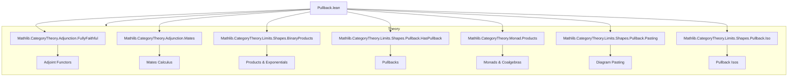
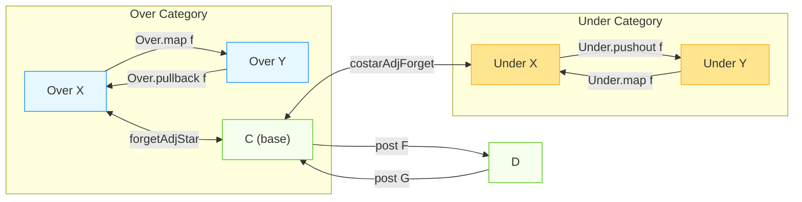

### Technical Brief: Pullback.lean — Adjunctions in Over/Under Categories

---

#### **1. Key Definitions & Theorems**

| Name | Type / Signature | Purpose |
|------|------------------|---------|
| `Over.pullback f` | `{X Y : C} → (f : X ⟶ Y) → [HasPullbacksAlong f] → Over Y ⥤ Over X` | Pullback functor along `f`, induced by universal property of pullbacks. |
| `Over.mapPullbackAdj f` | `Over.map f ⊣ Over.pullback f` | Adjunction: `Over.map f` (precomposition with `f`) is left adjoint to pullback along `f`. |
| `Over.star X` | `[HasBinaryProducts C] → C ⥤ Over X` | Sends `Y ↦ π₁ : X × Y → X`; right adjoint to `Over.forget X`. |
| `Over.forgetAdjStar X` | `Over.forget X ⊣ Over.star X` | Adjunction: `Over.forget X` (underlying object) is left adjoint to `star X`. |
| `Over.starPullbackIsoStar f` | `star Y ⋙ pullback f ≅ star X` | Compatibility of `star` with pullback: pulling back along `f : X → Y` commutes with `star`. |
| `Under.pushout f` | `{X Y : C} → (f : X ⟶ Y) → [HasPushoutsAlong f] → Under X ⥤ Under Y` | Pushout functor along `f`. |
| `Under.mapPushoutAdj f` | `Under.pushout f ⊣ Under.map f` | Adjunction: pushout along `f` is left adjoint to `Under.map f`. |
| `Under.costar X` | `[HasBinaryCoproducts C] → C ⥤ Under X` | Sends `Y ↦ in₁ : X → X ⊔ Y`; left adjoint to `Under.forget X`. |
| `Under.costarAdjForget X` | `Under.costar X ⊣ Under.forget X` | Adjunction: `costar X` is left adjoint to `Under.forget X`. |

**Notable Instances**:
- `(pullback f).Faithful` if `f` is epi and pullbacks preserve epis.
- `(pushout f).Faithful` if `f` is mono and pushouts preserve monos.
- `(pullback f).IsRightAdjoint`, `(pushout f).IsLeftAdjoint`, `(star X).IsRightAdjoint`, `(costar X).IsLeftAdjoint`, etc.

---

#### **2. Naming Conventions**

| Pattern | Meaning / Example |
|---------|-------------------|
| `pullback`, `pushout` | Functors induced by universal properties (limits/colimits). |
| `map` | Precomposition with a morphism: `Over.map f`, `Under.map f`. |
| `star`, `costar` | “Cofree”/“free” extensions into over/under categories (via products/coproducts). |
| `forget` | Underlying object functor: `Over.forget X`, `Under.forget X`. |
| `adj` suffix | Adjunctions: `mapPullbackAdj`, `forgetAdjStar`, `costarAdjForget`. |
| `iso` suffix | Natural isomorphisms: `pullbackId`, `pullbackComp`, `starPullbackIsoStar`. |
| `post` prefix | Post-composition functor: `post F`, `post G`. |
| `cofree`, `free` | Coalgebra/free algebra constructions used in definitions of `star`, `costar`. |

---

#### **3. Tactic Stack**

| Tactic | Usage Frequency | Purpose |
|--------|-----------------|---------|
| `simp` / `simp_rw` | Very High | Simplify hom-sets, pullback/pushout diagrams, and universal properties. |
| `ext` | High | Prove equality of morphisms/natural transformations by extensionality. |
| `dsimp` | Medium | Simplify definitional equalities in goals. |
| `rw` / `apply` | High | Rewrite using known equations (e.g., `pullback.condition`, `assoc`). |
| `infer_instance` | Medium | Solve class constraints (e.g., `HasPullbacksAlong`, `Faithful`). |
| `cat_disch` | Medium | Category-theoretic tactic to discharge diagrammatic commutativity. |
| `conjugateIsoEquiv` | Medium | Construct natural isomorphisms between adjoint functors. |
| `ofNatIsoLeft`, `ofNatIsoRight` | Medium | Convert componentwise isos to natural isos. |
| `exact`, `reflexivity` | Low-Medium | Final steps in proofs. |

---

#### **4. Proof Logic**

- **Structure**: Most proofs follow a *constructive universal property* pattern:
  1. **Define** the functor on objects/morphisms using (co)limits.
  2. **Construct** unit/counit using universal properties (e.g., `pullback.lift`, `pushout.desc`).
  3. **Verify** triangle identities via `simp` + `ext` + diagram chasing.
  4. **Leverage** existing lemmas: `pullback.condition`, `pushout.condition`, `Over.w`, `Under.w`.

- **Typical Flow**:
  - For adjunctions: define `homEquiv`, prove bijection via `left_inv`/`right_inv`.
  - For isomorphisms: use `conjugateIsoEquiv` to transfer known isos (e.g., `mapId`, `mapComp`) across adjunctions.
  - For faithfulness/fully-faithfulness: use `faithful_R_of_epi_counit_app`, `faithful_L_of_mono_unit_app`.

- **Induction**: Not used — proofs are diagrammatic and rely on universal properties.

---

#### **5. Imports & Dependencies**

| Module | Role |
|--------|------|
| `Mathlib.CategoryTheory.Adjunction.FullyFaithful` | Faithfulness criteria for adjoints. |
| `Mathlib.CategoryTheory.Adjunction.Mates` | Mates calculus (used implicitly via `conjugateIsoEquiv`). |
| `Mathlib.CategoryTheory.Limits.Shapes.BinaryProducts` | Binary products → `star`. |
| `Mathlib.CategoryTheory.Limits.Shapes.Pullback.HasPullback` | Existence of pullbacks → `pullback`. |
| `Mathlib.CategoryTheory.Monad.Products` | Coalgebra/free algebra machinery for `star`. |
| `Mathlib.CategoryTheory.Limits.Shapes.Pullback.Pasting` | Pasting lemmas for pullbacks (used in `pullbackComp`). |
| `Mathlib.CategoryTheory.Limits.Shapes.Pullback.Iso` | Isomorphism lemmas for pullbacks (e.g., `pullbackSymmetry`, `pullbackProdFstIsoProd`). |
| `Mathlib.CategoryTheory.Adjunction.Mates` | For `postAdjunctionLeft`, `postAdjunctionRight`. |

---

#### **6. Mermaid Diagrams**

##### **Dependency Graph (High-Level)**

##### **Overview of Pullback.lean Theory**

- **Blue**: Over-category constructions (`pullback`, `star`, `forget`).
- **Yellow**: Under-category constructions (`pushout`, `costar`, `forget`).
- **Green**: Base category `C` and post-composition functors.

---

#### **7. TODO & Open Directions**

- Show `star X` has a right adjoint if `C` is Cartesian closed *and* has pullbacks.
- Dualize to `costar X` having a left adjoint under cocartesian closed + pushout assumptions.
- Explore monadicity of `forget X` (via Beck–Linton criteria).
- Extend `postAdjunctionLeft/Right` to enriched or internal settings.

---

#### **8. Formalization Notes**

- **Noncomputable sections**: Used due to reliance on classical choice in limits/colimits.
- **`[simps!]` attributes**: Ensure `obj_left`, `obj_hom`, `map_left` simplify cleanly.
- **`conjugateIsoEquiv`**: Key for transferring isos across adjunctions (e.g., `pullbackId`, `pullbackComp`).
- **`homEquiv` pattern**: Standard for constructing adjunctions in `CategoryTheory`.

--- 

Let me know if you'd like a formalized summary in Lean syntax or a dependency graph for a specific sub-theory (e.g., `star`-related lemmas).
