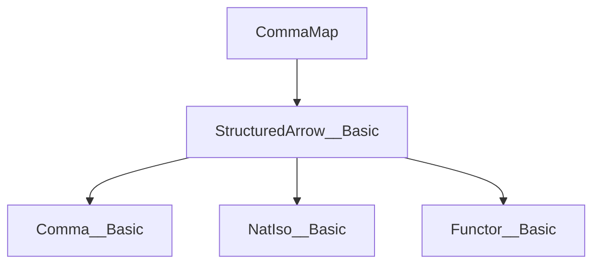

### Technical Brief: `CommaMap.lean`

---

#### **1. Key Definitions & Theorems**

| Name | Type / Signature | Purpose |
|------|------------------|---------|
| `commaMapEquivalenceFunctor` | `[IsIso β] → (X : Comma L' R') → StructuredArrow X (Comma.map α β) ⥤ Comma (map₂ (𝟙 _) α) (map₂ X.hom (inv β))` | Constructs the forward direction of the equivalence between structured arrow categories and a comma category. |
| `commaMapEquivalenceInverse` | `[IsIso β] → (X : Comma L' R') → Comma (map₂ (𝟙 _) α) (map₂ X.hom (inv β)) ⥤ StructuredArrow X (Comma.map α β)` | Constructs the inverse direction of the equivalence. |
| `commaMapEquivalenceUnitIso` | `[IsIso β] → (X : Comma L' R') → 𝟭 _ ≅ functor ⋙ inverse` | Provides the unit natural isomorphism for the equivalence. |
| `commaMapEquivalenceCounitIso` | `[IsIso β] → (X : Comma L' R') → inverse ⋙ functor ≅ 𝟭 _` | Provides the counit natural isomorphism for the equivalence. |
| `commaMapEquivalence` | `[IsIso β] → (X : Comma L' R') → StructuredArrow X (Comma.map α β) ≌ Comma (map₂ (𝟙 _) α) (map₂ X.hom (inv β))` | Main theorem: establishes the equivalence of categories. |

---

#### **2. Naming Conventions**

- **Prefixes**:
  - `commaMapEquivalence*`: All definitions/theorems related to the equivalence induced by `Comma.map`.
  - `map₂_*`: Refers to morphism-level actions of `StructuredArrow.map₂`.
- **Suffixes**:
  - `Functor`, `Inverse`, `UnitIso`, `CounitIso`: Standard categorical terminology for parts of an adjoint equivalence.
- **Pattern**:
  - `homMk`, `mk`, `Iso.refl`, `inv`, `congrArg`, `congrFun`: Lean-specific and category-theoretic constructors/lemmas.

---

#### **3. Tactic Stack**

Frequent tactics used in proofs:

| Tactic | Usage |
|--------|-------|
| `ext` | Extensionality for morphisms/objects (e.g., in `map_id`, `map_comp`). |
| `rfl` | Reflexivity for definitional equalities. |
| `simp only [...]` | Simplification using explicit lemmas, especially about `map₂`, `Comma.map`, `StructuredArrow`, and `inv`. |
| `simpa using ...` | Simplify goal using a given proof term. |
| `congrArg`, `congrFun` | To lift equalities through function/application. |
| `exact`, `by exact` | Direct proof application. |
| `isoMk`, `Comma.isoMk` | Constructing isomorphisms (objects or morphisms). |

---

#### **4. Proof Logic**

- **Structure**:
  - Prove equivalence by constructing:
    1. A functor in each direction.
    2. Natural isomorphisms for unit and counit.
  - **Functor definitions** are explicit and use `mk`/`homMk` to construct structured arrows and comma morphisms.
  - **Verification of functor laws** (`map_id`, `map_comp`) is done via `ext <;> rfl`, indicating definitional equality of components.
  - **Unit/Counit isomorphisms** are trivial (identity components), leveraging `NatIso.ofComponents`.
- **Key idea**:
  - Use `β` invertibility to “twist” the right leg of the comma object via `inv β`, enabling reconstruction of structured arrows from comma morphisms.

---

#### **5. Imports**

- **Primary dependency**:
  ```lean
  import Mathlib.CategoryTheory.Comma.StructuredArrow.Basic
  ```
- This indicates the file builds on foundational results about:
  - `Comma` categories,
  - `StructuredArrow` (a.k.a. *structured arrow categories*),
  - `Comma.map` (the functor induced by a square of natural transformations),
  - `map₂` (action of `StructuredArrow` on morphisms).

---

#### **6. Mermaid Diagrams**

##### **Dependency Graph (Module Level)**



##### **Theoretical Overview (File Content)**

```mermaid
graph LR
  A[Comma L' R'] -->|X| B[StructuredArrow X (Comma.map α β)]
  A -->|X| C[Comma (map₂ (𝟙 _) α) (map₂ X.hom (inv β))]
  B <-->|equivalence| C
  style B fill:#f9f,stroke:#333
  style C fill:#bbf,stroke:#333
```

##### **Equivalence Diagram (Categorical)**

```mermaid
graph LR
  subgraph StructuredArrow
    S[StructuredArrow X (Comma.map α β)]
  end

  subgraph Comma
    C[Comma (map₂ (𝟙 _) α) (map₂ X.hom (inv β))]
  end

  S <.->|η ≅| C
  style S fill:#f9f,stroke:#333
  style C fill:#bbf,stroke:#333
```

---

#### **7. Summary**

This file establishes a **categorical equivalence** between:
- The structured arrow category over `Comma.map α β`, and
- A comma category built from two `StructuredArrow.map₂`-induced functors.

It is a technical but foundational result for manipulating structured arrows under base change or pullback along natural transformations, especially when one of the transformations is an isomorphism (`β`). The equivalence is *explicit*, with fully defined functors and trivial unit/counit isomorphisms, making it suitable for further formalization in higher categorical or homotopical contexts.

--- 

Let me know if you'd like a formalized summary in Lean or a diagram for the naturality squares.
