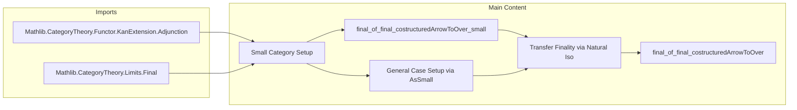

**Technical Brief: Finality on Costructured Arrow Categories (Final.lean)**  
*Based on Lean 4 formalization, category-theoretic content from Kashiwara–Schapira, Prop. 3.1.8(i)*

---

### 1. Key Definitions & Theorems

| Name | Type / Signature | Purpose |
|------|------------------|---------|
| `final_of_final_costructuredArrowToOver_small` | `lemma` | Proves `Final L` under small-category assumptions, using colimit iso chain and Grothendieck construction. |
| `final_of_final_costructuredArrowToOver` | `theorem` | Main result: extends the small-case result to general (possibly large) categories via equivalence with small versions (`AsSmall`). |
| `CostructuredArrow.toOver L t` | `CostructuredArrow L t ⥤ Over t` | Canonical functor from costructured arrow category to over-category; assumed final for all `b : B`. |
| `Grothendieck.pre F R` | `GrothendieckConstruction.pre F R` | Precomposition with Grothendieck fibration projection; used to relate colimits over comma/Grothendieck constructions. |
| `Grothendieck.map α` | `GrothendieckConstruction.map α` | Induced functor on Grothendieck constructions from a natural transformation `α`. |
| `colimitIsoColimitGrothendieck` | `colimit (F ⋙ G) ≅ colimit (grothendieckProj F ⋙ G)` | Standard iso relating colimits over a diagram and its Grothendieck construction. |
| `Final.colimitIso` | `[Final F] → colimit (F ⋙ G) ≅ colimit G` | Colimit preservation under final functors. |

---

### 2. Naming Conventions

- **Prefixes**:
  - `final_of_...`: Indicates a sufficient condition for a functor to be final.
  - `CostructuredArrow.toOver`: Standardized naming for canonical functors from costructured arrow → over-category.
  - `Grothendieck.pre`, `Grothendieck.map`, `GrothendieckPrecompFunctorToComma`: Grothendieck construction-related functors.
  - `whiskerLeft`, `whiskerRight`: Standard whiskering notation.
  - `preFunctor`, `pre L`: Precomposition with `L`.

- **Suffixes**:
  - `_small`: For lemmas restricted to small categories.
  - `_iso`, `_hom`, `_inv`: For components of isomorphisms.
  - `AsSmall.equiv`, `AsSmall.functor`: Equivalence with a small category.

- **Variables**:
  - `L`, `R`: Functors into a common target `T`.
  - `b : B`: Index for family of finality assumptions.

---

### 3. Tactic Stack

| Tactic | Usage |
|--------|-------|
| `rw [final_iff_isIso_colimit_pre]` | Reduces finality to isomorphism of colimits. |
| `intro G` | Introduces arbitrary diagram `G : T ⥤ C`. |
| `have := ...` + `apply final_of_natIso` | Uses natural isomorphism to transfer finality. |
| `let i : ... := calc ...` | Builds chain of isomorphisms for colimit comparison. |
| `convert Iso.isIso_hom i` | Converts isomorphism to isomorphism of hom-components. |
| `simp only [...]` | Simplifies using explicit definitions of functors, objects, morphisms. |
| `rw [← Iso.inv_comp_eq, Iso.eq_inv_comp]` | Rewrites using inverse properties. |
| `apply colimit.hom_ext (fun _ => by simp)` | Extends equality via colimit universal property. |
| `dsimp only [...] at hB ⊢` | Simplifies definitions in hypotheses and goal. |
| `exact ...` | Finishes with explicit construction. |

---

### 4. Proof Logic

The proof proceeds in two stages:

1. **Small-category case** (`final_of_final_costructuredArrowToOver_small`):
   - Uses characterization `Final L ↔ ∀ G, colimit(L ⋙ G) ≅ colimit G`.
   - Constructs a chain of isomorphisms:
     $$
     \operatorname{colim}(L \mathbin{\triangleright} G)
     \cong \operatorname{colim}(\operatorname{grothendieckProj}_L \mathbin{\triangleright} L \mathbin{\triangleright} G)
     \cong \operatorname{colim}(\operatorname{Grothendieck.pre}(L) R \mathbin{\triangleright} \cdots)
     \cong \cdots \cong \operatorname{colim} G
     $$
   - Each step uses:
     - `colimitIsoColimitGrothendieck`
     - `Final.colimitIso` (for `R` and for `CostructuredArrow.toOver L (R b)`)
     - Natural isomorphisms between composite diagrams (via `Grothendieck.map`, `whiskerLeft`, etc.)
   - Concludes by showing the induced map is an isomorphism.

2. **General case** (`final_of_final_costructuredArrowToOver`):
   - Reduces to small case via equivalence `A ≃ AsSmall A`, etc.
   - Defines `L'`, `R'` as conjugates of `L`, `R` along equivalences.
   - Shows `CostructuredArrow.toOver L' (R'.obj b)` is final using natural isomorphism to original case.
   - Applies small-case lemma to get `Final L'`.
   - Transfers back to `Final L` using stability of finality under natural isomorphism (`final_of_natIso`) and associator/unit isomorphisms.

---

### 5. Imports & Dependencies

| Import | Role |
|--------|------|
| `Mathlib.CategoryTheory.Functor.KanExtension.Adjunction` | Provides `GrothendieckConstruction`, `preFunctor`, `whiskerLeft`, adjunctions for Kan extensions. |
| `Mathlib.CategoryTheory.Limits.Final` | Defines `Final` functors, `final_iff_isIso_colimit_pre`, `Final.colimitIso`, colimit preservation. |
| `CostructuredArrow` | Implicit via `open CostructuredArrow`; provides `toOver`, structure of comma/costructured arrows. |
| `AsSmall` | Provides equivalence `C ≃ AsSmall C` to reduce to small categories. |

---

### 6. Mermaid Diagrams

#### Dependency Graph (Theoretical)

```mermaid
graph TD
  A[Final Functors] --> B[Colimit Characterization]
  B --> C[Colimit Preservation under Final Functors]
  D[Costructured Arrow Category] --> E[Canonical Functor to Over]
  E --> F[Assumed Finality of toOver]
  G[Grothendieck Construction] --> H[Colimit Iso: colim(F ⋙ G) ≅ colim(grothendieckProj ⋙ G)]
  H --> I[Chain of Isomorphisms]
  F --> I
  C --> I
  I --> J[Small Case: final_of_final_costructuredArrowToOver_small]
  K[AsSmall Equivalence] --> L[Reduction to Small Case]
  J --> L
  L --> M[Main Theorem: final_of_final_costructuredArrowToOver]
```

#### Overview of File Structure



--- 

Let me know if you'd like a formalized dependency graph in Lean or a visualization of the colimit iso chain.
