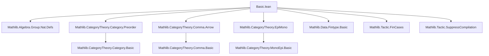

### Technical Brief: `Basic.lean` — `ComposableArrows` in Lean 4

---

#### **1. Key Definitions & Theorems**

| Name | Type / Signature | Purpose |
|------|------------------|---------|
| `ComposableArrows` | `abbrev ComposableArrows (n : ℕ) := Fin (n + 1) ⥤ C` | Represents $n$-simplices in the nerve of a category $C$: functors from the discrete ordinal category $\mathbf{n+1}$ to $C$, i.e., chains of $n$ composable arrows. |
| `obj'` | `abbrev obj' (i : ℕ) (hi : i ≤ n) : C` | The $i$-th object in the diagram $F : \mathbf{n+1} \to C$. |
| `map'` | `abbrev map' (i j : ℕ) (hij : i ≤ j) (hjn : j ≤ n) : F.obj' i ⟶ F.obj' j` | The structure map $F_i \to F_j$ for $i \le j$. |
| `left`, `right`, `hom` | `abbrev left := obj' 0`, `right := obj' n`, `hom := map' 0 n` | Leftmost object, rightmost object, and the canonical composite map $F_{\text{left}} \to F_{\text{right}}$. |
| `mk₀`, `mk₁`, `mk₂`, `mk₃`, `mk₄`, `mk₅` | Constructors for small $n$ | Explicitly build functors $\mathbf{n+1} \to C$ from sequences of objects and morphisms. E.g., `mk₁ f` corresponds to $X_0 \xrightarrow{f} X_1$. |
| `precomp` | `def precomp {X : C} (f : X ⟶ F.left) : ComposableArrows C (n + 1)` | “Shifts” $F$ right and prepends $f$, giving a functor $\mathbf{n+2} \to C$. Key for simplicial operations. |
| `δ₀Functor`, `δlastFunctor` | `whiskerLeftFunctor (Fin.succFunctor (n + 1))`, `whiskerLeftFunctor (Fin.castSuccFunctor (n + 1))` | Face functors: forget first/last arrow in a composable chain. |
| `homMk`, `isoMk`, `homMkSucc`, `isoMkSucc`, `homMk₁`, `isoMk₁`, `homMk₂`, `isoMk₂`, etc. | Constructors for morphisms/isos via component maps and naturality on adjacent pairs | Enable inductive construction of natural transformations and isomorphisms using only the $i \to i+1$ squares. |
| `arrowEquiv` | `ComposableArrows C 1 ≃ Arrow C` | Equivalence between 1-composable arrows and the arrow category of $C$. |
| `ext`, `ext₀`, `ext₁`, `ext₂`, `ext₃`, `ext₄`, `ext₅`, `hom_ext₀`, `hom_ext₁`, `hom_ext₂`, etc. | Extensionality lemmas | Prove equality of functors/natural transformations by checking components. |
| `precomp_surjective`, `mk₁_surjective`, `mk₂_surjective`, etc. | Surjectivity of constructors | Every $F : \mathbf{n+1} \to C$ arises as `mkₙ` of its sequence of maps. |

**Notable Theorems (definitional properties):**
- `precomp_δ₀`: $(F.\text{precomp}\ f).\delta_0 = F$ — definitional left inverse.
- `map' (mk₂ f g) 0 1 = f`, `map' (mk₃ f g h) 0 3 = f ≫ g ≫ h`, etc. — `dsimp`-computable.
- `homMkSucc_app_zero`, `homMk₂_app_one`, etc. — definitional on components.

---

#### **2. Naming Conventions**

- **Prefixes:**
  - `obj'`, `map'`, `app'`: indexed by natural numbers (not `Fin` elements).
  - `mkₙ`: constructors for $n$-simplices.
  - `homMkₙ`, `isoMkₙ`: constructors for morphisms/isos in `ComposableArrows C n`.
  - `δ₀`, `δlast`: face maps (forget first/last vertex).
  - `precomp`: precomposition with a new arrow on the left.

- **Suffixes:**
  - `'` (prime): natural-number-indexed version of `obj`, `map`, `app`.
  - `Succ`: inductive step for $n+1$ (e.g., `homMkSucc`).
  - `₀`, `₁`, `₂`, `₃`, `₄`, `₅`: for small $n$ (0 to 5).

- **Logical suffixes:**
  - `ext`, `hom_ext`: extensionality lemmas.
  - `isIso_iffₙ`: characterizations of isomorphisms.

---

#### **3. Tactic Stack**

| Tactic | Usage Frequency | Purpose |
|--------|-----------------|---------|
| `valid` | Custom macro (high freq) | Quick automation: `assumption`, `zero_le`, `le_rfl`, `transitivity`, `omega`. |
| `dsimp` | Very high | Tests definitional equality (e.g., `map' (mk₂ f g) 0 1 = f`). |
| `fin_cases`, `obtain rfl`, `rcases` | High | Case analysis on `Fin` elements or equalities. |
| `rw`, `simp`, `simp only` | Very high | Rewriting using lemmas like `map'_comp`, `naturality'`, `hom_extₙ`. |
| `assoc`, `comp_id`, `id_comp`, `cancel_epi`, `cancel_mono` | High | Category-theoretic simplifications. |
| `ext`, `Functor.ext_of_iso` | High | Prove equality of functors/natural transformations. |
| `intro`, `induction`, `cases` | Medium | Structural induction on naturals or `Fin`. |
| `cat_disch` | Custom (high) | Discharge trivial category-theoretic goals (e.g., `i < n` from `i ≤ n-1`). |

---

#### **4. Proof Logic**

- **Inductive structure on $n$**: Most proofs (e.g., `homMk`, `isoMk`, `ext`, `hom_ext`) proceed by:
  1. **Base case** ($n = 0$ or $n = 1$): Direct `fin_cases` + `simp`.
  2. **Inductive step** (`n + 1`): Split into:
     - Component at $0$ (`app 0`)
     - Component in the “tail” (`δ₀` or `δlast`)
     - Naturality condition for $0 \to 1$.
  3. Use `hom_ext_succ`, `ext_succ`, etc., to reduce to smaller $n$.

- **Definitional reasoning**: Heavy use of `dsimp` to unfold `precomp`, `mkₙ`, `obj'`, `map'`. This is critical for the “good definitional properties” mentioned in the docstring.

- **Naturality reduction**: Lemmas like `homMk` only require naturality for adjacent pairs ($i \to i+1$), then prove full naturality by induction on $k$ in $i \to i+k$.

- **Surjectivity proofs**: Construct preimage explicitly using components (e.g., `precomp_surjective` uses $F.\delta_0$, $F.\text{map'}\ 0\ 1$).

---

#### **5. Imports & Dependencies**

| Module | Role |
|--------|------|
| `Mathlib.Algebra.Group.Nat.Defs` | Basic `ℕ` arithmetic, `zero_le`, etc. |
| `Mathlib.CategoryTheory.Category.Preorder` | `Category*`, `homOfLE`, `leOfHom`, etc. |
| `Mathlib.CategoryTheory.Comma.Arrow` | `Arrow C`, used in `arrowEquiv`. |
| `Mathlib.CategoryTheory.EpiMono` | `cancel_epi`, `cancel_mono`, `reassoc_of%`. |
| `Mathlib.Data.Fintype.Basic` | `Fin`, `Fin.succ`, `Fin.castSucc`. |
| `Mathlib.Tactic.FinCases` | `fin_cases` tactic. |
| `Mathlib.Tactic.SuppressCompilation` | `attribute [-simp] Fin.reduceFinMk` workaround. |

---

#### **6. Mermaid Diagrams**

##### **Dependency Graph (Top-Level)**



##### **Overview of `ComposableArrows` Theory**

```mermaid
graph LR
  subgraph Definitions
    CA[ComposableArrows C n]
    obj'[obj' i]
    map'[map' i j]
    left[left]
    right[right]
    hom[hom : left ⟶ right]
    precomp[precomp f]
    δ₀[δ₀Functor]
    δlast[δlastFunctor]
  end

  subgraph Constructors
    mk₀[mk₀ X]
    mk₁[mk₁ f]
    mk₂[mk₂ f g]
    mk₃[mk₃ f g h]
    mk₄[mk₄ f g h i]
    mk₅[mk₅ f g h i j]
  end

  subgraph Morphisms
    homMk[homMk]
    isoMk[isoMk]
    homMkSucc[homMkSucc]
    isoMkSucc[isoMkSucc]
    homMk₁[homMk₁]
    isoMk₁[isoMk₁]
    homMk₂[homMk₂]
    isoMk₂[isoMk₂]
  end

  subgraph Lemmas
    ext[extₙ]
    hom_ext[hom_extₙ]
    isIso_iff[isIso_iffₙ]
    surj[mkₙ_surjective]
    precomp_δ₀[precomp_δ₀]
    arrowEquiv[arrowEquiv]
  end

  CA --> obj'
  CA --> map'
  CA --> left
  CA --> right
  CA --> hom
  CA --> precomp
  CA --> δ₀
  CA --> δlast

  mk₀ --> CA
  mk₁ --> CA
  mk₂ --> CA
  mk₃ --> CA
  mk₄ --> CA
  mk₅ --> CA

  homMk --> CA
  isoMk --> CA
  homMkSucc --> CA
  isoMkSucc --> CA

  ext --> CA
  hom_ext --> CA
  isIso_iff --> CA
  surj --> CA
  precomp_δ₀ --> CA
  arrowEquiv --> CA

  style CA fill:#f9f,stroke:#333
  style precomp fill:#bbf,stroke:#333,stroke-width:2px
  style δ₀ fill:#bfb,stroke:#333,stroke-width:2px
```

##### **Simplicial Operations (Future Work)**

```mermaid
graph LR
  subgraph Simplicial Ops
    d0[δ₀ : C^{n+1} → C^n]
    d1[δ₁]
    dn[δₙ]
    s0[σ₀ : C^n → C^{n+1}]
    sn[σₙ]
  end

  subgraph Precomp
    precomp[precomp f : C^{n} → C^{n+1}]
  end

  d0 --> CA[n-composable arrows]
  d1 --> CA
  precomp --> d0
  precomp --> s0

  style precomp fill:#f96,stroke:#333
  style d0 fill:#69f,stroke:#333
```

> **TODO (from docstring)**: Formalize face maps $\delta_i$, degeneracies $\sigma_i$ via `precomp` and `whiskerLeft`, with good definitional properties (up to $n=7$ for spectral sequences).

---

#### **7. Summary**

This file introduces the *category of $n$-composable arrows* in a category $C$, identified with functors $\mathbf{n+1} \to C$. It provides:
- Explicit constructors (`mkₙ`) for small $n$,
- A key operation `precomp` for inserting a new arrow on the left,
- Inductive tools (`homMkSucc`, `isoMkSucc`, `ext_succ`) for constructing morphisms and proving equalities,
- Definitional lemmas (`dsimp`-computable) essential for formalizing simplicial structures.

The design prioritizes **definitional equality** (e.g., `precomp_δ₀` is `rfl`) to support future formalization of *simplicial operations* (face/degeneracy maps) needed for spectral sequences (per Verdier). The heavy use of `Fin` and `homOfLE` reflects Lean 4’s category-theoretic infrastructure for ordinal-indexed diagrams.
