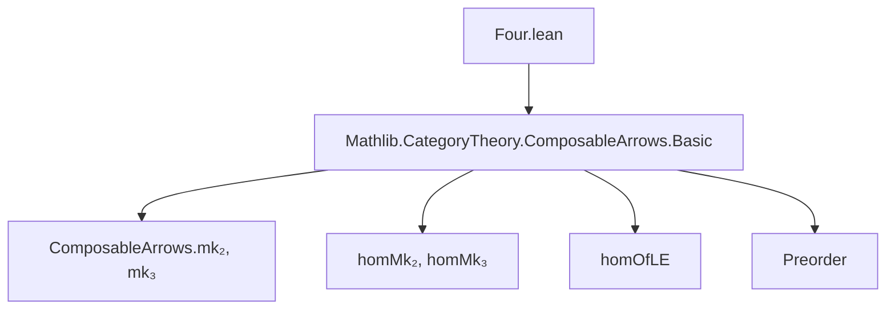
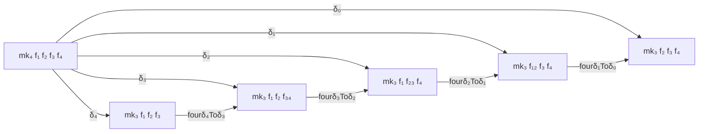

### Technical Brief: `Four.lean` — API for Compositions of Four Arrows

---

#### **1. Key Definitions & Theorems**

| Name | Type | Purpose |
|------|------|---------|
| `fourδ₄Toδ₃` | `mk₃ f₁ f₂ f₃ ⟶ mk₃ f₁ f₂ f₃₄` | Face map dropping the *last* object in a 3-composable arrow triple, using $f₃ ≫ f₄ = f₃₄$ |
| `fourδ₃Toδ₂` | `mk₃ f₁ f₂ f₃₄ ⟶ mk₃ f₁ f₂₃ f₄` | Face map dropping the *second* object, using $f₂ ≫ f₃ = f₂₃$ and $f₃ ≫ f₄ = f₃₄$ |
| `fourδ₂Toδ₁` | `mk₃ f₁ f₂₃ f₄ ⟶ mk₃ f₁₂ f₃ f₄` | Face map dropping the *first* object, using $f₁ ≫ f₂ = f₁₂$ and $f₂ ≫ f₃ = f₂₃$ |
| `fourδ₁Toδ₀` | `mk₃ f₁₂ f₃ f₄ ⟶ mk₃ f₂ f₃ f₄` | Face map dropping the *zeroth* object, using $f₁ ≫ f₂ = f₁₂$ |
| `fourδ₄Toδ₃'`, `fourδ₃Toδ₂'`, `fourδ₂Toδ₁'`, `fourδ₁Toδ₀'` | Abbreviations | Specializations to preorders via `homOfLE` (e.g., `hi₂₃.trans hi₃₄`) |
| `fourδₙToδₘ_app_k` (8 lemmas) | `simp`-friendly equalities | Describe component-wise action of each `fourδ` on the 4-indexed hom-family (e.g., `app 0 = 𝟙`, `app 3 = f₄`, etc.) |

All `fourδ` maps are defined using `homMk₃`, the constructor for morphisms between 3-composable arrow triples.

---

#### **2. Naming Conventions**

- **Prefix**: `fourδₙToδₘ` — indicates a face map from the *n*-th face to the *m*-th face of a 4-simplex (in nerve terms).
- **Suffix**: `_app_k` for component lemmas — standard for natural transformations in functor categories.
- **Prime variants** (`fourδₙToδₘ'`) — indicate preorder-specific versions.
- **Variables**: `f₁`, `f₂`, `f₃`, `f₄` for atomic arrows; `f₁₂`, `f₂₃`, `f₃₄` for composites.
- **Proof hypotheses**: `h₁₂`, `h₂₃`, `h₃₄` — equalities like `f₁ ≫ f₂ = f₁₂`.

---

#### **3. Tactic Stack**

- `rfl` — used in all `simp` lemmas (`fourδₙToδₘ_app_k`) to prove component equalities.
- `cat_disch` — used in default proof arguments (e.g., `h₃₄ : f₃ ≫ f₄ = f₃₄ := by cat_disch`) to discharge category-theoretic equalities automatically.
- Implicit use of `simp` via `@[simp]` attribute.

No heavy automation (e.g., `aesop`, `ring`, `linarith`) appears — proofs are definitional.

---

#### **4. Proof Logic**

- **Structure**: All definitions are *explicit* and *definitional*; no induction or case analysis.
- **Logic flow**:
  - Define each `fourδ` as a morphism of composable arrow triples via `homMk₃`.
  - Each `homMk₃` takes 4 components (one per index 0–3), with identity morphisms where appropriate.
  - The `simp` lemmas verify that each component matches the intended behavior (e.g., `app 2 = f₄` in `fourδ₄Toδ₃`).
- **Preorder variant**: Uses `homOfLE` and transitivity (`trans`) to construct composite arrows; definitions are abbreviations (not lemmas), relying on definitional equality of the underlying morphisms.

---

#### **5. Imports**

- `Mathlib.CategoryTheory.ComposableArrows.Basic` — provides:
  - `ComposableArrows.mk₂`, `mk₃`, `mk₄`
  - `homMk₂`, `homMk₃`
  - `homOfLE`, `Preorder`-based homs

This module extends the `ComposableArrows` API to handle 4-arrow chains and their face maps.

---

#### **6. Mermaid Diagrams**

##### **Dependency Graph**

##### **Overview of Theory (Nerve Interpretation)**

- This matches the simplicial identities: $d^i \circ d^j = d^{j+1} \circ d^i$ for $i \le j$.
- The `fourδ` maps implement the *coface maps* $d^i$ in the nerve of a category.

---

#### **7. Summary**

This file formalizes the *face maps* between 3-composable arrow triples that arise from a 4-composable chain — a key ingredient for constructing the *nerve* of a category as a simplicial object. The definitions are minimal, definitional, and verified component-wise via `simp` lemmas. The preorder variant ensures compatibility with order-theoretic constructions (e.g., poset-enriched categories or filtered diagrams).
