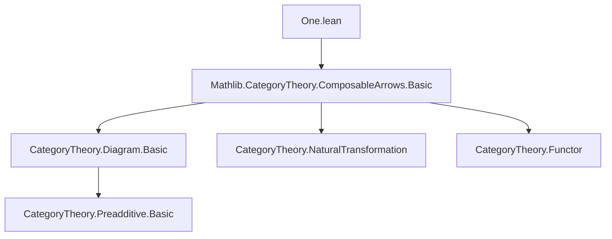

**Technical Brief: `One.lean` — Functors to `ComposableArrows C 1`**

---

### 1. **Key Definitions & Theorems**

| Name | Type | Purpose |
|------|------|---------|
| `functorArrows` | `ComposableArrows C n ⥤ ComposableArrows C 1` | For indices `i ≤ j ≤ n`, defines a functor sending a length-`n` composable arrow diagram `S` to the single arrow `S.map' i j` (i.e., the composite from level `i` to `j`). |
| `mapFunctorArrows` | `functorArrows C i j n ⟶ functorArrows C i' j' n` | For `i ≤ i'`, `j ≤ j'`, `j' ≤ n`, defines a natural transformation between functors induced by extending the source/target indices of the arrow in the diagram. |

Both definitions are annotated with `@[simps]`, indicating they are designed for automatic simplification using the `simps` machinery (i.e., their components are explicitly given and easily destructurable).

No theorems are stated in this file — only definitions and their structural properties (via `simps`).

---

### 2. **Naming Conventions**

- **Prefixes**:
  - `functorArrows`: indicates a *functor* between *composable arrows* categories.
  - `mapFunctorArrows`: indicates a *natural transformation* between functors named `functorArrows`.
- **Suffixes**:
  - `C`: universe parameter for the base category.
  - `i j n`: standard indices for source, target, and length.
  - `hij`, `hj`, etc.: proof hypotheses for inequalities (e.g., `hij : i ≤ j`).
- **Internal constructors**:
  - `mk₁`, `homMk₁`: constructors for `ComposableArrows C 1` (objects and morphisms), indicating the canonical embedding of a single arrow.

---

### 3. **Tactic Stack**

- `lia`: used in default proof arguments for linear arithmetic (e.g., `by lia` for `i ≤ j`, `j ≤ n`, etc.).
- `simp`: used in the `mapFunctorArrows` definition: `by simp [← Functor.map_comp]`.
- `simps`: implicit via `@[simps]` attribute — triggers automatic generation of `app`, `hom`, `hom_inv`, etc., projections.

No heavy automation (e.g., `aesop`, `ring`, `omega`) is used — the file is purely definitional.

---

### 4. **Proof Logic**

- **No proofs are written** — only definitions with *implicit* proofs for inequality constraints (handled by `by lia`).
- The definitions rely on:
  - `S.map' i j`: the map induced by monotonicity of the diagram `S : Δⁿ → C`, where `Δⁿ` is the ordinal category `[n]`.
  - `Functor.map_comp`: naturality of functors preserving composition.
- The `mapFunctorArrows` naturality square is justified by `simp` using `Functor.map_comp`, i.e., the diagram commutes because functors preserve composition.

---

### 5. **Imports**

- `Mathlib.CategoryTheory.ComposableArrows.Basic`: provides:
  - `ComposableArrows C n`: the category of length-`n` composable arrows in `C`.
  - `mk₁`, `homMk₁`: constructors for objects/morphisms in `ComposableArrows C 1`.
  - `S.map'`: the map induced by `i ≤ j` in a diagram `S : [n] ⥤ C`.

This file is part of a larger project on *composable arrows* and their behavior under reindexing (e.g., for simplicial or cosimplicial constructions).

---

### 8. **Mermaid Diagrams**

#### **Dependency Graph**



#### **Overview of File Structure**

```mermaid
flowchart LR
  subgraph "ComposableArrows C n"
    S["S : [n] ⥤ C"]
    Smap["S.map' i j : S i → S j"]
  end

  subgraph "ComposableArrows C 1"
    A1["A₁ : A₀ → A₁"]
    hA["homMk₁ f g h"]
  end

  functorArrows["functorArrows C i j n"] -->|obj| Smap
  functorArrows -->|map| hA

  mapFunctorArrows["mapFunctorArrows"] -->|natural transformation| functorArrows
  mapFunctorArrows -->|source| functorArrows C i j n
  mapFunctorArrows -->|target| functorArrows C i' j' n
```

#### **Conceptual Flow**

- Input: a diagram `S : [n] ⥤ C`.
- Extract arrow `S i → S j` via `S.map' i j`.
- Package it as an object in `ComposableArrows C 1` using `mk₁`.
- Extend this construction functorially in `S`.
- When indices expand (`i ≤ i'`, `j ≤ j'`), the induced maps between diagrams give a natural transformation between the corresponding functors.

---

**Summary**: This file introduces *reindexing functors* and *natural transformations* between them for composable arrow diagrams, laying groundwork for higher-categorical constructions (e.g., simplicial identities, Kan extensions, or homotopy colimits). It is minimal, definitional, and heavily reliant on `simps` and `lia` for automation.
