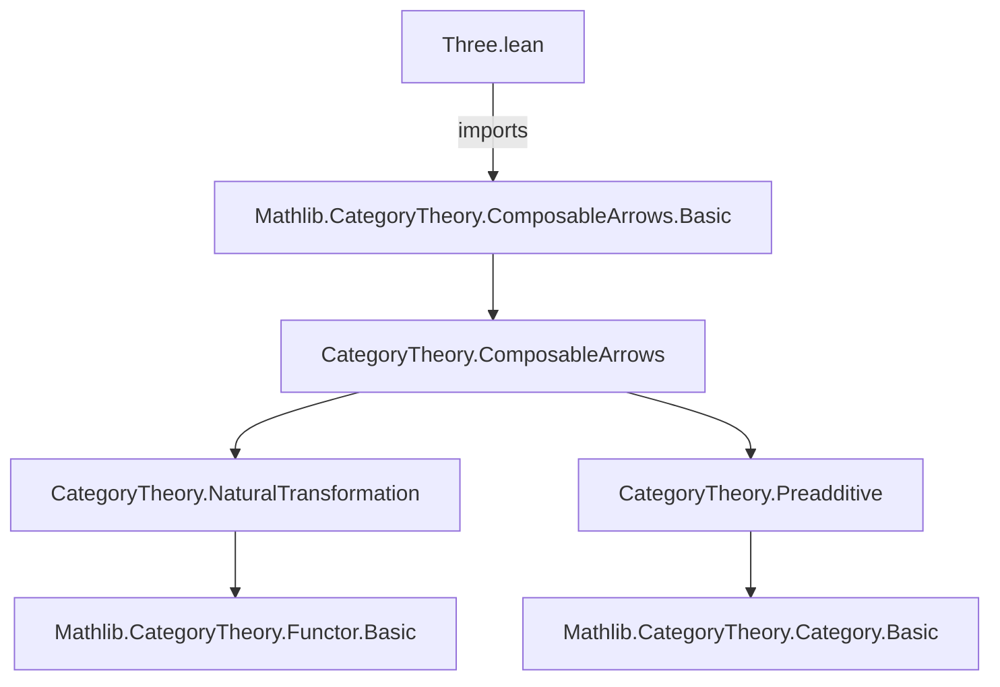

### Technical Brief: `Three.lean` — API for Compositions of Three Arrows

---

#### **1. Key Definitions & Theorems**

| Name | Type / Signature | Purpose |
|------|------------------|---------|
| `threeδ₃Toδ₂` | `mk₂ f₁ f₂ ⟶ mk₂ f₁ f₂₃` (given `f₂ ≫ f₃ = f₂₃`) | Face map `δ³₂`: includes the first two arrows `f₁, f₂` into the triple `f₁, f₂, f₃`, identifying the composite `f₂ ≫ f₃ = f₂₃`. |
| `threeδ₂Toδ₁` | `mk₂ f₁ f₂₃ ⟶ mk₂ f₁₂ f₃` (given `f₁ ≫ f₂ = f₁₂`, `f₂ ≫ f₃ = f₂₃`) | Face map `δ²₁`: replaces middle arrow `f₂` by composite `f₁₂ = f₁ ≫ f₂`, keeping `f₃`. |
| `threeδ₁Toδ₀` | `mk₂ f₁₂ f₃ ⟶ mk₂ f₂ f₃` (given `f₁ ≫ f₂ = f₁₂`) | Face map `δ¹₀`: replaces first arrow `f₁` by composite `f₁₂ = f₁ ≫ f₂`, keeping `f₃`. |
| `threeδ₃Toδ₂_app_zero`, `threeδ₃Toδ₂_app_one`, `threeδ₃Toδ₂_app_two` | `app n = ...` | Explicit component-wise description of `threeδ₃Toδ₂` as a natural transformation between composable arrow diagrams (0-indexed). |
| `threeδ₂Toδ₁_app_zero`, `threeδ₂Toδ₁_app_one`, `threeδ₂Toδ₁_app_two` | `app n = ...` | Same for `threeδ₂Toδ₁`. |
| `threeδ₁Toδ₀_app_zero`, `threeδ₁Toδ₀_app_one`, `threeδ₁Toδ₀_app_two` | `app n = ...` | Same for `threeδ₁Toδ₀`. |
| `threeδ₃Toδ₂'`, `threeδ₂Toδ₁'`, `threeδ₁Toδ₀'` | Abbreviations for preorders | Specializations of the above to the case where morphisms are `homOfLE` (i.e., proofs of `≤` in a preorder). |

> **Note**: The notation `mk₂ f g` denotes a composable pair (i.e., an object of `ComposableArrows C`), and `homMk₂ a b c` is the morphism between such pairs induced by `a : X₀ → Y₀`, `b : X₁ → Y₁`, `c : X₂ → Y₂` making the square commute.

---

#### **2. Naming Conventions**

- **Prefix `threeδₙToδₘ`**: Indicates a face map between 2-simplices (i.e., composable pairs) induced by a degeneracy or face relation among 3-simplices (`mk₃ f₁ f₂ f₃`).  
  - Subscripts `₃`, `₂`, `₁`, `₀` correspond to the *omitted* vertex in the 3-simplex:
    - `δ³₂`: omits vertex 2 → keeps `f₁, f₂` (i.e., `f₂₃ = f₂ ≫ f₃`)
    - `δ²₁`: omits vertex 1 → composes `f₁, f₂` into `f₁₂`
    - `δ¹₀`: omits vertex 0 → keeps `f₂, f₃`
- **Suffix `'`**: Used for preorder-specific variants (e.g., `threeδ₃Toδ₂'`), where morphisms are constructed via `homOfLE`.

---

#### **3. Tactic Stack**

- **`cat_disch`**: Used in default arguments to discharge category-theoretic equalities (e.g., `f₂ ≫ f₃ = f₂₃`). Likely a custom tactic for `CategoryTheory` that simplifies or proves such equalities automatically.
- **`rfl`**: Appears in all `@[simp]` lemmas for `app n`, confirming that the components are definitionally equal to identity or the given morphism.
- **No heavy automation**: No `aesop`, `ring`, or `simp` beyond `rfl`; proofs are definitional.

---

#### **4. Proof Logic**

- **Definitional equality**: All lemmas (`threeδ*_app_*`) are proven by `rfl`, meaning the `app` components are *definitionally* equal to the stated morphisms — no induction or case analysis needed.
- **Structure**:  
  - Definitions are direct via `homMk₂`, encoding the naturality of the face maps in the nerve of a category.  
  - The preorder variants are abbreviations that apply the general definitions with `rfl` proofs for the required equalities (since composition in a preorder is unique).

---

#### **5. Imports**

- **Primary dependency**:  
  ```lean
  import Mathlib.CategoryTheory.ComposableArrows.Basic
  ```
  - Provides the foundational definitions: `ComposableArrows`, `mk₂`, `homMk₂`, `app`, etc.

---

#### **6. Mermaid Diagrams**

##### **Dependency Graph**


##### **Overview of Theory Context**
```mermaid
graph LR
  Nerve[C nerve C] -->|objects| Simplex3[3-simplices: f₁,f₂,f₃]
  Simplex3 -->|faces| Face0[mk₂ f₂ f₃]
  Simplex3 -->|faces| Face1[mk₂ f₁₂ f₃]
  Simplex3 -->|faces| Face2[mk₂ f₁ f₂₃]
  Simplex3 -->|faces| Face3[mk₂ f₁ f₂]

  Face3 -->|threeδ₃Toδ₂| Face2
  Face2 -->|threeδ₂Toδ₁| Face1
  Face1 -->|threeδ₁Toδ₀| Face0

  subgraph "ComposableArrows C"
    mk2[mk₂ f g]
    homMk2[homMk₂ a b c]
  end

  subgraph "Three.lean"
    threeδ₃Toδ₂
    threeδ₂Toδ₁
    threeδ₁Toδ₀
  end

  mk2 -->|objects| ComposableArrows
  homMk2 -->|morphisms| ComposableArrows
  threeδ₃Toδ₂ -->|face maps| mk2
```

> **Interpretation**: This file implements the *simplicial face maps* for the nerve of a category, restricted to the level of composable pairs (`2`-simplices), using the `ComposableArrows` structure. The maps `threeδₙToδₘ` correspond to the standard simplicial identities `d^i_j`, where `d^3_2`, `d^2_1`, `d^1_0` are the three non-degenerate face maps among 3 vertices.

--- 

Let me know if you'd like the corresponding *degeneracy maps* (`threeσ₀`, `threeσ₁`) or verification of simplicial identities (`d_i d_j = d_j d_{i-1}`) formalized.
