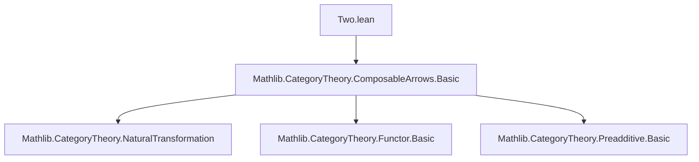

### Technical Brief: `Two.lean` — Composable Arrows of Length 2

---

#### **1. Key Definitions & Theorems**

| Name | Type / Signature | Purpose |
|------|------------------|---------|
| `twoδ₂Toδ₁` | `def twoδ₂Toδ₁ (h : f ≫ g = fg) : mk₁ f ⟶ mk₁ fg` | Morphism in `ComposableArrows C 1` induced by `g : j ⟶ k`, when `f ≫ g = fg`. Represents the face map `d²₂` (skipping vertex 2) in the nerve interpretation. |
| `twoδ₁Toδ₀` | `def twoδ₁Toδ₀ (h : f ≫ g = fg) : mk₁ fg ⟶ mk₁ g` | Morphism in `ComposableArrows C 1` induced by `f : i ⟶ j`, when `f ≫ g = fg`. Represents the face map `d¹₀` (skipping vertex 0). |
| `twoδ₂Toδ₁_app_zero` | `lemma (twoδ₂Toδ₁ h).app 0 = 𝟙 _` | Component at index `0` of `twoδ₂Toδ₁` is identity. |
| `twoδ₂Toδ₁_app_one` | `lemma (twoδ₂Toδ₁ h).app 1 = g` | Component at index `1` of `twoδ₂Toδ₁` is `g`. |
| `twoδ₁Toδ₀_app_zero` | `lemma (twoδ₁Toδ₀ h).app 0 = f` | Component at index `0` of `twoδ₁Toδ₀` is `f`. |
| `twoδ₁Toδ₀_app_one` | `lemma (twoδ₁Toδ₀ h).app 1 = 𝟙 _` | Component at index `1` of `twoδ₁Toδ₀` is identity. |
| `twoδ₁Toδ₀'` | `abbrev twoδ₁Toδ₀' : mk₁ (homOfLE (hi₀₁.trans hi₁₂)) ⟶ mk₁ (homOfLE hi₁₂)` | Preorder-specific variant of `twoδ₁Toδ₀`, using `homOfLE`. |
| `twoδ₂Toδ₁'` | `abbrev twoδ₂Toδ₁' : mk₁ (homOfLE hi₀₁) ⟶ mk₁ (homOfLE (hi₀₁.trans hi₁₂))` | Preorder-specific variant of `twoδ₂Toδ₁`. |
| `instance [IsIso g] : IsIso (twoδ₂Toδ₁ f g fg h)` | Proof that `twoδ₂Toδ₁` is an iso if `g` is. | |
| `instance [IsIso f] : IsIso (twoδ₁Toδ₀ f g fg h)` | Proof that `twoδ₁Toδ₀` is an iso if `f` is. | |

---

#### **2. Naming Conventions**

- **Prefix `twoδ_`**: Indicates face maps for a *2-simplex* (i.e., a composable pair of arrows) in the nerve construction.
  - `twoδ₂Toδ₁`: Face map skipping vertex `2` (source → middle).
  - `twoδ₁Toδ₀`: Face map skipping vertex `0` (middle → target).
- **Suffix `'`**: Variant for preorders (e.g., `twoδ₁Toδ₀'`), using `homOfLE`.
- **`mk₁`**: Standard notation for the embedding of a single morphism into a composable arrow of length 1 (i.e., an object of `ComposableArrows C 1`).
- **`homMk₁`**: Constructor for morphisms between `mk₁` objects; takes pair of morphisms `(f, g)` with compatibility condition.

---

#### **3. Tactic Stack**

- `rw [...]`: Rewriting using lemmas (e.g., `isIso_iff₁`).
- `constructor <;> dsimp <;> infer_instance`: Standard pattern for proving isomorphism instances.
- `rfl`: Used in `@[simp]` lemmas to show equality of components.
- `cat_disch`: Custom tactic (likely from `Mathlib.CategoryTheory`) to discharge category-theoretic hypotheses like `f ≫ g = fg`.

---

#### **4. Proof Logic**

- **Structure**: Definitions are direct and computational.
- **Lemmas**: Proven by `rfl`, exploiting definitional equality of components in `ComposableArrows`.
- **Isomorphism instances**: Use `isIso_iff₁`, which states that a natural transformation is an iso iff each component is an iso. Then `dsimp` simplifies components, and `infer_instance` uses the assumption (`[IsIso g]` or `[IsIso f]`) to conclude.

---

#### **5. Imports**

- `Mathlib.CategoryTheory.ComposableArrows.Basic`: Core definitions and properties of `ComposableArrows C n`, especially `mk₁`, `homMk₁`, and the category structure.

---

#### **6. Theory Context & Mermaid Diagrams**

##### **Dependency Graph**



##### **Conceptual Overview of `ComposableArrows C 1` and Face Maps**

```mermaid
graph LR
  subgraph Nerve Interpretation
    A[mk₁ f] -->|twoδ₂Toδ₁| B[mk₁ fg]
    B -->|twoδ₁Toδ₀| C[mk₁ g]
  end

  subgraph Simplicial Set (nerve C)
    Δ²[2-simplex: f; g] -->|d²₂| Δ¹[middle: fg]
    Δ² -->|d¹₀| Δ¹[target: g]
    Δ² -->|d⁰₁| Δ¹[source: f]
  end

  A <-->|interpretation| Δ²
  B <-->|interpretation| Δ²
  C <-->|interpretation| Δ²
```

- `ComposableArrows C 1` is equivalent to the arrow category `C^→`, whose objects are morphisms of `C`, and morphisms are commutative squares.
- The object `mk₁ f` corresponds to the morphism `f : i → j`.
- The morphism `twoδ₂Toδ₁` corresponds to the square:
  ```
  i --1--> i
  |        |
  f        fg
  |        |
  v        v
  j --g--> k
  ```
- The morphism `twoδ₁Toδ₀` corresponds to:
  ```
  i --f--> j
  |        |
  fg       1
  |        |
  v        v
  k --1--> k
  ```

---

#### **7. Summary**

This file formalizes the *face maps* between objects in `ComposableArrows C 1` corresponding to the inclusion of edges into a composable pair (a 2-simplex in the nerve). It sets up foundational API for higher categorical constructions (e.g., nerves, simplicial objects), especially in preparation for results involving simplicial identities or Kan conditions.

The naming (`twoδ₂Toδ₁`, `twoδ₁Toδ₀`) reflects the standard simplicial face map notation `dⁿᵢ`, skipping the `i`-th vertex in an `n`-simplex.
