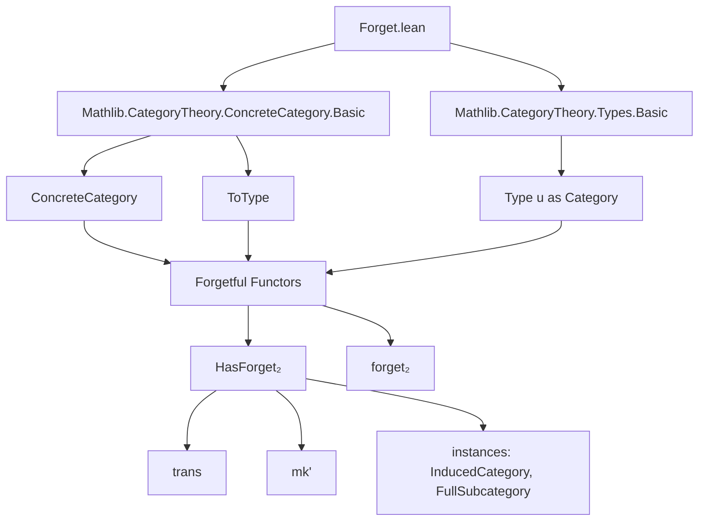
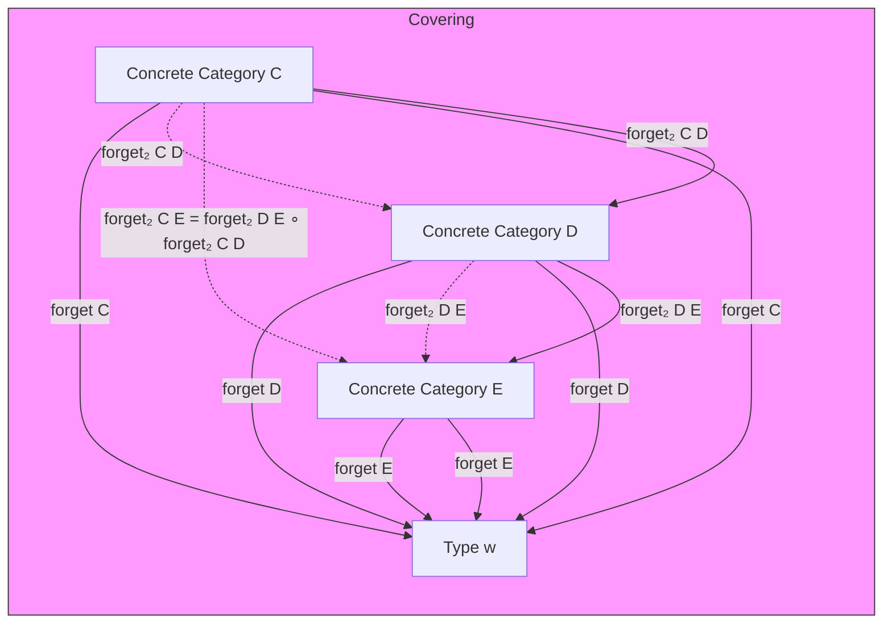
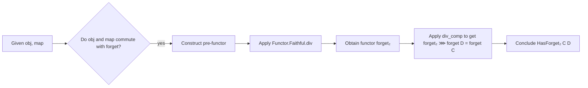

### Technical Brief: `Forget.lean` — Forgetful Functors in Lean 4 / Mathlib

---

#### **1. Key Definitions & Theorems**

| Name | Type / Signature | Purpose |
|------|------------------|---------|
| `forget C` | `C ⥤ Type w` | Canonical faithful functor from a concrete category `C` to `Type w`, sending objects to their underlying type and morphisms to themselves (as functions). |
| `forget₂ C D` | `[HasForget₂ C D] ⇒ C ⥤ D` | A *partially forgetting* functor from concrete category `C` to `D`, covering the forgetful functors to `Type`. |
| `HasForget₂` | `class` | States existence of a functor `forget₂ : C ⥤ D` such that `forget₂ ⋙ forget D = forget C`. |
| `HasForget₂.mk'` | `def` | Construction principle: to define `HasForget₂ C D`, it suffices to give `obj`, `map`, and proofs that they commute with `forget`, *without* verifying functor laws (due to `Faithful.div_comp`). |
| `HasForget₂.trans` | `def` | Transitivity: if `C → D` and `D → E` have forgetful functors, then so does `C → E`. |
| `InducedCategory.hasForget₂` | `instance` | The induced category along `f : C → D` has a forgetful functor to `D`. |
| `FullSubcategory.hasForget₂` | `instance` | Full subcategories inherit a forgetful functor to the ambient category. |
| `ConcreteCategory.congr_fun` | `theorem` | Analogue of `congr_fun` for morphisms in concrete categories: `f = g ⇒ f x = g x`. |
| `ConcreteCategory.congr_arg` | `theorem` | Analogue of `congr_arg`: `x = x' ⇒ f x = f x'`. |
| `Types.instConcreteCategory` | `instance` | `Type u` is a concrete category over itself via identity. |
| `forget₂_faithful` | `instance` | `forget₂` is always faithful when `HasForget₂` holds (follows from `forget_comp.faithful_of_comp`). |

---

#### **2. Naming Conventions**

- **Prefixes**:
  - `forget` / `forget₂`: core forgetful constructions.
  - `congr_`: analogues of `congr_fun`/`congr_arg` for concrete categories.
- **Suffixes**:
  - `_comp_apply`: lemmas about composition under `forget₂` or `forget`, applied to elements.
  - `_mk'`: construction lemma for `HasForget₂` (minimal verification).
- **Class names**:
  - `HasForget₂`: existential class for “there exists a forgetful functor to `D`”.

---

#### **3. Tactic Stack**

Frequently used tactics in proofs:
- `aesop`: for automated proof of equalities involving functors and natural transformations.
- `rw`: rewriting using `forget_comp`, `Functor.map_comp`, `congr_arg`, `congr_fun`.
- `simp only [...]`: simplification with specific lemmas (e.g., `forget₂_comp_apply`, `Types.hom_eq_coe`).
- `change`, `simp`: for restructuring goals using definitional equalities (`rfl`-like reasoning).
- `apply Functor.Faithful.div`, `apply Functor.Faithful.div_comp`: key for constructing functors via faithfulness.

---

#### **4. Proof Logic**

- **Functor construction**: Use `Functor.Faithful.div` to lift a “pre-functor” (object/map assignment commuting with `forget`) to a genuine functor, leveraging faithfulness of `forget`.
- **Verification strategy**:
  - For `HasForget₂.mk'`, verify:
    - `obj` lifts to same underlying type as `forget C`.
    - `map f` lifts to same function as `forget C.map f`.
  - Then `div` constructs the functor and `div_comp` gives the covering condition.
- **Inductive/structural reasoning**:
  - Instances like `InducedCategory.hasForget₂`, `FullSubcategory.hasForget₂` use `rfl` because the forgetful functors are definitionally equal.
- **Element-wise reasoning**:
  - Lemmas like `forget₂_comp_apply` reduce to `Functor.map_comp` and `comp_apply`, then apply to elements.

---

#### **5. Imports & Dependencies**

- **Core imports**:
  ```lean
  Mathlib.CategoryTheory.ConcreteCategory.Basic
  Mathlib.CategoryTheory.Types.Basic
  ```
- **Key dependencies**:
  - `CategoryTheory.ConcreteCategory`: defines `ConcreteCategory`, `ToType`, `hom`, `ofHom`.
  - `CategoryTheory.Functor`: for `Functor.map`, `comp`, `Faithful`, `div`, `div_comp`.
  - `CategoryTheory.NaturalTransformation`: for `naturality`, `app`.
  - `CategoryTheory.InducedCategory`, `FullSubcategory`: for instances.

---

#### **6. Mermaid Diagrams**

##### **Dependency Graph (Module-Level)**



##### **Conceptual Overview of Forgetful Structure**



##### **Proof Strategy Flow for `HasForget₂.mk'`**



---

#### **7. Summary**

This module formalizes the theory of *forgetful functors* between concrete categories in Lean 4. It introduces:
- The canonical `forget : C ⥤ Type`,
- A relative version `forget₂ : C ⥤ D` via `HasForget₂`,
- A powerful construction principle `mk'` that avoids verifying functor laws,
- And shows how many standard categorical constructions (induced categories, full subcategories) inherit forgetful functors.

The design leverages faithfulness of `forget` to reduce verification to element-level commutativity, enabling concise and reusable abstractions for concrete categories.
