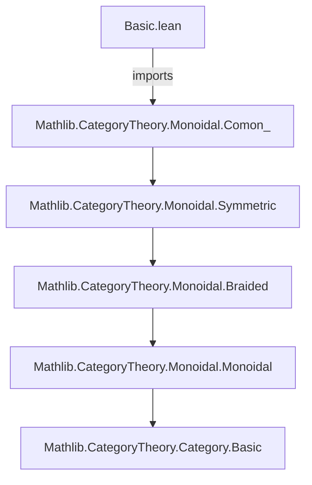
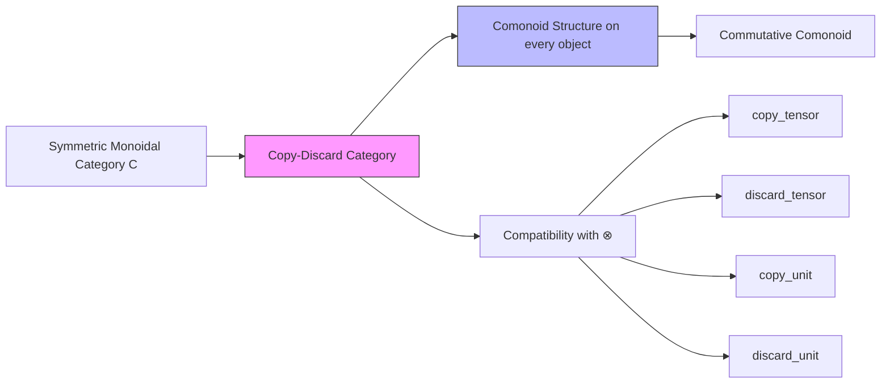

**Technical Brief: `Basic.lean` — Copy-Discard Categories in Lean 4**

---

### 1. **Key Definitions & Theorems**

| Name | Type / Signature | Purpose |
|------|------------------|---------|
| `CopyDiscardCategory` | `class` extending `SymmetricCategory` | Defines a symmetric monoidal category where every object carries a *commutative* comonoid structure (`ComonObj` + `IsCommComonObj`) and the comonoid structure is *compatible* with the monoidal structure (via `copy_tensor`, `discard_tensor`, `copy_unit`, `discard_unit`). |
| `Δ[X]` | `ComonObj.mul X` (notation for comultiplication) | The *copy* morphism $X \to X \otimes X$. |
| `ε[X]` | `ComonObj.counit X` (notation for counit) | The *discard* (or delete) morphism $X \to \mathbf{1}$. |
| `copy_tensor` | `Δ[X ⊗ Y] = (Δ[X] ⊗ₘ Δ[Y]) ≫ tensorμ X X Y Y` | Ensures copying distributes over tensor product up to the symmetry isomorphism (`tensorμ` is the symmetry: $ (X \otimes X) \otimes (Y \otimes Y) \xrightarrow{\sigma} (X \otimes Y) \otimes (X \otimes Y) $). |
| `discard_tensor` | `ε[X ⊗ Y] = (ε[X] ⊗ₘ ε[Y]) ≫ (λ_ (𝟙_ C)).hom` | Discarding a tensor product equals discarding each factor and then using the left unitor. |
| `copy_unit` | `Δ[𝟙_ C] = (λ_ (𝟙_ C)).inv` | Copy on the unit object is the inverse of the left unitor (i.e., the canonical isomorphism $\mathbf{1} \xrightarrow{\sim} \mathbf{1} \otimes \mathbf{1}$). |
| `discard_unit` | `ε[𝟙_ C] = 𝟙 (𝟙_ C)` | Discard on the unit is the identity. |

> **Note**: `by cat_disch` is a tactic that discharges category-theoretic equalities using coherence (e.g., Mac Lane’s coherence theorem), often implemented via `simp` with monoidal coherence lemmas.

---

### 2. **Naming Conventions**

- **Prefixes**:
  - `copy_` / `discard_`: for axioms about the comonoid structure interacting with tensor.
  - `isCommComonObj`: predicate naming for commutativity of comonoids.
- **Suffixes**:
  - `_tensor`: for properties involving tensor products.
  - `_unit`: for properties involving the monoidal unit.
- **Notation**:
  - `Δ[X]`, `ε[X]`: standard string-diagram notation for copy and discard.
  - `⊗ₘ`: tensor on morphisms (from `MonoidalCategory`).
  - `tensorμ`: symmetry isomorphism $ (X \otimes X) \otimes (Y \otimes Y) \cong (X \otimes Y) \otimes (X \otimes Y) $.

---

### 3. **Tactic Stack**

- `by cat_disch`: primary tactic for proving equalities in monoidal categories (relies on coherence).
- Implicit use of:
  - `simp` (via `cat_disch`) with lemmas from `MonoidalCategory`, `SymmetricCategory`, `ComonObj`.
  - `ext` (likely used internally in `cat_disch` to prove morphism equality).
  - `congr` (for functoriality of tensor).
- No explicit `induction`, `cases`, or `ring` — this is *structural* category theory, not arithmetic or algebra over types.

---

### 4. **Proof Logic**

- **Structure**: Axiomatization via *coherence conditions*.
- **Proof style**:
  - All proofs are *equational reasoning* in a monoidal category.
  - The class axioms (`copy_tensor`, `discard_tensor`, etc.) are *definitional constraints* — proofs are discharged automatically by `cat_disch`, which uses:
    - Monoidal coherence (e.g., associators, unitors, symmetries satisfy pentagon, triangle, hexagon identities).
    - Comonoid coherence (coassociativity, counitality, commutativity).
  - No inductive or constructive arguments — the theory is *synthetic* (axiomatic, diagrammatic).
- **Typical proof flow**:
  1. Expand definitions (`Δ`, `ε`, `tensorμ`, etc.).
  2. Apply naturality, coherence, and comonoid laws.
  3. Use `cat_disch` to normalize using coherence.

---

### 5. **Imports**

| Import | Role |
|--------|------|
| `Mathlib.CategoryTheory.Monoidal.Comon_` | Provides `ComonObj`, `IsCommComonObj`, and comonoid structure (comultiplication `mul`, counit `counit`, coassociativity, counitality, commutativity). |
| `CategoryTheory` (implicit via `open`) | Provides `Category`, `MonoidalCategory`, `SymmetricCategory`, tensor notation (`⊗`, `⊗ₘ`), unitors (`λ_`, `ρ_`), associators, symmetries (`tensorμ`). |

> **Scope**: This module sits at the intersection of *monoidal category theory* and *comonoid theory*, with a focus on *structural* properties needed for probabilistic reasoning (e.g., Bayesian inversion, disintegration — per cited papers).

---

### 6. **Mermaid Diagrams**

#### Dependency Graph (Module-Level)



#### Overview of Theory Structure



#### String-Diagram Intuition (for `copy_tensor`)

```
X ⊗ Y          X ⊗ Y
 │              │
 ▼              ▼
X ⊗ X   Y ⊗ Y  ──σ──► (X ⊗ Y) ⊗ (X ⊗ Y)
 │   │   │   │
 ▼   ▼   ▼   ▼
X ⊗ Y = X ⊗ Y
```

The copy of $X \otimes Y$ equals copying each factor and then swapping middle legs via symmetry.

---

### 7. **Tags & Context**

- **Tags**: `copy-discard`, `comonoid`, `symmetric monoidal`
- **Use Cases**:
  - Formalizing *probabilistic theories* (e.g., Markov categories).
  - Modeling *classical information* (copying and discarding) in quantum/linear logic settings.
  - Providing semantics for *string diagrammatic reasoning* in categorical probability (per Fritz, Cho–Jacobs).

---

### 8. **References Embedded**

- Cho & Jacobs (2019): *Disintegration and Bayesian inversion via string diagrams*  
- Fritz (2020): *A synthetic approach to Markov kernels...*  
→ These motivate the *copy-discard* structure as a categorical abstraction of classical information behavior.

--- 

**End of Brief**
