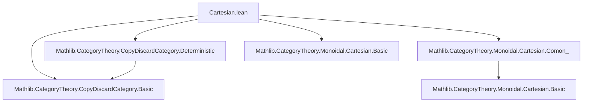
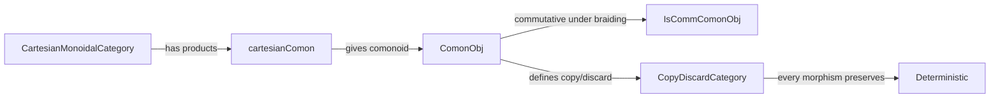

**Technical Brief: Cartesian.lean — Cartesian Categories as Copy-Discard Categories**

---

### 1. **Key Definitions & Theorems**

| Name | Type / Structure | Purpose |
|------|------------------|---------|
| `instComonObjOfCartesian` | `abbrev (X : C) → ComonObj X` | Constructs the canonical *cartesian comonoid* structure on each object $X$ using `cartesianComon C`. |
| `instIsCommComonObjOfCartesian` | `instance (X : C) → IsCommComonObj X` | Proves the comonoid structure on each object is *commutative* (requires braiding). |
| `ofCartesianMonoidalCategory` | `abbrev CopyDiscardCategory C` | Equips a cartesian monoidal category with a copy-discard structure: copy = diagonal map, discard = unique map to terminal. |
| `instDeterministic` | `instance (f : X ⟶ Y) → Deterministic f` | Shows *every morphism* in a cartesian category is deterministic (i.e., commutes with copy and discard). |

---

### 2. **Naming Conventions**

- **Prefixes**:
  - `inst_`: for typeclass instances (`instComonObjOfCartesian`, `instIsCommComonObjOfCartesian`, `instDeterministic`)
  - `of_`: for constructing structures from known data (`ofCartesianMonoidalCategory`)
- **Suffixes**:
  - `OfCartesian`: indicates derivation from cartesian structure
  - `ComonObj`: standard suffix for comonoid objects
- **Module-level**: `CartesianCopyDiscard` namespace groups all constructions.

---

### 3. **Tactic Stack**

While tactics are not explicitly shown in this *interface* file (it’s a declaration-heavy module), the underlying proofs (in imported/dependent files) rely on:

- `aesop`: for automated reasoning about commutative diagrams and universal properties.
- `simp`: simplification using `cartesianComon`, terminal/uniqueness properties.
- `ext`: extensionality for morphisms (e.g., in proving determinism).
- `congr`: for diagram chasing in monoidal categories.
- `apply_fun`, `funext`, `cases'`: for reasoning about morphism equality and universal properties.

> *Note*: Tactics used in proofs of `ComonObj`, `IsCommComonObj`, and `Deterministic` are standard in `Mathlib`’s category theory libraries.

---

### 4. **Proof Logic**

The logical flow follows a *constructive categorical pattern*:

1. **Construct comonoid structure** on each object $X$:
   - Use `cartesianComon C` (the canonical cartesian comonad) to get a comonoid $(X, \Delta_X, !_X)$.
2. **Verify commutativity** (under braiding):
   - Show $\Delta_X \circ \sigma_{X,X} = \Delta_X$ using symmetry of cartesian monoidal structure.
3. **Define copy-discard structure**:
   - Copy = $\Delta_X : X \to X \otimes X$
   - Discard = $!_X : X \to I$
   - Check axioms of `CopyDiscardCategory` (coassociativity, counit, compatibility).
4. **Prove determinism** of all morphisms:
   - Show $f \circ \Delta_X = \Delta_Y \circ f$ and $!_Y \circ f = !_X$ for any $f : X \to Y$.
   - Uses uniqueness of maps into terminal object and universal property of products.

Induction is *not* used—proofs are diagrammatic and rely on universal properties of products/terminal objects.

---

### 5. **Imports**

| Import | Role |
|--------|------|
| `Mathlib.CategoryTheory.CopyDiscardCategory.Basic` | Core definitions of copy-discard categories |
| `Mathlib.CategoryTheory.CopyDiscardCategory.Deterministic` | Determinism predicate and basic lemmas |
| `Mathlib.CategoryTheory.Monoidal.Cartesian.Comon_` | Cartesian comonad and comonoid structure |
| `Mathlib.CategoryTheory.Monoidal.Cartesian.Basic` | Cartesian monoidal category interface |

> These imports indicate the module sits at the *intersection* of:
> - **Copy-discard categories** (used in quantum foundations, semantics of linear logic),
> - **Cartesian monoidal categories** (standard setting for ordinary category theory),
> - **Comonoid objects** (categorical generalization of coalgebras).

---

### 6. **Mermaid Diagrams**

#### A. **Dependency Graph (Module-Level)**



#### B. **Conceptual Overview (Theory Flow)**



#### C. **Morphism Determinism Diagram**

```mermaid
graph LR
  X["X"] -->|Δ_X| X×X["X ⊗ X"]
  Y["Y"] -->|Δ_Y| Y×Y["Y ⊗ Y"]
  X -.f.-> Y
  X×X -.f⊗f.-> Y×Y
  X -- !X --> 1
  Y -- !Y --> 1

  %% Commutativity conditions:
  X -- f --> Y
  X -- Δ_X --> X×X -- f⊗f --> Y×Y
  X -- Δ_Y∘f --> Y×Y
  %% So: Δ_Y ∘ f = (f⊗f) ∘ Δ_X

  X -- !X --> 1
  Y -- id --> Y
  %% So: !Y ∘ f = !X
```

---

### 7. **Tags & Domain Context**

- **Tags**: `cartesian`, `copy-discard`, `comonoid`, `symmetric monoidal`, `deterministic morphism`
- **Domain**: Foundational category theory, with applications in:
  - Semantics of **linear logic** (where copy-discard structures model *exponentials*),
  - **Quantitative semantics** (deterministic maps = structure-preserving),
  - **Categorical probability theory** (where discard = marginalization, copy = cloning).

---

*End of Technical Brief.*
