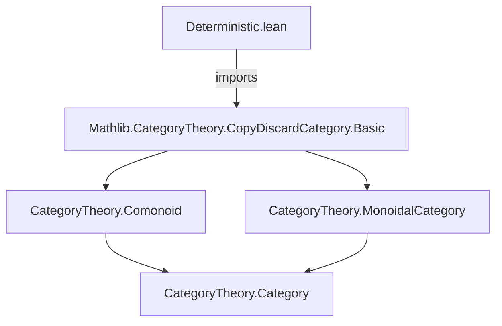
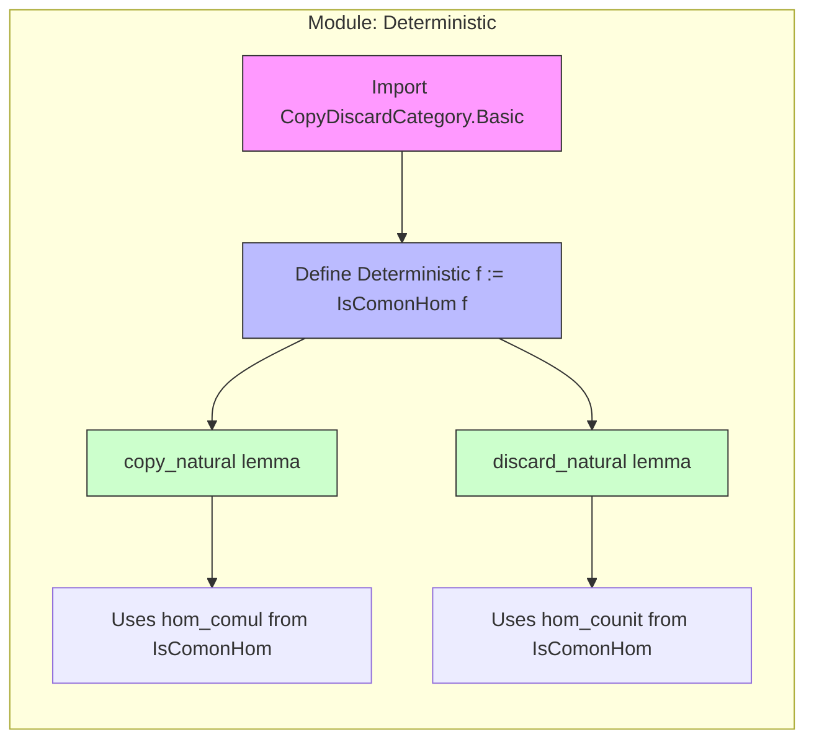

**Technical Brief: `Deterministic.lean`**

---

### 1. **Key Definitions & Theorems**

| Name | Type / Signature | Purpose |
|------|------------------|---------|
| `Deterministic` | `abbrev Deterministic {X Y : C} (f : X ⟶ Y) := IsComonHom f` | Defines a morphism `f` as *deterministic* iff it is a comonoid homomorphism (i.e., preserves comultiplication `Δ` and counit `ε`). |
| `copy_natural` | `lemma copy_natural (f : X ⟶ Y) [Deterministic f] : f ≫ Δ[Y] = Δ[X] ≫ (f ⊗ₘ f)` | States that deterministic morphisms commute with copying (`Δ`). |
| `discard_natural` | `lemma discard_natural (f : X ⟶ Y) [Deterministic f] : f ≫ ε[Y] = ε[X]` | States that deterministic morphisms commute with discarding (`ε`). |

> **Note**: The main *results* mentioned in the docstring (identity and composition closure) are **not yet formalized** in this file — only the foundational definition and naturality lemmas are present.

---

### 2. **Naming Conventions**

- **Prefixes**:
  - `Deterministic.` — namespace for lemmas about deterministic morphisms.
  - `is_` — *not used here*, but `IsComonHom` (from `CopyDiscardCategory.Basic`) follows this pattern.
- **Suffixes**:
  - `_natural` — used for naturality conditions (`copy_natural`, `discard_natural`).
- **Operational terms**:
  - `copy` → `Δ` (comultiplication)
  - `discard` → `ε` (counit)
  - `⊗ₘ` — monoidal tensor in `MonoidalCategory`.

---

### 3. **Tactic Stack**

- **No explicit tactics** appear in the *proofs* shown (the lemmas are `abbrev`/`lemma` with no proof script — they likely use `rfl` or are defeq by definition).
- **Expected tactics** (inferred from context and similar files):
  - `rfl` (for defeq proofs like `IsComonHom.hom_comul`/`hom_counit`)
  - `simp` / `simp_rw` (for rewriting using `Δ`/`ε` laws)
  - `ext` (if extensionality needed for morphisms)
  - `apply` / `exact` (for composing `IsComonHom` instances)

> Since `Deterministic` is an `abbrev`, proofs of lemmas are *deferred* to `IsComonHom`’s properties.

---

### 4. **Proof Logic**

- **Logical flow** is *definition-driven*:
  1. Define `Deterministic f` as `IsComonHom f`.
  2. Use the *definition* of `IsComonHom` (from `CopyDiscardCategory.Basic`) to extract:
     - `hom_comul f : f ≫ Δ = Δ ≫ (f ⊗ f)`
     - `hom_counit f : f ≫ ε = ε`
  3. These become `copy_natural` and `discard_natural` via `:= IsComonHom.hom_comul f` etc.

- **No induction or case analysis** is needed — the lemmas are *direct projections* from the typeclass instance.

---

### 5. **Imports**

| Import | Role |
|--------|------|
| `Mathlib.CategoryTheory.CopyDiscardCategory.Basic` | Provides `CopyDiscardCategory`, `IsComonHom`, `Δ`, `ε`, and the comonoid structure. |

> This module *extends* the theory of copy-discard categories by isolating deterministic morphisms as comonoid homomorphisms.

---

### 8. **Mermaid Diagrams**

#### **Dependency Graph**


#### **Overview of File Structure**


#### **Theoretical Context**
```mermaid
graph LR
  subgraph "Category Theory Stack"
    A[Category] --> B[MonoidalCategory]
    B --> C[CopyDiscardCategory]
    C --> D[Deterministic Morphisms]
  end
  D -->|models| E["No randomness (probabilistic)"]
  D -->|in| F[Cartesian categories (all morphisms deterministic)]
```

---

### Summary

This file formalizes *deterministic morphisms* in copy-discard categories as **comonoid homomorphisms**, leveraging existing infrastructure from `CopyDiscardCategory.Basic`. It provides the core naturality lemmas (`copy_natural`, `discard_natural`) and sets the stage for future results on closure under identity and composition. The design reflects a *property-based* approach: determinism is not an extra structure, but a *property* (a typeclass) derived from the comonoid laws.
