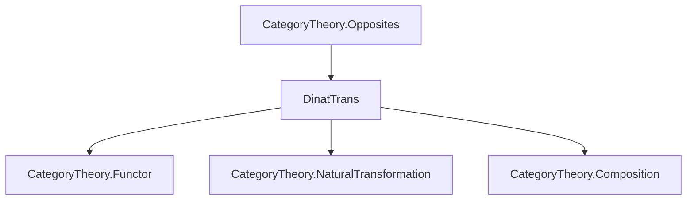
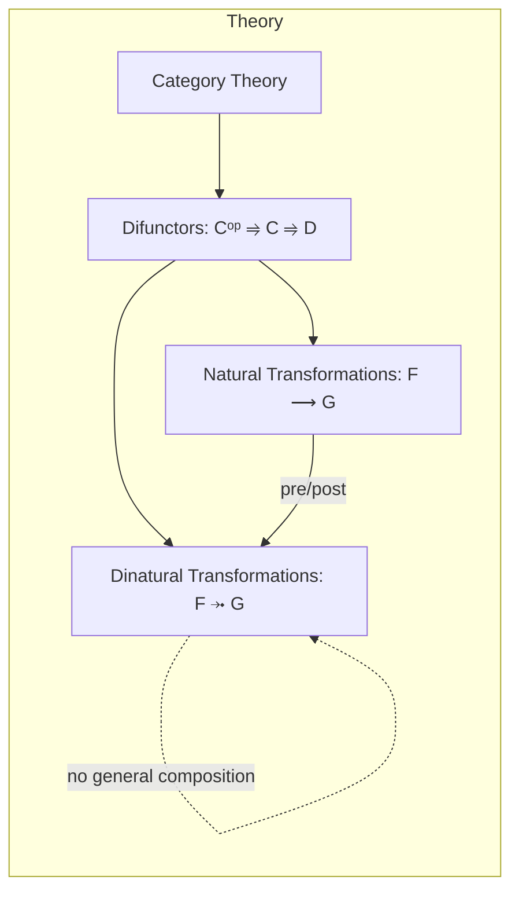

### Technical Brief: `DinatTrans.lean`

---

#### **1. Key Definitions & Theorems**

| Name | Type | Purpose |
|------|------|---------|
| `DinatTrans (F G : Cᵒᵖ ⥤ C ⥤ D)` | `Type (max u₁ v₂)` | Structure representing **dinatural transformations** between two *difunctors* $F, G : C^{op} \to C \to D$. |
| `app (X : C)` | `F.obj (op X).obj X ⟶ G.obj (op X).obj X` | Component of the dinatural transformation at object $X \in C$, i.e., the diagonal component. |
| `dinaturality {X Y : C} (f : X ⟶ Y)` | Commutativity of the **dinaturality hexagon** for any morphism $f : X \to Y$. Ensures compatibility with both covariant and contravariant actions. |
| `compNatTrans (δ : F ⤞ G) (α : G ⟶ H)` | `F ⤞ H` | **Post-composition** of a dinatural transformation with a natural transformation $\alpha : G \Rightarrow H$. |
| `precompNatTrans (δ : G ⤞ H) (α : F ⟶ G)` | `F ⤞ H` | **Pre-composition** of a dinatural transformation with a natural transformation $\alpha : F \Rightarrow G$. |

> **Note**: Unlike natural transformations, dinatural transformations **do not compose associatively** in general — only pre/post-composition with natural transformations is defined.

---

#### **2. Naming Conventions**

- **Structure**: `DinatTrans` — compound noun, descriptive of the concept.
- **Fields**:
  - `app` — standard for component-wise definition in natural/dinatural transformations.
  - `dinaturality` — suffix `-ality` indicates a property (here, dinaturality condition).
- **Operations**:
  - `compNatTrans` — “composition with natural transformation” (post).
  - `precompNatTrans` — “pre-composition with natural transformation”.
- **Notation**: `infixr:50 " ⤞ "` → `F ⤞ G` for `DinatTrans F G`.

Prefixes/suffixes used:
- `comp*`, `precomp*` for composition variants.
- `app` for components.
- `dinaturality` for the defining coherence condition.

---

#### **3. Tactic Stack**

- `by cat_disch` — used in the definition of `dinaturality` to discharge diagrammatic reasoning (likely a custom tactic or abbreviation for category-theoretic diagram chasing).
- `rw [...]` — rewriting using associativity, naturality, and dinaturality.
- `← NatTrans.naturality_app`, `← δ.dinaturality_assoc f` — reverse rewriting using naturality and dinaturality.
- `simp_rw` — implied via `@[simps]` attribute on `compNatTrans`, `precompNatTrans`.
- `Category.assoc`, `NatTrans.naturality` — standard category theory rewrites.

---

#### **4. Proof Logic**

- **Structure definition**: Requires constructing a family of morphisms (`app`) satisfying a hexagonal commutative diagram (`dinaturality`).
- **Proofs of `compNatTrans` and `precompNatTrans`**:
  - Define `app` pointwise.
  - Prove `dinaturality` by:
    - Expanding definitions.
    - Applying associativity (`Category.assoc`).
    - Using naturality of $\alpha$ (`NatTrans.naturality_app`).
    - Applying dinaturality of $\delta$ (`δ.dinaturality_assoc`).
- **No induction or case analysis** — proofs are purely diagrammatic and rely on categorical axioms.

---

#### **5. Imports**

- `Mathlib.CategoryTheory.Opposites` — essential for handling opposite categories and objects like `op X`.
- Implicit imports from `Mathlib.CategoryTheory.*` (e.g., `Category`, `Functor`, `NatTrans`) via `CategoryTheory` namespace.

---

#### **8. Mermaid Diagrams**

##### **Dependency Graph**



##### **Overview of File & Theory Context**



##### **Dinaturality Hexagon (Schematic)**

```mermaid
graph LR
  A[F(op Y).obj X] -->|F(map f.op).app X| B[F(op X).obj X]
  B -->|app X| C[G(op X).obj X]
  C -->|G(op X).map f| D[G(op X).obj Y]
  
  A -->|F(obj (op Y)).map f| E[F(op Y).obj Y]
  E -->|app Y| F[G(op Y).obj Y]
  F -->|G(map f.op).app Y| D

  style A fill:#f9f,stroke:#333
  style D fill:#f9f,stroke:#333
```

> This diagram expresses the dinaturality condition: two paths from $F(\mathrm{op}\,Y).\mathrm{obj}\,X$ to $G(\mathrm{op}\,X).\mathrm{obj}\,Y$ are equal.

---

### Summary

This module formalizes **dinatural transformations** in Lean 4, building on opposites and difunctors. It defines the core structure, proves that pre- and post-composition with natural transformations yields dinatural transformations, and enforces the dinaturality hexagon via `dinaturality`. The design reflects the categorical literature (e.g., nLab), emphasizing diagrammatic reasoning and careful handling of variance.
