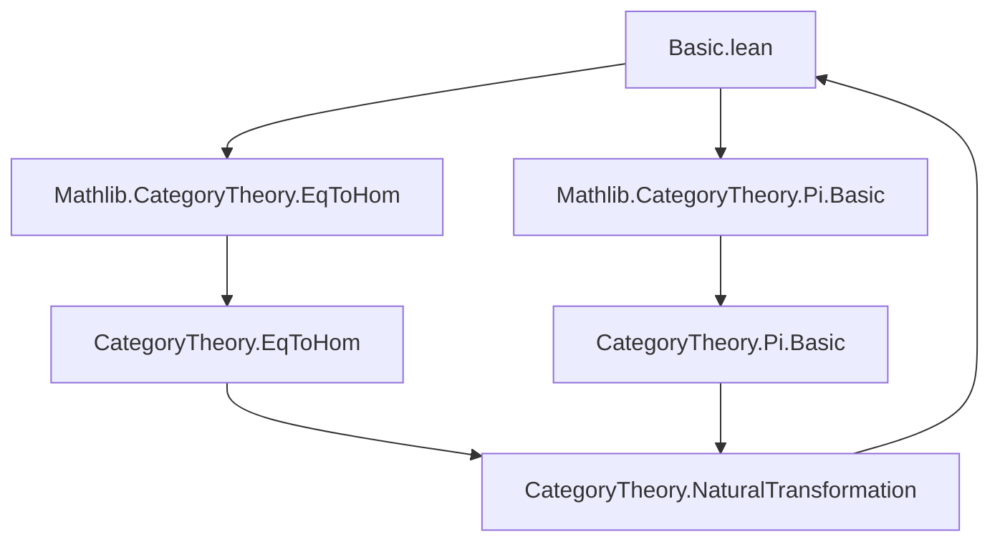

### Technical Brief: `Basic.lean` — Discrete Categories in Lean 4 / Mathlib

---

#### **1. Key Definitions & Theorems**

| Name | Type / Signature | Purpose |
|------|------------------|---------|
| `Discrete α` | `Structure` | Wraps a type `α` to form a category with only identity morphisms. |
| `discreteEquiv` | `Discrete α ≃ α` | Equivalence between `Discrete α` and `α`. |
| `discreteCategory` | `SmallCategory (Discrete α)` | Equips `Discrete α` with a category structure. |
| `eq_of_hom` | `X ⟶ Y → X.as = Y.as` | Extracts equality from a morphism in a discrete category. |
| `eqToHom` / `eqToHom'` | `X.as = Y.as → X ⟶ Y` | Converts equality to identity morphism. |
| `eqToIso` / `eqToIso'` | `X.as = Y.as → X ≅ Y` | Converts equality to identity isomorphism. |
| `functor` | `(I → C) → Discrete I ⥤ C` | Promotes a function to a functor from discrete category. |
| `natTrans` | `(∀ i, F.obj i ⟶ G.obj i) → F ⟶ G` | Builds natural transformation from pointwise maps. |
| `natIso` | `(∀ i, F.obj i ≅ G.obj i) → F ≅ G` | Builds natural isomorphism from pointwise isos. |
| `equivalence` | `I ≃ J → Discrete I ≌ Discrete J` | Promotes type equivalence to categorical equivalence. |
| `equivOfEquivalence` | `Discrete α ≌ Discrete β → α ≃ β` | Recovers type equivalence from categorical equivalence. |
| `opposite` | `(Discrete α)ᵒᵖ ≌ Discrete α` | Shows discrete category is self-dual. |
| `piEquivalenceFunctorDiscrete` | `(J → C) ≌ (Discrete J ⥤ C)` | Equivalence of function space and functor category. |
| `IsDiscrete` | `Class` | A category is *discrete* if it has at most one morphism and all morphisms are identities. |

---

#### **2. Naming Conventions**

- **Prefixes**:
  - `Discrete.`: Module-level namespace.
  - `eqToHom`, `eqToIso`: Convert equalities to morphisms/isos.
  - `functor`, `natTrans`, `natIso`: Promote functions/families to categorical constructs.
  - `opposite`, `equivalence`, `equivOfEquivalence`: Relate discrete categories to equivalences.

- **Suffixes**:
  - `'` (e.g., `eqToHom'`): Variant that works directly on underlying type terms (`α`) instead of wrapped terms (`Discrete α`).
  - `Ext`, `Opposite`, `Functor`, `Iso`: Reflect categorical constructions.

- **Tactic-related**:
  - `discrete_cases`: Custom tactic for case analysis on discrete morphisms.

---

#### **3. Tactic Stack**

Frequently used tactics in proofs:

| Tactic | Usage |
|--------|-------|
| `cat_disch` | Simplifies goals using `Subsingleton` and `DecidableEq` properties of discrete categories. |
| `cases` / `rcases` | Destruct `Discrete`, `ULift`, `PLift`, and morphism terms. |
| `simp` / `simp only` | Normalize homs and objects using `@[simp]` lemmas (`id_def`, `functor_obj`, etc.). |
| `rw` / `induction` | Rewrite using equality extracted from morphisms (`eq_of_hom`). |
| `fapply`, `ext`, `funext` | Prove equality of functors/natural transformations. |
| `infer_instance` | Derive `IsIso`, `Subsingleton`, `DecidableEq`, etc., automatically. |

---

#### **4. Proof Logic**

- **Induction & Case Analysis**:
  - Proofs often start by destructing `Discrete α` terms (`X`, `Y`, `Z`) and morphisms (`f`, `g`) using `cases` or `rcases`.
  - Morphism types (`ULift (PLift (X.as = Y.as))`) are destructed to extract underlying equalities.

- **Subsingleton Reasoning**:
  - Hom-spaces are `Subsingleton`, so any two morphisms with same domain/codomain are equal.
  - Used implicitly via `cat_disch`, `simp`, and `infer_instance`.

- **Equational Reasoning**:
  - Morphisms correspond to equalities in `α`, so proofs reduce to manipulating equalities (`rfl`, `congrArg`, `symm`, `trans`).
  - Naturality squares collapse to identities because only identity morphisms exist.

- **Equivalence Construction**:
  - To prove `A ≌ B`, construct functors `F : A ⥤ B`, `G : B ⥤ A`, and show unit/counit are natural isos (often `Iso.refl _` due to subsingularity).

---

#### **5. Imports**

| Import | Purpose |
|--------|---------|
| `Mathlib.CategoryTheory.EqToHom` | Provides `eqToHom`, `eqToIso`, and related lemmas. |
| `Mathlib.CategoryTheory.Pi.Basic` | Provides basic tools for functor categories, natural transformations, and products. |

---

#### **6. Mermaid Diagrams**

##### **Dependency Graph (Module-Level)**



##### **Conceptual Overview of Discrete Category Construction**

```mermaid
graph LR
  α[Type α] --> Discreteα[Discrete α]
  Discreteα --> Hom[X ⟶ Y = ULift (PLift (X.as = Y.as))]
  Hom --> Subsingleton[Subsingleton (X ⟶ Y)]
  Hom --> IsIso[IsIso (f : X ⟶ Y)]
  α --> Equiv[I ≃ J]
  Equiv --> Equivalence[Discrete I ≌ Discrete J]
  Function[I → C] --> Functor[Discrete I ⥤ C]
  Family[∀ i, F i ⟶ G i] --> NatTrans[F ⟶ G]
```

##### **Equivalence of Function Space and Functor Category**

```mermaid
graph LR
  (J → C) -->|functor| DiscreteFunctors[Discrete J ⥤ C]
  DiscreteFunctors -->|inverse| (J → C)
  DiscreteFunctors <-->|unitIso/counitIso| Iso
```

---

#### **7. Summary**

This file formalizes the *discrete category* construction: a category where morphisms exist only as identities, derived from equalities in a type. It establishes:

- A categorical structure on `Discrete α` using `ULift (PLift (X = Y))` to avoid `Prop`-valued morphisms.
- A tight correspondence between type-theoretic functions/families and categorical functors/natural transformations.
- Equivalence between type equivalences and categorical equivalences of discrete categories.
- Self-duality: `Discrete α ≌ (Discrete α)ᵒᵖ`.
- A class `IsDiscrete` characterizing categories with at most one morphism per pair of objects.

The proofs rely heavily on subsingularity of homs, case analysis on wrapped terms, and `cat_disch`-based simplification.

--- 

Let me know if you'd like a formalized dependency graph (e.g., `.dot` format) or a summary of lemmas for automated reasoning (e.g., for `aesop`).
