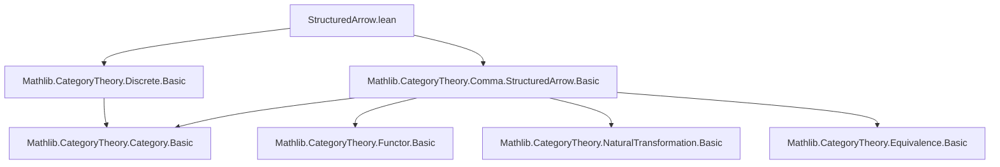

**Technical Brief: `StructuredArrow.lean` (Discrete Target Case)**  
*Domain: Category Theory (Lean 4, Mathlib)*  
*Author: Joël Riou (2025)*  
*License: Apache 2.0*

---

### 1. **Key Definitions & Theorems**

| Name | Type | Purpose |
|------|------|---------|
| `structuredArrowEquivalenceOfUnique` | `(F : C ⥤ Discrete T) → t : T → [Subsingleton T] → StructuredArrow (.mk t) F ≌ C` | Constructs an equivalence of categories between the *structured arrow category* over a unique object `t` and the base category `C`, when the target of `F` is discrete and `T` is a subsingleton. |
| `costructuredArrowEquivalenceOfUnique` | `(F : C ⥤ Discrete T) → t : T → [Subsingleton T] → CostructuredArrow F (.mk t) ≌ C` | Same as above, but for the *costructured arrow category*. |

Both theorems assert that when the codomain of `F` is a discrete category on a contractible type `T`, the (co)structured arrow categories collapse to `C` itself.

---

### 2. **Naming Conventions**

- **Prefixes**:
  - `structuredArrow*` / `costructuredArrow*`: Denotes constructions related to structured/costructured arrows.
  - `proj`: Standard projection functor from (co)structured arrow categories.
- **Suffixes**:
  - `EquivalenceOfUnique`: Indicates the equivalence arises from uniqueness (subsingleton hypothesis).
- **Constructor patterns**:
  - `StructuredArrow.mk`, `StructuredArrow.homMk`, `StructuredArrow.isoMk`
  - `CostructuredArrow.mk`, `CostructuredArrow.homMk`, `CostructuredArrow.isoMk`
  - `Iso.refl`, `NatIso.ofComponents`: Standard isomorphism-building tactics.

---

### 3. **Tactic Stack**

- `subsingleton`: Used in `by subsingleton` to solve goals that follow from `Subsingleton T`.
- `Iso.refl`, `NatIso.ofComponents`: For constructing identity isomorphisms and natural isomorphisms componentwise.
- `structuredArrow.isoMk`, `costructuredArrow.isoMk`: Specialized constructors for isomorphisms in structured arrow categories.
- Implicit use of `eqToHom` (from `CategoryTheory.Equivalence`) to convert equalities (guaranteed by subsinglton) into isomorphisms.

No heavy automation (e.g., `aesop`, `ring`, `simp_rw`) is used—proofs are *explicit and constructive*.

---

### 4. **Proof Logic**

- **Strategy**: Direct construction of an equivalence of categories.
- **Steps**:
  1. Define the functor as the projection `StructuredArrow.proj _ _` (or costructured version).
  2. Define the inverse functor on objects: `X ↦ StructuredArrow.mk (Y := X) (eqToHom (by subsingleton))`.
     - Uses `eqToHom` to turn the equality `t = t` (from `Subsingleton T`) into an isomorphism.
  3. Define the inverse on morphisms: `f ↦ StructuredArrow.homMk f`.
  4. Show unit and counit are natural isomorphisms:
     - Unit: `NatIso.ofComponents (fun _ ↦ StructuredArrow.isoMk (Iso.refl _))`
     - Counit: `Iso.refl _`
- **Key idea**: In a discrete category, all morphisms are identities; with `T` a subsingleton, the only object is `t`, so (co)structured arrows reduce to morphisms in `C` over the identity on `t`.

---

### 5. **Imports**

- `Mathlib.CategoryTheory.Discrete.Basic`: Provides `Discrete T`, `Discrete.mk`, and basic facts about discrete categories.
- `Mathlib.CategoryTheory.Comma.StructuredArrow.Basic`: Defines structured and costructured arrow categories (`StructuredArrow`, `CostructuredArrow`, their projections, etc.).

---

### 6. **Dependency & Theory Overview**

#### Mermaid Diagram: Module Dependencies



#### Mermaid Diagram: Theoretical Flow

```mermaid
graph LR
  T[Type w] -->|Subsingleton| T_unique[T has unique element t]
  C[Category C] --> F[F : C ⥤ Discrete T]
  F -->|target = Discrete.mk t| SA[StructuredArrow (.mk t) F]
  F -->|same| CSA[CostructuredArrow F (.mk t)]
  SA <-->|≈| C
  CSA <-->|≈| C
```

#### Summary

This module formalizes a *degenerate case* of structured/costructured arrows: when the target category is discrete and contractible, the comma-like constructions reduce to the domain category itself. It serves as a foundational lemma for more general results about structured arrows (e.g., in fibered categories or descent theory), where the discrete case is often used as a base case or sanity check.

--- 

*End of Technical Brief.*
