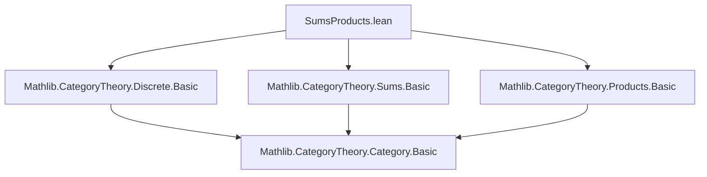
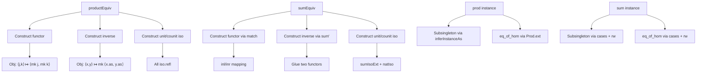

### Technical Brief: `SumsProducts.lean`

---

#### **1. Key Definitions & Theorems**

| Name | Type | Purpose |
|------|------|---------|
| `productEquiv` | `{J K : Type*} → Discrete (J × K) ≌ Discrete J × Discrete K` | Explicit categorical equivalence between the discrete category on a product type and the product of discrete categories. |
| `sumEquiv` | `{J K : Type*} → Discrete (J ⊕ K) ≌ Discrete J ⊕ Discrete K` | Explicit categorical equivalence between the discrete category on a sum type and the sum of discrete categories. |
| `prod` | `{C D : Type*} [Category* C] [Category* D] [IsDiscrete C] [IsDiscrete D] → IsDiscrete (C × D)` | Instance proving that the product of two discrete categories is discrete. |
| `sum` | `{C C' : Type*} [Category* C] [Category* C'] [IsDiscrete C] [IsDiscrete C'] → IsDiscrete (C ⊕ C')` | Instance proving that the sum (coproduct) of two discrete categories is discrete. |

---

#### **2. Naming Conventions**

- **Prefixes**:
  - `is_`: Used in typeclass `IsDiscrete`, indicating a *property* (i.e., “is discrete”).
  - `productEquiv`, `sumEquiv`: Use `Equiv` suffix to denote *equivalences of categories*.
- **Suffixes**:
  - `Equiv`: Standard for categorical equivalences (`≈`, `≌`).
  - `mk`: Used in `Discrete.mk` to construct objects in a discrete category.
  - `as`: Used in `x.as` to extract the underlying element from a `Discrete` object.

---

#### **3. Tactic Stack**

Frequently used tactics in proofs:
- `cases`: To destruct sum or product types (e.g., `cases f`, `cases x`).
- `rw`: Rewriting using equalities or definitional equalities.
- `dsimp`: Simplify definitional equalities (e.g., in `eqToHom` construction).
- `discrete_cases`: Custom tactic (likely from `Mathlib.CategoryTheory.Discrete.Basic`) to handle morphism cases in discrete categories.
- `rw [f₁, f₂]`: Simultaneously rewrite using multiple equalities.
- `Prod.ext`: To prove equality of pairs by extensionality.
- `inferInstanceAs`: To infer subsingleton instances automatically.
- `sum'`: From `Discrete`, used to construct functors from coproducts.
- `Functor.sumIsoExt`: Extensionality for natural isomorphisms on sums.

---

#### **4. Proof Logic**

- **For `productEquiv`**:
  - Construct a functor `Discrete (J × K) → Discrete J × Discrete K` by mapping $(j,k) \mapsto (j, k)$ at object level.
  - Define inverse on objects as $(x,y) \mapsto (x.as, y.as)$.
  - Morphism mapping uses `eqToHom` with a proof that the only morphism between equal objects is identity (via `discrete_cases` and rewriting).
  - Unit and counit are identity natural isomorphisms (since all hom-sets are subsingletons).

- **For `sumEquiv`**:
  - Functor maps `inl j` to `inl (Discrete.mk j)` and `inr k` to `inr (Discrete.mk k)`.
  - Inverse uses `sum'` to glue two functors (one for each injection).
  - Unit/counit isomorphisms are built using `Iso.refl` and `Functor.sumIsoExt`.

- **For `IsDiscrete.prod`**:
  - Subsingleton: Use `inferInstanceAs` to get that hom-sets in product are products of subsingletons.
  - Equality of morphisms: Use `Prod.ext` + `IsDiscrete.eq_of_hom` on components.

- **For `IsDiscrete.sum`**:
  - Subsingleton: Case analysis on morphisms (`cases f`, `cases g`) and apply `subsingleton` from respective component.
  - Equality of morphisms: Case analysis and apply `eq_of_hom` from the appropriate component instance.

---

#### **5. Imports**

- `Mathlib.CategoryTheory.Discrete.Basic`: Core definitions and tactics for discrete categories.
- `Mathlib.CategoryTheory.Sums.Basic`: Coproducts (sums) of categories.
- `Mathlib.CategoryTheory.Products.Basic`: Products of categories.

These imports define the foundational categorical constructs and the `IsDiscrete` typeclass.

---

#### **6. Mermaid Diagrams**

##### **Dependency Graph (Module-Level)**



##### **Overview of Theoretical Flow**

```mermaid
graph LR
  DiscreteType[Type J, K] --> DiscreteCat[Discrete J, Discrete K]
  DiscreteCat --> Product[Discrete J × Discrete K]
  DiscreteCat --> Sum[Discrete J ⊕ Discrete K]
  Product <-->|productEquiv| DiscreteProd[Discrete (J × K)]
  Sum <-->|sumEquiv| DiscreteSum[Discrete (J ⊕ K)]

  IsDisc[IsDiscrete C, IsDiscrete D] --> ProdInst[IsDiscrete (C × D)]
  IsDisc --> SumInst[IsDiscrete (C ⊕ D)]
```

##### **Proof Structure Summary**



--- 

This file formalizes foundational categorical algebra: discrete categories are closed under products and coproducts, both *structurally* (via equivalences) and *property-wise* (via `IsDiscrete`).
