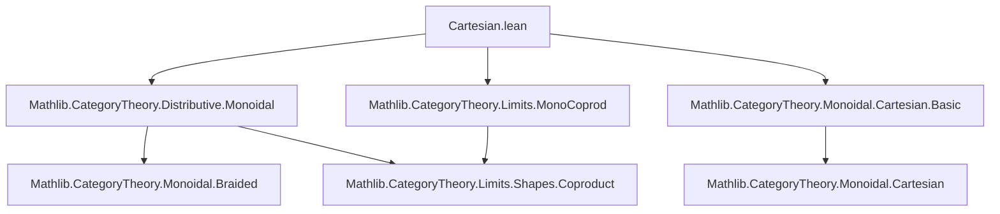
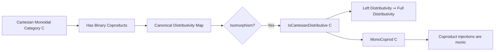

**Technical Brief: `Cartesian.lean` (Distributive Categories in Lean 4)**  
*Domain: Category Theory — Distributive Categories in the Cartesian Monoidal Setting*

---

### 1. **Key Definitions & Theorems**

| Name | Type / Signature | Purpose |
|------|------------------|---------|
| `IsCartesianDistributive` | `abbrev IsCartesianDistributive := IsMonoidalDistrib C` | Defines a *Cartesian distributive category* as a Cartesian monoidal category that is monoidal distributive (i.e., the canonical map $(X \times Y) + (X \times Z) \to X \times (Y + Z)$ is an iso). |
| `of_isMonoidalLeftDistrib` | `lemma` | Shows that *left* monoidal distributivity suffices for full Cartesian distributivity, using symmetry of the Cartesian monoidal structure. |
| `MonoCoprod` | `instance` | In a Cartesian distributive category, binary coproduct injections are monic. Constructed via splitting of a retraction using the left distributivity isomorphism $\partial^L_{Z,A,B}$. |

---

### 2. **Naming Conventions**

- **Prefixes**:
  - `is_`: Predicate-style definitions (`IsCartesianDistributive`, `IsMonoidalLeftDistrib`).
  - `MonoCoprod`: Compound noun naming a *property instance* (a typeclass proving monicity of coproduct injections).
- **Suffixes**:
  - `_mk'`: Constructor for instances with explicit data (e.g., `MonoCoprod.mk'`).
  - `_of_`: Implication-based lemmas (`of_isMonoidalLeftDistrib`).
- **Morphisms**:
  - `∂L Z A B`: Left distributivity isomorphism (standard notation in monoidal distributivity literature).
  - `lift`, `coprod.desc`, `coprod.inl`, `coprod.inr`: Standard coproduct universal property tools.

---

### 3. **Tactic Stack**

| Tactic | Usage |
|--------|-------|
| `aesop` | Automated reasoning for equality chains and diagram chasing (e.g., `aesop` after `rw [← cancel_mono]`). |
| `simp_rw` | Implicitly via `simpa only [...] using`, used to simplify goals using rewrite rules and definitions. |
| `cancel_mono` | Cancels monomorphisms on the left (used in monicity proofs). |
| `split` / `intro` / `cases` | Standard intro/case analysis (not shown inline but implied by `MonoCoprod.mk'` structure). |
| `letI` | Introduces instances locally (e.g., `letI : BraidedCategory C := Nonempty.some inferInstance`). |

---

### 4. **Proof Logic**

The core proof logic follows this pattern:

1. **Reduction via symmetry**: To prove full monoidal distributivity, it suffices to assume left distributivity and use symmetry of Cartesian monoidal structure (`SymmetricCategory.isMonoidalDistrib_of_isMonoidalLeftDistrib`).
2. **Monicity of coproduct injections**:
   - Fix objects $A, B$.
   - Use the left distributivity isomorphism $\partial^L_{Z,A,B} : (Z \times A) + (Z \times B) \xrightarrow{\sim} Z \times (A + B)$.
   - Show that $Z \lhd \iota_A = Z \times \iota_A$ (i.e., precomposition with coproduct injection) is a split mono → hence mono.
   - Use universal property of coproducts to construct a retraction explicitly.
   - Apply `cancel_mono` to deduce equality of morphisms from equality after precomposition.
   - Conclude monicity via `MonoCoprod.mk'`.

---

### 5. **Imports**

| Module | Role |
|--------|------|
| `Mathlib.CategoryTheory.Distributive.Monoidal` | Core definitions of monoidal distributivity (`IsMonoidalDistrib`, `IsMonoidalLeftDistrib`, `∂L`, etc.). |
| `Mathlib.CategoryTheory.Limits.MonoCoprod` | Typeclass `MonoCoprod` and its constructor `MonoCoprod.mk'`. |
| `Mathlib.CategoryTheory.Monoidal.Cartesian.Basic` | Cartesian monoidal category structure, symmetry, and basic properties (`BraidedCategory`, `SymmetricCategory`, `lift`, `fst`, `snd`). |

---

### 6. **Mermaid Diagrams**

#### **Dependency Graph (Module-Level)**

#### **Conceptual Overview (Theory Flow)**

---

### 7. **Notes on TODOs & Future Work**

- **Finitary distributivity**: The current result only covers binary coproducts; extending to all finite coproducts requires showing $X \times -$ preserves finite coproducts (i.e., is a left adjoint).
- **Extensivity & topos embedding**: Relates to *extensive* categories (coproducts are pullback-stable and disjoint). Embedding into a topos would likely use the *Grothendieck construction* or *classifying topos* techniques.

---

### 8. **References Embedded**

- Cockett, *Introduction to distributive categories*, 1993  
- Carboni et al., *Introduction to extensive and distributive categories*, 1993

These are foundational for the categorical semantics of distributivity and extensivity.

--- 

*End of Technical Brief.*
