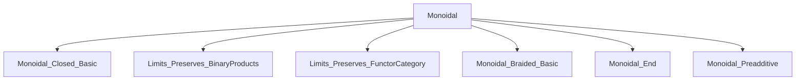

### Technical Brief: `Monoidal.lean` — Distributive Monoidal Categories

---

#### **1. Key Definitions & Theorems**

| Name | Type / Signature | Purpose |
|------|------------------|---------|
| `IsMonoidalLeftDistrib` | `class` | Asserts that `tensorLeft X` preserves binary coproducts for all `X`. |
| `IsMonoidalRightDistrib` | `class` | Asserts that `tensorRight X` preserves binary coproducts for all `X`. |
| `IsMonoidalDistrib` | `class` | Extends both left and right distributivity. |
| `leftDistrib` | `(X Y Z : C) → (X ⊗ Y) ⨿ (X ⊗ Z) ≅ X ⊗ (Y ⨿ Z)` | Canonical left distributivity isomorphism. |
| `rightDistrib` | `(X Y Z : C) → (Y ⊗ X) ⨿ (Z ⊗ X) ≅ (Y ⨿ Z) ⊗ X` | Canonical right distributivity isomorphism. |
| `SymmetricCategory.isMonoidalDistrib_of_isMonoidalLeftDistrib` | `lemma` | In symmetric monoidal categories, left distributivity ⇒ full distributivity. |
| `MonoidalClosed.isMonoidalLeftDistrib` | `instance` | Any closed monoidal category is left distributive. |
| `isMonoidalDistrib.of_symmetric_monoidal_closed` | `instance` | Symmetric + closed ⇒ distributive. |
| `isMonoidalLeftDistrib.of_endofunctors` | `instance` | Endofunctor category `C ⥤ C` is left distributive. |
| `IsMonoidalDistrib.of_MonoidalPreadditive_with_binary_coproducts` | `instance` | Preadditive monoidal categories with binary coproducts are distributive. |

---

#### **2. Naming Conventions**

- **Prefixes**:
  - `isMonoidal*`: Class names for properties (`isMonoidalLeftDistrib`, `isMonoidalRightDistrib`, `isMonoidalDistrib`).
  - `tensorLeft`, `tensorRight`: Functors for left/right tensoring.
  - `coprod*`: Coproduct-related morphisms (`coprod.inl`, `coprod.inr`, `coprod.desc`, `coprod.map`).
  - `whiskerLeft`, `whiskerRight`: Horizontal composition with identity on one side.

- **Suffixes**:
  - `*Distrib`: For distributivity-related definitions (`leftDistrib`, `rightDistrib`).
  - `*Comparison`: For canonical comparison maps (`coprodComparison`).

- **Notation**:
  - `∂L` → `leftDistrib`
  - `∂R` → `rightDistrib`
  - `◁`, `▷`: Notation for left/right whiskering (`X ◁ f`, `f ▷ X`).

---

#### **3. Tactic Stack**

- **Core tactics**:
  - `rfl`, `rw`, `ext`, `simp`, `apply`, `exact`
- **Category-theoretic helpers**:
  - `cancel_iso_hom_right`: Used to simplify compositions with isomorphisms.
  - `preservesBinaryCoproducts_of_isIso_coprodComparison`: To prove preservation via isomorphism of comparison maps.
  - `preservesColimitsOfShape_of_natIso`: For transport of colimit preservation along natural isomorphisms.
- **Simplification**:
  - `@[reassoc (attr := simp)]`: Marks lemmas for automatic simplification in associativity-heavy contexts.
  - `simp [coprodComparison]`, `simp [leftDistrib_hom]`, etc.

---

#### **4. Proof Logic**

- **Structure**:
  - Most proofs follow a pattern:
    1. Define the canonical comparison map (e.g., `coprodComparison`).
    2. Show it is an isomorphism (via `of_isIso_coprodComparison` or `preservesColimitsOfShape_of_natIso`).
    3. Use universal properties of coproducts and tensor functors to derive equations.
  - For symmetric monoidal categories:
    - Use braiding/symmetry to relate left and right tensor functors.
    - Prove equivalence via natural isomorphism `tensorLeft X ≅ tensorRight X`.
  - For closed monoidal categories:
    - Use currying/uncurrying adjunction to express the inverse of `leftDistrib`.
  - For endofunctor categories:
    - Leverage pointwise computation of coproducts and the fact that `Functor.whiskeringLeft` preserves them.

- **Common proof techniques**:
  - **Universal property of coproducts**: To define and reason about `coprod.desc`.
  - **Iso cancellation**: `cancel_iso_hom_right` to reduce equations involving `∂L.inv`, `∂R.inv`.
  - **Naturality & symmetry**: To relate `∂L` and `∂R` in symmetric settings.

---

#### **5. Imports & Dependencies**

| Module | Purpose |
|--------|---------|
| `Mathlib.CategoryTheory.Monoidal.Closed.Basic` | Closed monoidal structure, currying, etc. |
| `Mathlib.CategoryTheory.Limits.Preserves.Shapes.BinaryProducts` | Preserves binary products/coproducts machinery. |
| `Mathlib.CategoryTheory.Limits.Preserves.FunctorCategory` | Colimit preservation in functor categories. |
| `Mathlib.CategoryTheory.Monoidal.Braided.Basic` | Braided/symmetric monoidal categories. |
| `Mathlib.CategoryTheory.Monoidal.End` | Endofunctor monoidal structure. |
| `Mathlib.CategoryTheory.Monoidal.Preadditive` | Preadditive monoidal categories. |

---

#### **6. Mermaid Diagrams**

##### **Dependency Graph (Module-Level)**



##### **Conceptual Overview of Theory**

```mermaid
graph TD
  A[Monoidal Category C] --> B[Has Binary Coproducts]
  B --> C{Left Distributive?}
  B --> D{Right Distributive?}
  C -->|tensorLeft X preserves coproducts| E[∂L: (X⊗Y)⨿(X⊗Z) ≅ X⊗(Y⨿Z)]
  D -->|tensorRight X preserves coproducts| F[∂R: (Y⊗X)⨿(Z⊗X) ≅ (Y⨿Z)⊗X]
  C & D --> G[Distributive]
  H[Symmetric Monoidal] -->|β_ X (Y⨿Z)| C
  H -->|β_ (Y⨿Z) X| D
  I[Monoidal Closed] --> C
  J[Preadditive + Coproducts] --> G
  K[Endofunctors C ⥤ C] --> C
```

##### **Proof Strategy Flow (Symmetric Case)**

```mermaid
graph LR
  SymMonoidal -->|tensorLeft X ≅ tensorRight X| NatIso
  NatIso -->|preservesColimitsOfShape_of_natIso| LeftDistrib ⇒ RightDistrib
  LeftDistrib -->|SymmetricCategory.isMonoidalDistrib_of_isMonoidalLeftDistrib| Distributive
```

---

#### **7. Summary**

This file formalizes the theory of **distributive monoidal categories**, focusing on conditions under which tensoring preserves binary coproducts. It introduces two key properties — left and right distributivity — and shows their equivalence in symmetric monoidal settings. It provides several important instances:

- Closed monoidal categories are left distributive.
- Symmetric + closed ⇒ distributive.
- Endofunctor categories are left distributive.
- Preadditive monoidal categories with coproducts are distributive.

The formalization leverages Lean’s `PreservesColimitsOfShape` infrastructure and uses naturality, universal properties, and symmetry to relate left/right structures. The notation `∂L`, `∂R` and lemmas about their interaction with coprojections (`coprod.inl`, `coprod.inr`) are central to reasoning about distributivity isomorphisms.

--- 

Let me know if you'd like a formalized dependency graph (e.g., `leanpkg.toml`-style) or a proof outline for a specific theorem.
