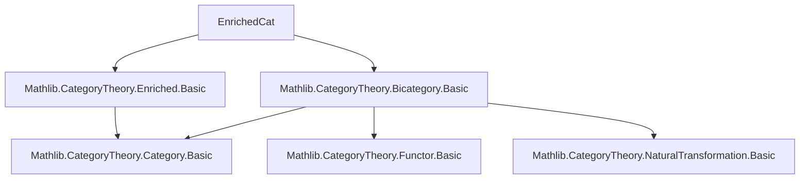
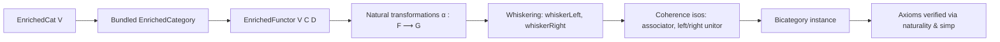

### Technical Brief: `EnrichedCat.lean`

---

#### **1. Key Definitions & Theorems**

| Name | Type / Signature | Purpose |
|------|------------------|---------|
| `EnrichedCat V` | `Type (max v u + 1)` | Bundled category of `V`-enriched categories (objects are types with `EnrichedCategory V` structure). |
| `of C` | `C : Type u → [EnrichedCategory V C] → EnrichedCat V` | Constructor to bundle an enriched category. |
| `whiskerLeft F α` | `F : EnrichedFunctor V C D → α : G ⟶ H → F.comp G ⟶ F.comp H` | Left whiskering of an enriched natural transformation by a functor. |
| `whiskerRight α H` | `α : F ⟶ G → H : EnrichedFunctor V D E → F.comp H ⟶ G.comp H` | Right whiskering of an enriched natural transformation by a functor. |
| `leftUnitor F` | `F : EnrichedFunctor V C D → (id V _).comp F ≅ F` | Left unit law for composition of enriched functors, up to isomorphism. |
| `rightUnitor F` | `F : EnrichedFunctor V C D → F.comp (id V _) ≅ F` | Right unit law for composition of enriched functors, up to isomorphism. |
| `associator F G H` | `F,G,H` functors → `(F.comp G).comp H ≅ F.comp (G.comp H)` | Associativity of composition of enriched functors, up to isomorphism. |
| `bicategory` | `Bicategory (EnrichedCat V)` | Constructs the bicategory structure on `EnrichedCat V`. |

**Key Lemmas:**
- `comp_whiskerRight`: `whiskerRight` preserves composition in the natural transformation argument.
- `whisker_exchange`: interchange law for left and right whiskering.

---

#### **2. Naming Conventions**

- **Prefixes:**
  - `whiskerLeft`, `whiskerRight`: indicate direction of whiskering.
  - `leftUnitor`, `rightUnitor`, `associator`: standard bicategorical coherence isomorphisms.
  - `of`: bundling constructor.
- **Suffixes:**
  - `_out`, `_app`: used in proofs to refer to underlying morphism / component.
  - `forgetComp`, `forgetId`: refer to forgetful functor’s behavior on composition / identity.
- **Pattern:**
  - `F.comp V G` for composition of enriched functors.
  - `α.out` for underlying natural transformation of an enriched natural transformation.

---

#### **3. Tactic Stack**

- `simp only [...]`: heavily used in proofs to unfold definitions and simplify.
- `simp [← ForgetEnrichment.homOf_comp]`: leverages hom-isomorphism from enrichment.
- `ext X`: extensionality for natural transformations (pointwise equality).
- `exact ...`: for final proof steps using lemmas like `naturality`.
- `rw`, `apply`, `congr`: implicit in `simps!` and `isoMk` usage.

---

#### **4. Proof Logic**

- **Structure of proofs:**
  - Most lemmas are proven by `ext X` (extensionality), reducing to component-wise equality.
  - Then `simp only [...]` unfolds definitions (e.g., `whiskerLeft_out_app`, `comp_obj`, `category_comp_out`).
  - Final step uses naturality or known identities (e.g., `naturality`, `← homOf_comp`).
- **Bicategory instance proof:**
  - Uses `isoMk` to construct isomorphisms from underlying isos.
  - Relies on coherence of the underlying 1-category (`Functor`) and the forgetful functor `ForgetEnrichment`.
  - Axioms like `comp_whiskerRight`, `whisker_exchange` are proven directly via naturality and simp.

---

#### **5. Imports**

- `Mathlib.CategoryTheory.Enriched.Basic`: core definitions of enriched categories, functors, natural transformations.
- `Mathlib.CategoryTheory.Bicategory.Basic`: bicategory interface and axioms.

---

#### **6. Mermaid Diagrams**

##### **Dependency Graph (Module Level)**



##### **Overview of File Structure**



##### **Bicategory Structure Hierarchy**

```mermaid
graph LR
  EnrichedCat V[Bicategory]
  EnrichedCat V --> Objects[Enriched categories]
  EnrichedCat V --> 1Cells[Enriched functors]
  EnrichedCat V --> 2Cells[Enriched natural transformations]
  1Cells --> comp[Composition]
  1Cells --> id[Identity functor]
  2Cells --> whiskerLeft[Left whiskering]
  2Cells --> whiskerRight[Right whiskering]
  whiskerLeft --> associator
  whiskerRight --> associator
  whiskerLeft --> leftUnitor
  whiskerRight --> rightUnitor
```

---

#### **7. Notes on Formalization Strategy**

- Uses **bundled objects** (`Bundled (EnrichedCategory V)`) for clean bicategorical structure.
- Leverages `ForgetEnrichment` to reduce enriched proofs to ordinary categorical ones.
- `simps!` attributes ensure `whiskerLeft`, `whiskerRight`, and coherence isos are definitionally transparent on components.
- The proof of `bicategory` instance is **constructive and modular**, reusing standard functorial coherence from `Functor` and naturality from enrichment.

--- 

Let me know if you'd like a formalized dependency graph in `leanpkg` format or a visualization of the `Bicategory` axioms verification.
