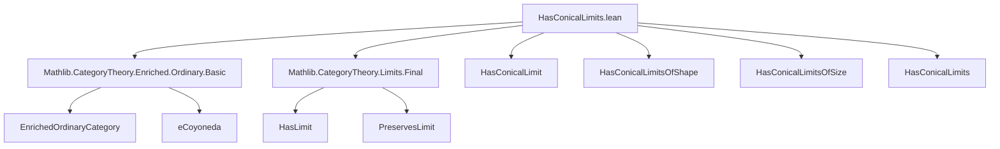
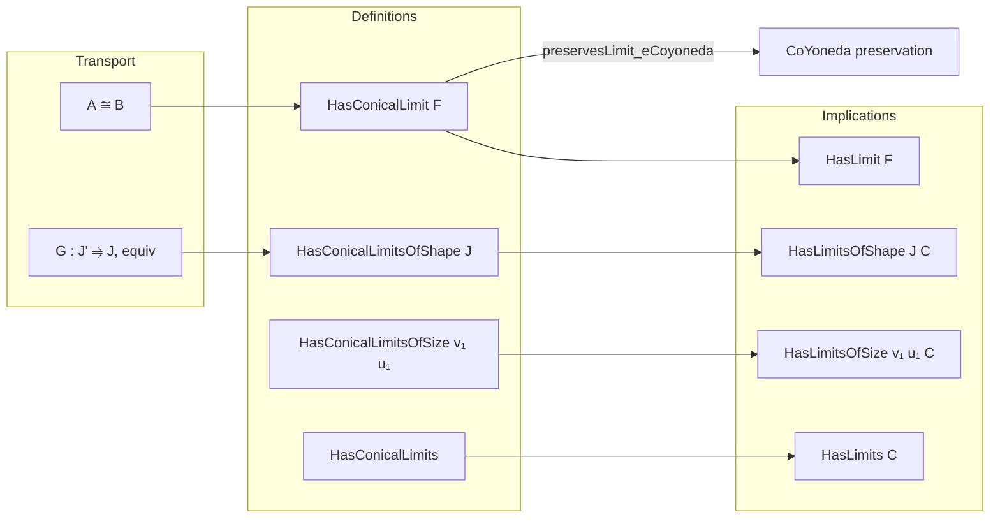

### Technical Brief: `HasConicalLimits.lean`

---

#### **1. Key Definitions & Theorems**

| Name | Type / Class | Purpose |
|------|--------------|---------|
| `HasConicalLimit (F : J ⥤ C)` | `Prop`-valued class extending `HasLimit F` | Asserts existence of a *conical* limit for diagram `F`, with additional coherence condition: preservation of the limit by the enriched coyoneda embedding `eCoyoneda V X`. |
| `HasConicalLimitsOfShape (J : Type u₁)` | `Prop`-valued class | States that *every* diagram `F : J ⥤ C` has a conical limit. |
| `HasConicalLimitsOfSize.{v₁, u₁}` | `Prop`-valued class | Asserts that for all shapes `J` of size `(v₁, u₁)`, all diagrams `F : J ⥤ C` have conical limits. |
| `HasConicalLimits` | `abbrev` | Special case: `C` has all small conical limits, where “small” means size bounded by hom-set universe `(v, v)`. |
| `HasConicalLimit.preservesLimit_eCoyoneda` | Instance projection | Ensures conical limits are preserved under the enriched coyoneda embedding — key for coherence in enriched settings. |
| `HasConicalLimit.of_iso` | Lemma | Conical limits are invariant under natural isomorphism of diagrams. |
| `HasConicalLimit.of_equiv` | Instance | If `G : J' ⥤ J` is an equivalence and `F : J ⥤ C` has a conical limit, then so does `G ⋙ F`. |
| `HasConicalLimit.of_equiv_comp` | Lemma | Converse: if `G ⋙ F` has a conical limit and `G` is an equivalence, then `F` does too. |
| `HasConicalLimitsOfShape.hasLimitsOfShape` | Instance | From conical limits of shape `J`, deduce ordinary limits of shape `J`. |
| `HasConicalLimitsOfShape.of_equiv` | Lemma | Transport conical limits along equivalences of diagram shapes. |
| `HasConicalLimitsOfSize.hasLimitsOfSize` | Instance | From conical limits of size `(v₁, u₁)`, deduce ordinary limits of same size. |
| `HasConicalLimits.hasLimits` | Instance (via `abbrev`) | From all small conical limits, deduce all small (ordinary) limits. |

---

#### **2. Naming Conventions**

- **Prefixes**:
  - `HasConicalLimit`: for existence of conical limit for a *specific* diagram.
  - `HasConicalLimitsOfShape`: for *all* diagrams of a fixed shape `J`.
  - `HasConicalLimitsOfSize`: for *all* diagrams over *all* shapes of bounded size.
  - `of_iso`, `of_equiv`, `of_equiv_comp`: indicate transport of limits along categorical equivalences/isomorphisms.

- **Suffixes**:
  - `preservesLimit_eCoyoneda`: indicates preservation property w.r.t. coyoneda embedding.

- **General pattern**: `Has<Property><Scope>` for existence classes; `of_<morphism-type>` for transport lemmas.

---

#### **3. Tactic Stack**

- **`infer_instance`**: heavily used in class definitions and proofs to synthesize instances automatically.
- **`aesop`**: likely used in trivial proof steps (not shown explicitly, but implied by Lean 4 style).
- **`simp_rw` / `simp`**: for rewriting using definitional equalities and instance properties.
- **`exact` / `assumption`**: for direct proof steps where instances are already in scope.
- **`apply` / `refine`**: for constructing instances/lemmas by filling in fields (e.g., `toHasLimit`, `preservesLimit_eCoyoneda`).

No heavy automation like `interval_cases`, `induction`, or `rcases` appears — the proofs are mostly *instance-based* and *structural*.

---

#### **4. Proof Logic**

- **Structure**: Most proofs follow a *decomposition* pattern:
  1. Use existing `HasLimit` infrastructure (e.g., `hasLimit_of_iso`, `preservesLimit_of_iso_diagram`).
  2. For equivalence-based transport, construct an explicit isomorphism (`e : G.inv ⋙ G ⋙ F ≅ F`) and apply `of_iso`.
  3. For shape transport, use `of_equiv_comp` or `of_equiv` to lift limits along equivalences.
- **No induction or case analysis** is needed — the arguments rely on *categorical universal properties* and *functoriality*.
- **Key logical flow**:
  - From `HasConicalLimit F`, deduce `HasLimit F` (trivial by class extension).
  - From `F ≅ G`, deduce `HasConicalLimit G` (via `of_iso`).
  - From `G` equivalence, deduce equivalence of diagram categories, hence equivalence of limit existence.

---

#### **5. Imports**

| Import | Purpose |
|--------|---------|
| `Mathlib.CategoryTheory.Enriched.Ordinary.Basic` | Core definitions of enriched categories, ordinary structure, coyoneda embedding `eCoyoneda`. |
| `Mathlib.CategoryTheory.Limits.Final` | Tools for limits, especially preservation and finality (used implicitly via `PreservesLimit`). |

> **Note**: The file does *not* import general limit existence results (e.g., `Limits.IndCones`), indicating it focuses on *constructive* or *axiomatic* existence of conical limits, not their construction from other limits.

---

#### **6. Mermaid Diagrams**

##### **Dependency Graph (Module-Level)**



##### **Conceptual Overview (Theory Flow)**



##### **Diagram Shape Equivalence Transport**

```mermaid
flowchart LR
  J'[category] -- G ≃ J --> J
  F' : J' ⥤ C -- ⋙ G⁻¹ --> F : J ⥤ C
  subgraph Limits
    L'[limit of F'] -- transport --> L[limit of F]
  end
```

---

#### **7. Summary**

This file formalizes *non-constructive* existence of **conical limits** in the context of **enriched category theory**, where the base of enrichment `V` is a monoidal category and `C` is an enriched-ordinary category. It distinguishes between:

- existence for a single diagram (`HasConicalLimit`),
- for all diagrams of a fixed shape (`HasConicalLimitsOfShape`),
- for all diagrams over all small shapes (`HasConicalLimitsOfSize`, `HasConicalLimits`).

It establishes that conical limits imply ordinary limits, and are stable under isomorphism and equivalence of diagram shapes — crucial for homotopical and higher-categorical applications.

The design reflects a *modular* and *instance-driven* approach, typical of modern Lean formalizations in category theory, with careful attention to universe polymorphism and coherence conditions (e.g., preservation under `eCoyoneda`).
