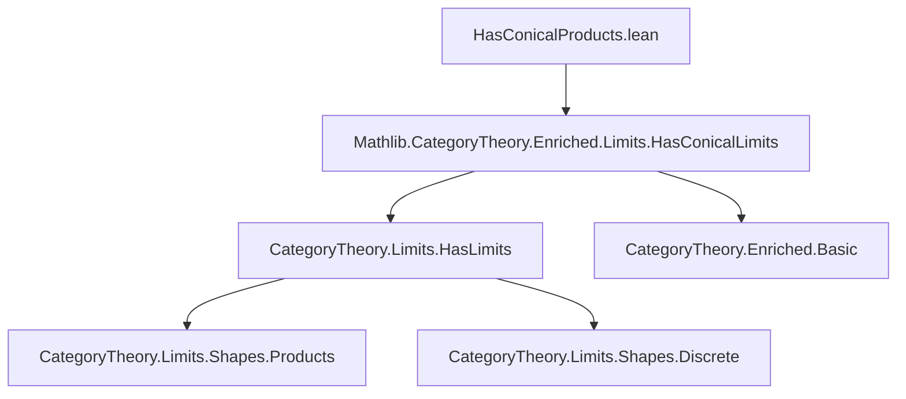
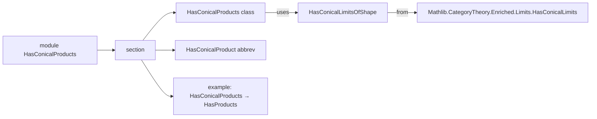

**Technical Brief: `HasConicalProducts.lean`**

---

### 1. **Key Definitions & Theorems**

| Name | Type / Signature | Purpose |
|------|------------------|---------|
| `HasConicalProducts` | `class HasConicalProducts (V : Type u') [Category V] [MonoidalCategory V] (C : Type u) [Category C] [EnrichedOrdinaryCategory V C] : Prop` | States that *all* discrete diagrams of size bounded by `Type w` admit conical limits (i.e., conical products) in the enriched sense. |
| `hasConicalLimitsOfShape` | `∀ J : Type w, HasConicalLimitsOfShape (Discrete J) V C` | The single constructor of `HasConicalProducts`: asserts existence of conical limits for every discrete diagram indexed by a type `J` of size `w`. |
| `HasConicalProduct` | `abbrev HasConicalProduct {I : Type w} (f : I → C) := HasConicalLimit V (Discrete.functor f)` | Abbreviation for the existence of a conical limit of a diagram `f : I → C`, viewed as a discrete diagram. |
| `example [HasConicalProducts.{w} V C] : HasProducts.{w} C` | `example` | Derives ordinary (non-enriched) products from enriched conical products; used to connect enriched and ordinary product notions. |

---

### 2. **Naming Conventions**

- **Prefixes**:
  - `HasConical*`: Indicates existence of *conical* (i.e., ordinary, non-weighted) limits in an enriched setting.
  - `*Product`: Used for binary or indexed products (e.g., `HasConicalProduct`, `HasProducts`).
- **Suffixes**:
  - `OfShape`: Used for limits of a specific shape (e.g., `HasConicalLimitsOfShape`).
- **Quantifier style**:
  - `∀ J : Type w` — universal quantification over indexing types of bounded size.

---

### 3. **Tactic Stack**

- **`infer_instance`**: Used twice — to discharge class instances and to derive consequences (e.g., `HasProducts` from `HasConicalProducts`).
- **No explicit tactic usage in proofs** — this file is largely definitional and class-based; proofs are by typeclass inference.

---

### 4. **Proof Logic**

- **Logical flow**:
  1. Define a *class* `HasConicalProducts` asserting conical limits exist for *all* discrete diagrams of bounded size.
  2. Provide a constructor `hasConicalLimitsOfShape` to witness this.
  3. Define `HasConicalProduct` as a convenient alias for conical limits of diagrams `I → C`.
  4. Derive a corollary: existence of enriched conical products implies existence of ordinary products (via `inferInstance`).

- **No induction or case analysis** — the reasoning is purely typeclass-based and definitional.

---

### 5. **Imports**

- `Mathlib.CategoryTheory.Enriched.Limits.HasConicalLimits`: Core module defining conical limits in enriched categories.

- **Key dependencies** (inferred from context):
  - `CategoryTheory.Category`
  - `CategoryTheory.MonoidalCategory`
  - `CategoryTheory.Enriched.Basic` (via `EnrichedOrdinaryCategory`)
  - `CategoryTheory.Limits.Shapes.Products`
  - `CategoryTheory.Limits.HasLimits`

---

### 6. **Mermaid Diagrams**

#### **Dependency Graph (Module Level)**



#### **Conceptual Overview (Theory Flow)**

```mermaid
flowchart LR
  subgraph EnrichedWorld
    V[Monoidal Category V]
    C[Enriched Category C over V]
    HCP[HasConicalProducts V C]
    HCP -->|constructor| HCL[∀ J, HasConicalLimitsOfShape (Discrete J) V C]
    HCL -->|specialize| HCPf[HasConicalProduct f]
  end

  subgraph OrdinaryWorld
    HC[HasProducts C]
  end

  HCP -.->|example| HC
```

#### **File-Level Structure**



--- 

This file serves as a *bridge* between enriched and ordinary limit theory: it shows that if all discrete diagrams admit *enriched* conical limits, then the underlying ordinary category has (ordinary) products. The design reflects Lean’s typeclass-driven approach to categorical existence statements.
